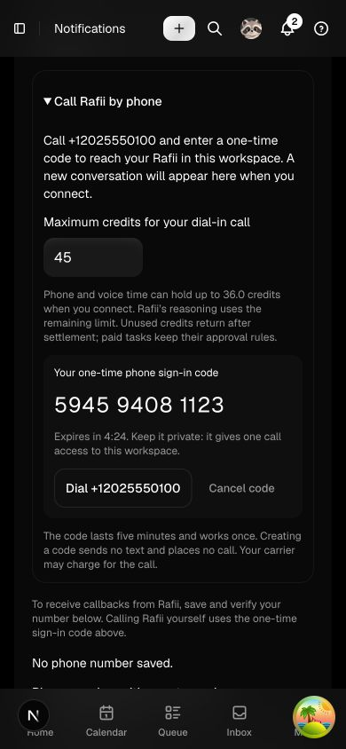
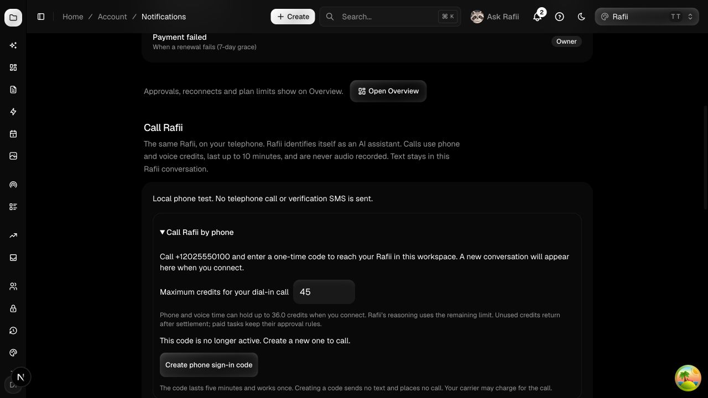

# Rafii inbound phone v1 — local implementation

Status: implemented and locally verified; **not deployed or enabled on the production number**.

Branch: `codex/rafii-inbound-v1`, based on `origin/consumer-saas` at `4f686a7`.
Worktree: `/Users/ouxianxing/.codex/worktrees/rafii-inbound-v1/James-Au-Studio`.
Intended existing production line: `+16055978162`. Local fixtures use `+12025550100` only.

## User flow

1. Sign into Rafii and open **Call Rafii by phone**, in phone settings or the existing Rafii call controls.
2. Confirm the call credit limit where credits apply, then create a twelve-digit phone sign-in code. It lasts five minutes and works once. Saving a callback number or receiving an SMS is not required.
3. Dial the shared line and enter the code on the keypad. `*` clears the entered digits. There are three attempts and a 45-second admission window.
4. Rafii binds the call to the code owner's current membership, workspace and chosen conversation (or creates a conversation on admission). The existing Rafii controller, agent, tools, memory and approval rules handle the conversation.
5. The browser removes the used code, refreshes call controls and exposes the conversation. Unknown/expired/revoked codes receive the same generic refusal.

Creating a code never calls the provider or sends SMS. The displayed code exists only in the initial no-store response and transient component state, and is removed after expiry/use/error or workspace/conversation changes. The server stores a keyed digest, not the code. Caller ID is only a rate-limit signal; it does not authenticate access to an account.

## Implementation

- `phone/inbound.py`: fresh interactive login, per-person issuance limits, keyed code digests, atomic consumption with call/credit reservation, shared PostgreSQL admission limits and ephemeral cleanup.
- `phone/asgi.py` and `phone/providers/dial.py`: signed inbound Self-Hosted audio, called-number validation, stock greeting/keypad entry, and the existing authenticated Live bridge. Pre-authentication speech is discarded; no model or private context is opened before admission. Reconnect/replay cannot create another session.
- Existing phone service, ledger, webhook, reconciliation and cron paths now distinguish inbound/outbound calls. Outbound acceptance and callback verification remain in place.
- `042_phone_inbound.sql`: direction column plus two server-only RLS tables. Account/workspace deletion removes codes. Cleanup preserves ordinary settled call history.
- `dial-in-rafii.tsx`, `call-rafii.tsx`, `phone-settings.tsx`: code generation/cancellation/expiry, credit gate, mobile layout and used-code call refresh. Phone settings distinguish direct dial-in from callback setup.
- Backend/public privacy notices and locally generated greeting provenance updated.

Endpoints use the existing interactive-session, origin, permission and no-store guards:

```text
POST   /api/workspaces/{workspace}/phone/inbound-codes
GET    /api/workspaces/{workspace}/phone/inbound-codes/{codeId}
DELETE /api/workspaces/{workspace}/phone/inbound-codes/{codeId}
```

No new external phone service, deployment, credential change or account setting was made.

## Limits and rollout configuration

`RAFII_PHONE_INBOUND_ENABLED` defaults off and is rejected in preview environments. Enabling incoming calls requires the existing phone switch, configured Dial provider, reviewed positive telephony rate, and the existing Rafii voice/agent runtime. Outbound, scheduled, proactive and SMS switches are independent.

Code issuance is limited to six/hour/person, at least 30 seconds apart, with one outstanding code per person. Call admission keeps the existing active-call exclusion, six explicit calls/day/person, per-person cost/credit limits and duration cap. Incoming phone estimates include up to 45 seconds of authentication time.

Before authentication, the operator bears the greeting cost. V1 allows at most twelve admitted connections/hour globally and three/ten minutes per caller digest. `RAFII_PHONE_INBOUND_AUTH_DAILY_USD_MICRO` defaults to 1,000,000 (one USD estimated per rolling 24 hours), bounded at five USD. It reserves a whole configured-rate minute per admitted greeting. This is an **application admission estimate**, not a carrier/account billing guarantee: refused connections and provider billing terms need live verification. Choose a reviewed rate ceiling before enabling it.

Expired code digests older than a day and session/caller digests older than two days are removed on the next incoming-call or enabled phone-maintenance pass. Disabling all phone maintenance pauses that cleanup; the five-minute authentication expiry remains enforced independently.

Migration `042` was chosen after inspecting local/remote refs (other work claims 037–041). Recheck migration numbering when merging. Apply the additive migration before releasing code that reads the direction column; disabling the feature does not remove the schema dependency. Roll back by disabling the inbound flag; keep the additive tables/column.

## Validation

All external telephony and model transports in these checks are synthetic. Real local PostgreSQL, HTTP/WebSockets, agent tool execution, ledger operations and browser components were exercised.

- **63 Python tests passed**: phone policy/provider/media, new keypad/preview tests, existing deployment isolation and migration numbering.
- **Three PostgreSQL suites passed**: `postgres_dial_phone`, `postgres_phone_mode`, `postgres_inbound_phone`. New coverage includes two users/conversations, stale login, cross-account access, single use, concurrent replay, expiry/revocation, active-call rollback, revoked membership, server-only RLS, account deletion, admission limits and cleanup.
- Signed inbound ASGI flow reached the actual Rafii manager/tools, edited the intended draft, returned synthetic audio, retained publishing review, and settled usage with duplicate signed callback handling. No pre-authentication audio/code appeared in model input. Missing signature, wrong called number and reconnect were refused.
- **Three web tests passed**: credit-limit parsing/bounds and preview destination guards.
- Browser: **390×844 mobile and 1280×720 desktop**, no horizontal overflow; credit gating (including insufficient wallet), generate/cancel/expiry, code removal, active controls and correct conversation navigation. Consumed-state UI used a labelled synthetic keypad-success fixture; full keypad authentication was independently tested through signed ASGI. No browser console errors observed.
- Final lint, production build (including TypeScript), offline secret scan and whitespace checks: **passed**. See the [verification log index](inbound-v1-evidence/validation.json). The initial secret-scan finding was a generated fixture key, narrowly annotated at its source; no real secret was added or allowlist broadly changed.

Reproduce from the worktree (Node 24 and the pinned Python dependencies):

```sh
PYTHONPATH=src:tests /tmp/rafii-phone-env/bin/python -m unittest test_rafii_phone test_rafii_dial test_rafii_phone_media test_rafii_inbound test_consumer_deployment test_migration_numbers
PYTHONPATH=src:tests /tmp/rafii-phone-env/bin/python scripts/postriff_pg_suite.py postgres_dial_phone postgres_phone_mode postgres_inbound_phone
/tmp/rafii-phone-env/bin/python scripts/consumer_ready_secrets.py
cd web
/opt/homebrew/opt/node@24/bin/node --test tests/credit-limit.test.cjs tests/deployment-env.test.mjs
/opt/homebrew/opt/node@24/bin/node /opt/homebrew/bin/npm run lint
NEXT_PUBLIC_SENTRY_DISABLED=1 NEXT_TELEMETRY_DISABLED=1 /opt/homebrew/opt/node@24/bin/node /opt/homebrew/bin/npm run build
```

Optional local UI harness: `scripts/postriff_dev_hosted.py --port 4450 --pg-port 55581 --inbound-phone-fixture --credit-fixture`, with the Next dev API origin pointing to loopback port 4450. The fixture injects fake transports and has no real PSTN/SMS path. The temporary harness used for this review has been stopped.

Evidence screenshots (synthetic number, account, credits and code; displayed code is now expired):





## Remaining production work

Production migration, deployment/flag activation and paid live-call validation require scoped authorization. No push, merge, deployment or paid provider/model call was performed here.

For a small approved pilot, verify the existing Self-Hosted URL/signing secrets, μ-law 8kHz formats, owned number and provider rate; apply 042, deploy this reviewed source, set the inbound flag and a short duration/cost ceiling. The earlier production `/self-hosted` readiness 403 was not rechecked or resolved by this local implementation. The inbound path does not make that outbound readiness request, but actual provider delivery/audio still needs a live test.

Live acceptance must confirm: generic greeting, correct-code login from two distinct accounts to their own conversations, wrong/expired code refusal, normal Cantonese conversation and interruption, saved draft visible in the same conversation, hang-up and final provider/model billing, and no publication without the existing review. **Synthetic audio and a provider “Completed” call status do not prove live voice works.**
