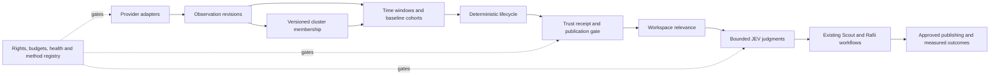
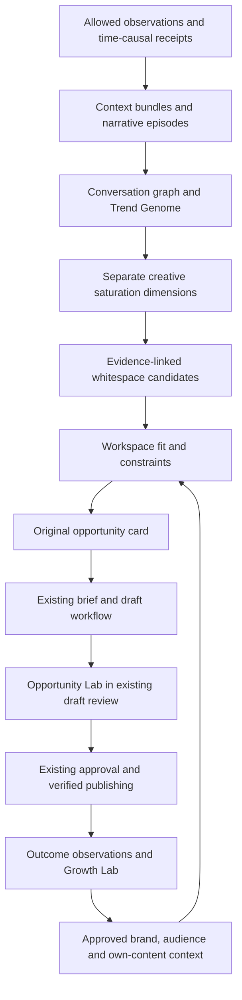

# Rafii Social Trend Intelligence — Canonical Master Engineering Specification

Date: 2026-09-27  
Status: Canonical engineering planning specification; implementation and release gates remain open<br>
Repository: `dev-james0723/PostRiff`  
Primary audit worktree: `/Users/ouxianxing/Documents/James-Au-Studio-all-updates`  
Source audit baseline: `origin/consumer-saas@d5bb9d6` (audit-time fact)  
Later origin observed during trust-spec workflow: `origin/consumer-saas@6cdfe8f` (audit-time fact)  
Revision: 2 — shared-chat reconciliation, Social Opportunity Intelligence architecture and detailed delivery plan, 2026-09-27<br>
Method: source-spec preservation, direct repository inspection, evidence-first primary-source research, artifact-readiness review

Product principle: **Internet Signal -> Cultural Understanding -> Personal Relevance -> Action.**  
Trust principle: **Do not require the user to trust Rafii. Make Rafii verifiable.**

## Document authority

This file combines and supersedes the following two documents for future implementation planning:

1. `/Users/ouxianxing/Documents/Rafii-Social-Trend-Intelligence-Audit-2026-09-27.md`
2. `docs/design/social-trend-intelligence/TRUST_METRICS_ENGINEERING_SPEC_2026-09-27.md`

Those source files remain evidence/reference for the original audit and trust-design provenance.

Where requirements overlap, this master applies the newer trust architecture as authoritative for metrics, confidence, evidence, calibration, backtesting, method governance, database/API contracts, agent behavior, UI, release gates and definition of done.

Repository SHAs, migration numbers, provider quotas, prices, scopes and access programs are time-sensitive. Before implementation, re-fetch the repository, inspect all worktrees/branches, re-scan migration numbers, and re-verify provider terms. Do not treat any audit-time observation below as a permanent production fact.

### Revision authority, source chronology and evidence

This revision updates the existing master in place. It preserves the preceding architecture/trust decisions, resolves conflicts in their implementation details, and adds normative contracts within the relevant sections. **A proposed filename, endpoint, threshold, schema or test below describes work to implement; it is not evidence that the work exists.** MUST/SHALL indicate release requirements; SHOULD indicates a documented exception may be justified.

The user supplied the public conversation [“newest jev architecture”](https://chatgpt.com/share/6ab98b78-6cbc-83ea-b393-9010e2a9132c). This revision reviewed the substantive user/assistant turns through the **last strategic proposal**, not only the initial audit. The accessible share contains 69 user/assistant final-message records: 14 substantive messages, 53 redacted plugin-output placeholders and two unavailable custom-instruction placeholders. Redacted material cannot establish repository actions or research results. Statements in that chat that files were saved or benchmarking was added are historical claims, not proof that implementation or competitor testing ran.

Later requests expand the product direction while retaining the trust architecture:

| Conversation step | Requirement carried forward | Specification consequence |
|---|---|---|
| Initial architecture audit | Internet signals, temporal measurement, culture, workspace relevance and action | Preserve the shared intelligence spine and existing Rafii integrations |
| Trust discussion and user assent | Explainable measurements, calibration, receipts, recomputation, no opaque viral score | Trust contracts remain mandatory for every later feature |
| Competitor capability discussion | Understand enterprise listening, narrative detection, forecasting and video intelligence | Separate published capabilities from inferred algorithms and account access |
| Explicit request to reverse engineer | Reconstruct observable behavior through evidence and controlled comparisons | Add a reproducible competitor benchmark protocol; no claim of access to proprietary code |
| Final request for a uniquely powerful Rafii | Help users find and execute original, timely content opportunities | Add Conversation Graph, Trend Genome, multidimensional saturation, whitespace, spread hypotheses, Platform DNA, Opportunity Lab and closed-loop learning |

The last proposal is incorporated as a **product/engineering target**, not a proven claim that Rafii predicts virality or outperforms those products. Detailed numerical defaults and implementation choices introduced here are proposals to qualify. Later scope does not grant permission for paid calls, competitor subscriptions or publication.

Evidence classifications used here:

| Classification | Meaning | Permitted conclusion |
|---|---|---|
| Rechecked local | Specific source file inspected in the target worktree on 2026-09-27 | Describes those bytes, including uncommitted work |
| Prior audit | Preserved finding from the two original source documents | Historical context; implementation must recheck |
| Primary-source research | Public official documentation inspected for this revision | Documented interface/policy; no proof of account entitlement or live success |
| Proposed contract/default | Engineering choice made in this specification | Implement and validate before enabling |
| Unresolved | Missing source, provider access, qualification or production evidence | Explicit gate; never silently substitute an assumption |

Reader routes: §§2–5 explain integration boundaries; §§6–11 define acquisition, data and method contracts; §§12–19 define runtime/product behavior; §§20–24 define work packages and verification; §§25–27 define completion and source evidence. The first deployable slice is deliberately narrower than the complete product vision.

This is a **documentation update**. It neither provisions a service nor authorizes paid ingestion, model benchmarks, provider contracts, database migrations, deployment, notifications or publishing.

## Resolved architectural decisions

1. **JEV remains a bounded judge/evaluator.** It is not a crawler, social API client, retrieval provider, metric source or popularity oracle.
2. **Observed provider evidence is authoritative for activity.** Mention volume, engagement velocity, acceleration, breadth and lifecycle inputs come from source evidence plus deterministic/statistical code.
3. **Four semantic layers are permanent:** observed evidence -> calculated metrics -> inferred lifecycle state -> model interpretation.
4. **Coverage and confidence are separate concepts.** Missing access cannot become a claim of absence.
5. **No opaque viral/trend score.** Popularity, relevance, audience fit, brand fit, timing, originality, risk and confidence remain separately inspectable.
6. **Every user-visible lifecycle claim gets a Trust Receipt.** The receipt binds evidence/snapshots, formulas, method versions, coverage, limitations and confidence components.
7. **Calculated metrics must be recomputable.** If retained allowable evidence cannot reproduce a user-visible metric within tolerance, the metric fails closed.
8. **Accuracy claims are cohort-specific.** Historical calibration must name the platform/niche/language/provider mix/time range/sample size.
9. **Backtests are time-causal.** Future snapshots, future cluster membership and later cross-platform evidence are forbidden at decision time.
10. **Method changes shadow before promotion.** Threshold changes are versioned behavior; historical receipts remain explainable under their original versions.
11. **Unknown-topic discovery is required.** Watchlists are one input, not the entire discovery system.
12. **Provider adapters are rights-aware capability contracts.** Raw posts, aggregate metrics, search leads, owned posts and trend seeds are distinct evidence forms.
13. **Official/licensed routes beat brittle scraping.** Public-web search is a discovery/corroboration route, not a substitute for platform-native metrics.
14. **Shared trend computation is entitlement-scoped; personalization is tenant-scoped.** Workspace-private Brand Brain/voice/history/campaign data must never leak across tenants.
15. **Cultural language is analyzed before translation.** Preserve Cantonese, Traditional/Simplified Chinese, English and code-switching in original form.
16. **Social repetition does not establish factual truth.** Factual/event claims continue through FactPack and appropriate primary/reputable verification.
17. **Existing Rafii workflow engines remain authoritative.** Trends feed Research, Suggestions, Weekly, Campaigns, platform writing, approval/publishing and performance learning.
18. **Continuous ingestion uses durable cursors, leases and fences.** External calls stay outside long DB locks; outages lower coverage instead of creating zeros.
19. **Storage/display/LLM-processing rights are independent.** Retention and deletion rules propagate through raw evidence, cached derivatives and displays where required.
20. **Implementation state must be re-audited.** Historical migration-number guesses are not reservations; scan refs/worktrees before allocating any number.
21. **JEV classifies; a chat model composes.** Typed judgments, free-text explanations and generated angles are different task contracts.
22. **Native evaluation is not domain calibration.** A primary-route probability does not establish trend accuracy, Cantonese reliability or outcome prediction.
23. **Rights constrain sharing as well as storage.** Public visibility alone does not authorize cross-customer reuse or transfer to an embedding/model provider.
24. **Event time and knowledge time are distinct.** Historical decisions use only observations, memberships and policies available by their decision cutoff.
25. **Deletion takes precedence over reproducibility.** Revoke affected claims and retain only permitted audit metadata when inputs cannot legally remain.
26. **No duplicate worker or learning engine.** Reuse mechanisms and existing workflow ownership; introduce dedicated high-volume storage and jobs without pretending the workspace publishing queue is a generic ingestion bus.

27. **The product target is Social Opportunity Intelligence.** Trend Radar exposes the evidence; the Opportunity Engine turns qualified evidence and approved user context into original, actionable options.
28. **Topic momentum and creative saturation are independent.** A rising topic may have crowded hooks and an underrepresented narrative; no single saturation label can stand for all five dimensions.
29. **Graph edges, spread mechanisms and whitespace are evidence-linked hypotheses unless directly observed.** Sequence is not causation; absence in a sample is not absence on the internet.
30. **Opportunity Lab extends the existing draft review path.** It cannot create a second publishing authority, change permanent voice memory or promise viral performance.
31. **Competitor reconstruction is empirical product research.** Agreement with a competitor is not ground truth and undocumented internals remain hypotheses.

## 1. Executive architecture decision

Do **not** turn JEV into a crawler, social API client, or popularity oracle.

The right extension is:

```
Public + licensed source adapters
  -> discovery frontier
  -> normalized observations + rights/provenance
  -> temporal metric snapshots
  -> statistical burst/momentum detection
  -> multilingual semantic clustering
  -> Trend Objects + per-platform lifecycle
  -> Cultural Language Intelligence
  -> workspace relevance features
  -> JEV semantic/relevance/originality/risk judgments on the small actionable set
  -> existing Rafii Research / Scout / Suggestions / Weekly / Campaign / Writing pipelines
  -> published outcomes
  -> performance learning
```

JEV is already well placed as a **judge**. It should remain downstream of measurable evidence. Popularity, velocity, acceleration and lifecycle stage must come from observed source data and deterministic/statistical code, never from the LLM.

### Product outcome and scope of the expanded engine

The user outcome is: **identify what is changing, understand how people express it, find a useful angle this creator can credibly contribute, execute it in the existing Rafii workflow, and learn from verified outcomes.** Success is more accepted useful ideas, less repetitive output and better creator-relative results in qualified experiments. Raw topic count, model enthusiasm or a fictional viral probability are not success metrics.

“Internet DNA × Trend DNA × Audience DNA × Brand DNA × Creative DNA” is a shorthand for five evidence views, not multiplication, genetics or a new score. `InternetContext` projects measured public samples and temporal states; `TrendGenome` describes the topic/narrative/expression; `AudienceContext` projects user-declared audiences and permitted aggregate outcomes; `BrandContext` references existing approved Brand Brain/voice/goals; `CreativeContext` references permitted patterns and the workspace's own content history. Every view carries source IDs, revision, scope, cutoff and unknowns. There is one canonical owner for each source of truth.

The foundational release can expose reliable observations and receipts before all advanced modules qualify. The **full product vision** additionally requires graph/genome, creative saturation, whitespace and draft diagnostics. Multimodal and forecasting capabilities have their own gates and cannot be implied by a text-only beta.

## 2. Audit-time current-state architecture assessment

### Production vs local in-flight state

The old `/Users/ouxianxing/Documents/James-Au-Studio` worktree was 239 commits behind `origin/consumer-saas` and heavily dirty, so it is not a reliable current-state baseline.

The original audit treated `origin/consumer-saas@d5bb9d6` as its production-reference snapshot, including Growth Phase 0 + Active Scout v1.2. A Git ref alone does not prove which revision is deployed. The `James-Au-Studio-all-updates` worktree is based on that revision but contains uncommitted connector/growth work. The separate `jev-scoring-recovery` worktree is 81 commits behind production and contains offline scoring-recovery work; it is not the production JEV runtime.

### Rechecked local baseline and implementation delta

On this revision's read-only inspection the target worktree was on `release/rafii-all-updates-20260927`, HEAD `d5bb9d6b1e03df832a8b9c2b1505cf6ae4f33d7f`, with extensive staged/unstaged/untracked work. This is **not a clean production snapshot**. No remote fetch, merge, deployment, credential inspection or provider call was performed. Changes in other sessions may invalidate this baseline.

| Inspected seam | Actual behavior / relevant constraint | Required implementation response |
|---|---|---|
| `growth/jev.py::JevService.evaluate` | One HTTP evaluation request; typed errors; token estimates; Gateway usage metadata | Keep acquisition outside it; add trend question sets through existing abstractions |
| `growth/router.py::AIModelRouter` | Deadline-bound evaluator; native primary returns `calibrated=True`; retries/fallbacks are task-specific | Separate route capability from task/cohort calibration; test actual executed-model identity |
| `growth/judgments.py::JudgmentService` | Validates answer types/distributions; in-memory default cache; `shared` vs `personal:<workspace>` scope | Add rights/entitlement/freshness-aware cache envelope; do not infer durable caching from this class |
| `growth/scout.py::normalize/cluster` | Workspace-specific IDs, lexical/time clustering, compact snippets and creator keys | Adapt through a typed projection; never bulk-promote legacy workspace signals into a global corpus |
| `growth/scout.py::prepare` | At most two clusters reach four JEV gates (up to eight judgments) | Preserve bounded admission; benchmark any changed fan-out |
| `growth/scout_runtime.py::reserve/complete` | Fingerprint/reservation/completion over workspace state | Keep scope/fences; a new global ingestion queue needs its own row contracts |
| `coworker/research_broker.py` | Provider-kind/provenance abstraction; official provider is `official_owned_posts` | Add discovery capability separately from owned-account access |
| `hosted_worker.py::claim/complete/authorize_dispatch` | Claims workspace publishing jobs with leases and approval checks | Reuse fence/claim patterns, not publishing state semantics or approval authority |
| `migrations/postriff/` | Local numbered files include 030–036; 026–029 absent from this listing | Gaps are not available numbers; inspect branch ownership and migration runner |

Existing tests found include `tests/test_growth_jev.py`, `test_growth_router.py`, `test_growth_judgments.py`, `test_growth_scout.py`, `test_postriff_research.py`, and PostgreSQL scripts under `tests/phase2/`. Their existence is not a passing result. The documentation change does not claim these suites were run.

### JEV today

Key files:
- `src/postriff_phase2/growth/jev.py`
- `src/postriff_phase2/growth/router.py`
- `src/postriff_phase2/growth/judgments.py`
- `src/postriff_phase2/growth/scout.py`
- `src/postriff_phase2/growth/scout_runtime.py`

`jev.py` calls Vercel AI Gateway's evaluate endpoint using `typesafe-ai/jev`. `AIModelRouter` assigns JEV primarily to judge/evaluator work and provides model fallbacks, deadline budgets, usage receipts and failure classes. `JudgmentService` adds validation, caching and explicit abstention/degraded states.

JEV does **not** discover or retrieve social content. That is good architecture and should stay that way.

### Active Scout v1.2

Active Scout is the closest existing substrate for the requested system:
- normalizes evidence and source rights;
- preserves provider/access method/platform/retrieval/publish timestamps/content hashes;
- clusters multiple signals into trend-like objects;
- produces lifecycle labels including emerging/rising/peak/saturated/declining;
- runs four bounded JEV gates: signal, cluster, workspace fit, execution;
- outputs evidence-linked opportunities and platform-native execution plans;
- limits external retrieval/model work through a reserved budget and fenced completion pattern.

Its current limitations are material:
- discovery begins with user watchlist queries;
- clustering is lexical/time based rather than multilingual semantic;
- velocity is essentially new-signal count, not measured time-series momentum;
- no cross-platform lifecycle state;
- no unknown-topic discovery frontier;
- no language/slang object model;
- no geographic/community model;
- no durable global trend memory.

### Research layer

Key files:
- `src/postriff_phase2/research.py`
- `src/postriff_phase2/coworker/research_broker.py`
- `src/postriff_phase2/coworker/service.py`
- `skills/postriff-research-and-source-log/SKILL.md`
- `migrations/postriff/025_coworker_evidence_growth.sql`

Current hosted public-web research is Exa Search + Jina Reader. Importantly, `research.py` explicitly skips X/Twitter, Instagram, Facebook, TikTok, LinkedIn, YouTube, Pinterest, Threads and Reddit. So current Research is **not** a social listening engine.

`ResearchBroker` is nevertheless a strong extension seam. It already models provider kind (`web_search`, `web_reader`, `official_api`, `mcp`, `local_agent_reach`, `fixture`) plus access method, represented scope, evidence type, source rights and prompt-injection flags.

The current `OfficialPlatformApiProvider` is oriented to owned-account evidence, not platform-wide discovery. The broker chooses the first ready search provider rather than performing controlled multi-provider fan-out.

`pr_research_evidence` is excellent for workspace-selected evidence, but it is the wrong table for millions of raw observations and time-series snapshots.

### Campaign / suggestions / weekly / brand / learning

Reuse rather than parallelize:
- `campaigns.py`, `campaign_worker.py` and `migrations/postriff/018_raffi_planning.sql` already own campaign planning and recurring work.
- `suggestions.py` already has evidence-oriented proactive suggestion/cooldown behavior.
- `coworker/weekly_operator.py` owns weekly planning.
- `coworker/fact_pack.py` already distinguishes confirmed/corroborated/attributed/disputed/unverified claims.
- `memory.py`, `learning_service.py`, `learning_signals.py` own Brand Brain / voice / preference memory.
- `coworker/performance.py`, `growth/scout_outcomes.py`, `growth/outcomes.py` and `migrations/postriff/035_growth_metric_reads.sql` already provide measured-outcome and hypothesis infrastructure.

Trend observations should **read** Brand Brain / Learn My Voice for relevance and writing constraints. They must not silently write internet slang/trends into persistent brand/voice memory.

### Agent runtime and tool routing

Key files:
- `src/postriff_phase2/agent_runtime_v2/service.py`
- `src/postriff_phase2/agent_runtime_v2/specialists.py`
- `src/postriff_phase2/agent_runtime_v2/domain_tools.py`
- `src/postriff_phase2/coworker/agent_tools.py`

The runtime already has specialists for research, brand intelligence, content, campaign, publishing operations, analytics and workspace history. `specialists.extend_scope()` and the coworker tool extension mechanism are the right integration point for trend tools.

### AI Gateway

`model_runtime.py` already centralizes Vercel AI Gateway chat models and model usage; `growth/router.py` centralizes bounded judge tasks. `pr_model_usage_events` records task/stage/model/route/tokens/cost/latency/status/subject hash.

One major gap: the current deployment has **no qualified embedding provider/index**. `site_agent/knowledge.py` explicitly states retrieval is lexical BM25/CJK bigrams and the vector hook is empty.

### Scheduler / workers

`vercel.json` runs `/api/cron/worker` every minute with a 300s function budget. `coworker/runtime.py` consumes a bounded slice for notifications, weekly work, performance learning, listening and retention. `hosted_worker.py` already provides Postgres claim/lease/fence behavior with advisory locks and `FOR UPDATE SKIP LOCKED`.

Do not stuff continuous social ingestion directly into the existing 120s coworker sequence. Reuse its worker primitives, but give trend ingestion/enrichment its own durable queue and per-provider cursors.

## 3. What JEV can already do and its permanent boundary

JEV can already:
- judge whether a normalized signal is semantically meaningful;
- judge whether a cluster represents one coherent conversation;
- judge workspace/brand/audience fit;
- judge whether a content execution is native, original and appropriate;
- abstain and degrade cleanly;
- operate under explicit time/cost budgets;
- emit usage telemetry.

JEV should be extended for bounded classification/selection/validation of:
- proposed cluster labels;
- evidence-backed cultural-language interpretations;
- ambiguity/context sensitivity;
- originality opportunity;
- brand fit;
- audience fit;
- execution risk;
- explanation quality.

Free-text labels, cultural explanations and content angles are generated by a separately routed chat model or deterministic template, then optionally evaluated by JEV. A JEV score is an ordinal rubric result, not a probability of future popularity.

JEV should **not** determine mention volume, engagement velocity, cross-platform spread, acceleration, stage, or whether something is objectively popular.

## 4. Gaps preventing a real Social Trend Intelligence system

1. No shared global social-signal store.
2. No provider capability/rights matrix enforced in code.
3. Research broker skips major social domains and lacks discovery fan-out.
4. Current watchlist-driven discovery cannot discover unknown topics.
5. Scout clustering is lexical and English-ish; no multilingual semantic index.
6. No immutable time-series snapshots for volume/engagement/creator diversity.
7. No per-platform lifecycle for a shared Trend Object.
8. No slang/catchphrase/meme-language object model.
9. No regional/community/niche dimensions.
10. No durable trend archive for recurrence/lifecycle learning.
11. No explicit trend-to-published-post lineage for performance learning.
12. Current provider connections mostly mean account identity/publishing/owned analytics, not platform-wide listening.
13. No source-specific retention/redaction/deletion worker for licensed social data.
14. No Trend Radar API/UI.

## 5. Target architecture

### A. Acquisition plane

Create provider capability contracts, not a generic scraper interface. Every provider declares:
- source/platform;
- discovery modes;
- auth mode;
- raw-content availability;
- metrics availability;
- supported search dimensions;
- stream/poll capability;
- geographic/language coverage;
- retention/deletion requirements;
- whether raw text may be stored;
- whether content may be sent to an LLM;
- whether content may be shown to end users;
- current cost/quota metadata.

Provider output is an `ObservedSignal`, never a Trend Object.

### B. Shared intelligence plane

`ObservedSignal -> snapshots + bounded ContextBundles -> narrative seeds + temporal clustering -> TrendObject/episodes -> PlatformState + CulturalLanguageObject + TrendGenome + ConversationGraph -> qualified creative-pattern/saturation views`

This layer may reuse observations across workspaces only within a rights/entitlement domain that permits the relevant processing and sharing. One eligible observation should not be re-fetched and re-embedded per customer; workspace-private or account-scoped observations never become globally shared merely for efficiency.

### C. Workspace relevance plane

For each workspace, score a small set of candidate Trend Objects against:
- Brand Brain / industry / audience;
- Learn My Voice constraints;
- recent content history;
- campaign goals;
- selected platforms/languages/regions;
- measured performance hypotheses.

Persist dimensions separately: `trend_relevance`, `audience_relevance`, `brand_fit`, `timing_opportunity`, `originality_opportunity`, `risk`, `confidence`.

### D. Action plane

A selected opportunity flows into existing Rafii paths:
`TrendObject -> evidence projection -> FactPack when factual -> CanonicalBrief -> platform-specific writing skills -> campaign/weekly/suggestion -> approval -> publish -> outcomes -> performance learning`.

### E. Trust/control plane and ownership

The control plane evaluates source rights, entitlements, budgets, health, method qualification and tenant authorization before any data-plane effect. It has deterministic final authority; a model can propose a classification but cannot grant permission.



The graph is a dependency view, not a new agent hierarchy. `TrendService` is the read/composition boundary; workers own durable writes; existing Campaign/Weekly/Notifications own their mutations. Shared derived data remains partitioned by its permitted audience/entitlement domain. No global worker reads Brand Brain. Personalization workers may read a workspace's approved context and write only that workspace's results.

Minimum bounded contexts: acquisition; observation storage; temporal metrics; clustering; lifecycle/trust; cultural interpretation; workspace opportunities; existing action/outcome pipeline. Start as modules in the present Python application. Separate process deployment only when continuous streams or independently measured load require it; a new microservice fleet is not a prerequisite.

### F. Opportunity composition and bounded advanced modules



The last edge means **approved strategy adoption**, not automatic overwrite. Public graph/genome processing cannot read private brand/audience context. Workspace overlays can consume permitted shared projections without writing private conclusions back into them. Each advanced projection is optional and independently versioned: an unavailable audio modality does not erase valid text observations, and a failed forecast does not block ordinary drafting.

`OpportunityComposer` retrieves at most a bounded shortlist of trends, joins frozen context revisions, checks hard exclusions, finds supported gaps, evaluates separate fit dimensions, generates up to three original execution options and persists a workspace-only opportunity revision. Hard exclusions (rights, brand constraints, stale evidence, unsupported geography, unavailable metrics) are applied before model ranking. The ranking method records why a candidate was shown and which alternatives were suppressed; optimize for usefulness/original contribution, not indiscriminate controversy.

## 6. Source-by-source ingestion strategy

The rule is: prefer an official API or a licensed data product; use public-web search only as discovery/evidence leads; do not create browser scraping as the backbone.

| Source | Recommended route | What Rafii should treat it as | Important limitation |
|---|---|---|---|
| X | X API Recent Search + Filtered Stream; Enterprise only if required | First-class near-real-time social source | Pay-per-use and retention/compliance contract must be enforced |
| Reddit | Direct Data API only after explicit commercial approval/contract, or a licensed provider such as Brandwatch | Community/subreddit signal source | Commercial use needs Reddit permission; deletion obligations are strict |
| TikTok | Creative Center public trend surfaces for broad trend seeds; authorized creator API for owned data; licensed listening provider for commercial post-level discovery | Trend seed + licensed/aggregate source | Research API is not available to creators/advertisers/commercial users |
| Instagram | Meta Professional API + Facebook Login hashtag discovery where available; owned analytics; licensed/aggregate provider for broader coverage | Narrow native discovery + owned metrics | Not a generic full-text public firehose |
| Threads | Official Threads keyword/topic search + owned account API | Strong native search source | App review/quotas and Meta platform policy still apply |
| YouTube | Data API `search.list`, video/category discovery, public metrics | Search/video conversation source | Search quota and 2026 derived-metric/storage policy require explicit compliance design |
| LinkedIn | Owned/org Community Management APIs + public web discovery + licensed provider where contractual | Owned/org signal + external lead source | No general arbitrary public-post search API; member read permission is restricted |
| Google Trends | Trends API Alpha if accepted | Search-demand corroboration, not breaking-news detector | Alpha access; interval/latency means it is not minute-level social signal |
| Bluesky | Public AppView/search + AT Protocol firehose/Jetstream | Excellent open-network real-time source | Need service rate limits and deletion/current-truth handling |
| Mastodon | Selected instance public/hashtag timelines + streaming | Federated sample source | No single global firehose; each instance only knows part of federation |
| News/blogs/forums | Existing Exa/Jina + Exa Monitors or equivalent web monitor | Discovery and factual corroboration | Search-index evidence is not a substitute for platform-native engagement metrics |
| Licensed listening | Brandwatch/Talkwalker or another vetted provider | Fill coverage gaps, sometimes aggregate-only | Export rights differ by network and provider contract |

### Prior-audit external findings and re-verification requirements

- X now exposes Recent Search, Full Archive Search, Filtered Stream and Trends under a pay-per-use/Enterprise model. Recent Search covers seven days; Filtered Stream is near-real-time. Current self-serve pricing is per resource and has a monthly post-read cap before Enterprise.
- Reddit requires explicit approval for API access and explicit written permission/contract for commercial use. OAuth free access is documented at 100 QPM/client for eligible use, and deleted content must be removed.
- TikTok Research API can query rich public video/comment data, but TikTok explicitly states creators, advertisers and commercial users are not eligible. It is therefore not a production Rafii ingestion route. The public Creative Center remains useful as a trend seed surface, not a guaranteed API.
- Meta's verified Postman collections show Threads keyword search and Instagram Professional API capabilities. Instagram hashtag discovery is narrower than a generic social search engine.
- YouTube `search.list` is usable but has a separate current search-query quota. YouTube's 2026 policy requires approved terms for certain derived metrics and longer analytics storage.
- LinkedIn's Community Management APIs are account/org-centric; `r_member_social` is restricted and the current program is not a global public-post search product.
- Google Trends API remains limited alpha.
- Bluesky/ATProto is unusually attractive for early real-time work because public network streams are first-class.
- Talkwalker explicitly documents that some networks are aggregate-only or non-exportable. That means the provider adapter must support `aggregate_only` evidence rather than pretending every provider yields raw posts.

### Provider admission and operation matrix

Each adapter is registered with a versioned `ProviderCapability` plus an operator-reviewed `SourcePolicy`. Neither provider marketing nor a successful token response establishes entitlement. Readiness is per **operation**, not one `connected` Boolean.

Required readiness states: `not_configured`, `access_pending`, `ready`, `rate_limited`, `budget_paused`, `health_degraded`, `rights_suspended`, `revoked`, `unsupported`. Keep credential status out of user-facing errors. A source may permit owned reads while public discovery is `unsupported`.

Every operation declares: supported evidence kinds; endpoint/API version; credential class; requested and verified scopes; search filters; pagination/stream semantics; metric-definition IDs; rights-policy version; representable territory/language; billable unit and price timestamp; cost ceiling; response-byte ceiling; maximum items; timeout/retry policy; and deletion/update mechanism. Unknown rights default to denied for the affected operation.

Independent permissions: `store_raw`, `store_metrics`, `store_embeddings`, `llm_process`, `display_excerpt`, `display_link`, `share_across_workspaces`, `derive_metrics`, `cross_source_combine`, `retain_derivatives`, `train_or_finetune`. Every permission has `allow/deny/unknown`, policy reference, audience scope and expiry. Embedding is model processing; hashed text is not automatically exempt from source restrictions. No training permission follows from inference permission.

| Route | Initial permitted engineering use | Admission proof before real enablement |
|---|---|---|
| Bluesky | Bounded public events and update/delete correctness prototype | Pin stream implementation/version and cursor semantics; verify host service terms, quotas and replay cost |
| Mastodon | Explicit instance/community sample | Instance rules plus endpoint/auth capability; preserve sample boundaries |
| Existing Exa/Jina | Links, permitted excerpts, web corroboration | Existing account capacity and source-processing rights; never synthesize social counts |
| X | Narrow official queries, selective hydration | Price snapshot, funded cap authorization, approved application operation and retention rules |
| Threads | Scoped keyword discovery where entitled | App/scopes, actual permitted fields and quotas; missing engagement fields stay null |
| YouTube | Separate attributed source lane | Per-operation policy review; additional derived metrics/storage need applicable audited-use-case approval |
| Reddit/TikTok/IG/LinkedIn licensed routes | Contract-specific post or aggregate lane | Written rights for that network, operation, territory, customer audience and downstream processing |
| Google Trends | Search-demand lane | Distinguish public Trending Now/RSS from alpha API; record normalized-series comparability |

**YouTube gate:** the official policy guide states that expanded derived-metric/storage permissions apply to audited developers with approved analytics use cases. Rafii must not assume its proposed lifecycle, embedding, cross-source combination or durable archive is permitted merely because `search.list` works. Until mapped and approved, retain only permitted source references/raw API displays, outside unqualified derived metrics. This is an implementation gate, not a claim that every mathematical operation is forbidden. [Official policy guide](https://developers.google.com/youtube/terms/developer-policies-guide), [additional policy](https://developers.google.com/youtube/terms/derived-metrics-policy).

Provider failure outputs must distinguish a successful empty page from a rejected request, truncated page, unavailable scope and partial response. An empty page counts as observed zero only inside a declared complete query/window; it says nothing about the whole platform.

Fallbacks are explicit capability changes: X unavailable -> web leads means a new evidence type/coverage lane, not continued “X volume.” Adapter activation remains an operational step after implementation, with rights and costs reviewed.

## 7. Discovery frontier and unknown-topic detection

The system must continuously discover candidate conversations rather than rely entirely on predefined keywords.

Required discovery modes include:
- semantic query expansion and related-topic exploration;
- hashtag/topic-tag discovery;
- entity tracking;
- creator/community tracking where permitted;
- platform-native trending/search surfaces;
- search-engine/public-web discovery;
- engagement/volume anomaly detection;
- rapidly recurring phrases and n-grams;
- cross-platform handoff when one source moves first;
- incremental clustering of newly observed signals;
- workspace watchlists as one bounded input.

Every candidate keeps the discovery route, provider scope, timestamps and rights so later calibration can compare discovery methods. Discovery does not itself establish truth, lifecycle stage, or brand relevance.

The discovery frontier must maintain provider budgets, cursor/checkpoint state, query/filter versions, exploration-vs-exploitation quotas, retry/backoff state and duplicate suppression.

### Frontier algorithm and stopping rules

Store a `DiscoveryRequest` with route, normalized query/filter digest, privacy scope, provider-policy version, time interval, language/community dimensions, parent candidate, priority, next eligible time, cost reservation and iteration depth. Query expansions are untrusted suggestions: validate allowed operators, character count, provider/domain scope and excluded categories before dispatch.

Proposed starting allocation per eligible provider budget: 60% tracked/topic follow-up, 25% keyword-independent exploration, 15% corroboration/refresh. These are configurable product defaults, not proven optimal weights. Under pressure, preserve deletion/health work first, then required existing watches; pause exploration before exceeding the hard cap. Low-budget operation must expose reduced discovery breadth.

Bound each seed to two expansion generations and at most five child queries per generation; persist parent edges and deduplicate equivalent requests. Admit candidates using measured local burst/entity/phrase changes, platform seeds or diverse new observations. Require at least one exploration route that does not derive all its seeds from active user keywords. A private workspace seed and its query text remain workspace-private even when results contain public posts.

Track examined, admitted, dropped and failed candidates by route/language, with reason codes and sampling probabilities where known. Do not keep only winners: preserve a permitted evaluation sample of rejected candidates to measure selection bias. A discovery route changes the sampled population, so changing query/ranking/filter configuration creates a new `coverage_epoch` for downstream comparisons.

Cold start: show “Collecting evidence” or “New conversation observed.” Until qualified baselines exist, do not label a large backfill as Breaking. Backfill is a distinct job mode and never emits current alerts solely because many old records arrived together.

## 8. Trend measurement, momentum and lifecycle

Do not produce one popularity score. Maintain an observed feature vector plus lifecycle state.

### Observation windows

For each `trend_id x platform x language x region/community`, maintain rolling windows such as:
- 5m, 15m, 1h, 6h, 24h, 7d;
- source-specific windows when data arrives more slowly.

### Core measured features

```
mention_rate
mention_rate_change
log_volume_slope
log_volume_acceleration
engagement_velocity
share_or_repost_velocity
comment_velocity
independent_creator_count
creator_diversity_entropy
cross_platform_count
cross_platform_entropy
search_interest_change
geographic_spread
community_spread
niche_penetration
novelty_distance
historical_recurrence
persistence
data_coverage
```

Normalize against platform + niche + hour-of-week baselines. Use robust statistics rather than raw global counts.

A 600% six-hour increase should only be promoted when:
- the starting base passes a minimum floor;
- multiple independent creators are present;
- the signal is not one creator/repost storm;
- the source coverage is sufficient;
- the cluster has coherent semantic evidence.

### Lifecycle state machine

Use hysteresis and minimum dwell time to avoid flapping.

- **Emerging**: novel + positive acceleration + low absolute base + independent-creator floor.
- **Rising**: sustained positive velocity across at least two windows.
- **Breaking**: extreme acceleration or multi-source burst with high recency.
- **Hot**: high absolute and relative activity, still positive/flat momentum.
- **Peaking**: high activity but acceleration has flattened/turned negative.
- **Saturated**: a qualified topic-level state supported by a declared penetration/concentration proxy; hook, narrative, format and creator saturation remain separate dimensions. Until that proxy qualifies, display `repetition_heavy` as a sample description instead of inferring topic saturation.
- **Declining**: sustained negative momentum.
- **Evergreen**: persistent baseline, low anomaly, long historical recurrence.

Keep `stage_basis` in the object: observed metrics and thresholds that produced the state.

### Trend confidence

Confidence is not popularity. It should reflect:
- source coverage;
- cluster cohesion;
- number of independent creators/sources;
- freshness;
- provider reliability;
- metric completeness;
- cross-source corroboration;
- uncertainty caused by aggregate-only/licensed data.

### Time, identity and comparability contract

All stored timestamps are UTC instants. User timezone affects display; baseline timezone is an explicit cohort parameter. Use half-open windows `[start, end)` to avoid double counting. A signal can carry four different times:

- `event_at`: provider publication/event time; null when unavailable, never silently inferred from retrieval time.
- `provider_observed_at`: when the provider measured the metric, if supplied.
- `received_at`: first successful receipt by Rafii.
- `available_at`: durable commit time after which this revision could affect a decision.

A decision at `D` uses only revisions with `available_at <= D`, the source revision then known, membership then available, and the method/policy then selected. Event-time eligibility additionally requires `event_at` inside its window. If publication time is unknown, use a separately named `discovery_rate`, never `mention_rate`. Metric snapshots without provider measurement time use a labelled retrieval-time basis and inherit its latency uncertainty.

For streams, record the protocol-specific cursor and ingestion watermark separately. A time watermark is a completeness assertion within a declared source/filter scope, not the maximum event timestamp seen. For polls, completeness requires all pages for a fixed query/window or an explicit `truncated` state. A provider-specific allowed-lateness setting controls provisional windows; no universal lateness value is asserted here.

Late data produces a new snapshot/receipt revision with `supersedes_id`, `computed_at`, reason and the original decision cutoff. It does not mutate the earlier decision's feature vector. Correction replay and historical live-decision replay are different modes. Out-of-order deletes/updates consult source revision ordering/tombstones so an old replay cannot resurrect deleted content.

Comparisons require matching provider metric definitions, query/filter digest, evidence kind, audience entitlement, sampling method, language/community, inclusion rules, time basis and coverage epoch. When any changes, open a new series or an explicitly qualified bridge; never show the jump as organic acceleration.

### Deterministic metric formulas and missingness

Let `n_k` be eligible unique original posts in a complete observation window of `h` hours and `r_k = n_k / h`. Eligible means rights allow the computation, source identity is resolved, membership was available at the cutoff, event time qualifies and exclusion rules passed. Counts of edits/retries/reposts are tracked separately. Count unknown authors as posts when otherwise eligible; do not count them as proven independent creators.

| Metric | Definition / units | Preconditions and null behavior |
|---|---|---|
| `mention_rate` | `n_k / h`, posts/hour | Complete comparable sampled window; partial windows expose count + coverage, not extrapolated platform rate |
| `rate_change` | `r_k - r_(k-1)`, posts/hour | Adjacent equal-duration comparable windows |
| `velocity` | `(r_k - r_(k-1)) / delta_hours`, posts/hour² | Two window-center observations; do not also call raw rate “velocity” |
| `acceleration` | `(velocity_k - velocity_(k-1)) / delta_hours`, posts/hour³ | Three equal-spacing comparable windows; irregular intervals require method-specific calculation |
| `growth_pct` | `100 * (r_k / baseline_rate - 1)` | Baseline sufficient, positive and comparable; otherwise null with `insufficient_base` |
| `burst_ratio` | `r_k / baseline_rate` | Same qualification as `growth_pct`; do not replace zero denominator with an invisible epsilon |
| `robust_anomaly` | `(r_k - median(baseline_rates)) / max(1.4826*MAD, scale_floor)` | Qualified same-scope baseline; `scale_floor` versioned and exposed; an anomaly, not a probability |
| `engagement_velocity` | `(metric_new - metric_old) / elapsed_hours`, engagements/hour | Same item/metric definition and counter epoch; no cross-platform sum |
| `creator_entropy` | `-sum(p_i * ln(p_i))` | Known provider-scoped authors only; expose unknown-author fraction |
| `effective_creators` | `exp(creator_entropy)` | Not the same as actual distinct creator count |
| `largest_creator_share` | `max(author_original_posts) / known_author_original_posts` | Expose known-author denominator |
| `observed_platform_count` | Count of distinct platforms with qualified independent evidence | No claim that accounts across platforms are distinct people |
| `search_interest_change` | Provider-native comparison within a comparable normalized series | Different Google Trends normalization contexts are not directly additive |

Negative engagement deltas may be real corrections, deletions or counter-definition changes. Preserve the returned values, flag `counter_decreased`, and exclude them from positive-growth assertions until resolved; do not silently clamp to zero. Missing, hidden, censored and permission-denied counts are null with distinct reasons. A provider-returned zero remains zero.

Baseline proposal: use preceding 28 days, matched by platform/query-scope/language/community and hour-of-week where data supports it. Require at least four comparable historical windows for a provisional baseline and disclose the count. Sparse cohorts fall back only to an explicitly broader cohort with its own label and qualification; do not fabricate a local baseline. Longer seasonal/holiday baselines are later method variants. Keep cold start, outage and changed sampling out of “decline” labels.

Worked synthetic vector: hourly original counts `60, 90, 150` yield rates `60, 90, 150`, velocities `30, 60`, and latest acceleration `30`. With a qualified baseline of `50`, latest `growth_pct=200` and `burst_ratio=3`. These are arithmetic fixtures, not observed Rafii performance. Window length and units must appear in API/tooltips so “200% growth” cannot be confused with acceleration.

### Lifecycle qualification, precedence and transitions

Separate `stage` from `data_state`. `data_state` is `collecting`, `provisional`, `qualified`, `stale`, `insufficient`, `rights_blocked` or `retracted`; only `qualified` may emit a current public stage claim. Keep `last_qualified_stage` and its timestamp for historical explanation, clearly labelled when stale. `stage=null` is valid and is never rendered as Declining.

The following is a **shadow-only candidate configuration**, not a calibrated production method. Freeze it as a versioned fixture, then promote only after §24 gates. Use a 1h primary window with 15m updates and a 6h confirmation view; overlapping updates do not count as independent full windows.

| Stage | Proposed measurable entry predicate | Important qualification |
|---|---|---|
| Emerging | First current episode; ≥10 original posts and ≥5 known creators; positive change over two comparable windows | New episode is a deterministic archive-distance rule; does not require a fabricated prehistory |
| Rising | ≥20 original posts, ≥10 known creators, ≥1.5× qualified baseline for two consecutive full windows, positive velocity | No critical gap; creator concentration gate passed |
| Breaking | ≥50 posts, ≥20 known creators, ≥3× baseline, robust anomaly ≥4, positive acceleration | Two independently measured communities or a separately qualified single-source extreme-burst rule |
| Hot | ≥2× baseline and above cohort historical 90th activity percentile for two windows | Requires sufficient cohort percentile support; no universal raw-count “hot” threshold |
| Peaking | Previously Hot/Breaking, activity still ≥1.5× baseline, nonpositive acceleration for two windows | Early change warning; does not imply the historical maximum is known |
| Saturated | Reserved: previously active plus a separately qualified topic saturation method; duplicate ratio alone is insufficient | A ratio ≥0.60 across ≥50 posts for two windows may support `repetition_heavy`; it cannot establish exhausted audience demand |
| Declining | Previously active; velocity <0 for two windows and rate below 70% of the last qualified episode high | An outage or quota reduction cannot satisfy this predicate |
| Evergreen | ≥28 days of recurring eligible observation; rate near baseline, no current burst | Archival stability; an Evergreen topic can begin a new Rising episode |

Proposed anti-concentration gate: at least 80% of eligible observations have known author keys; largest known creator share ≤0.35; no unresolved duplication surge. These are method parameters to validate by cohort, not “bot” labels or fixed universal truths.

Allowed lifecycle transitions are explicit, including Emerging→Rising/Breaking, Rising→Hot/Breaking/Peaking/Declining, Breaking→Hot/Peaking/Declining, Hot→Peaking/Saturated/Declining, Peaking→Hot/Saturated/Declining, Saturated→Declining, and Declining/Evergreen→a new Emerging/Rising episode. Staying in the same stage is always allowed. New episode IDs preserve earlier receipt history.

Evaluate data qualification first; then candidate predicates. If multiple predicates pass, use a versioned order `Declining > Saturated > Breaking > Peaking > Hot > Rising > Emerging > Evergreen`, subject to prior-stage predicates. The order is a testable proposal, not model discretion. Entry requires two non-overlapping qualified windows except a separately validated fast Breaking path. Minimum dwell: one full primary window. Exit hysteresis uses explicit lower thresholds (e.g. Rising's entry 1.5×, sustain 1.2×); no hidden “smooth it” logic.

A global summary is not the maximum stage across platforms and never merges engagement scales. Return the per-platform states; a default summary may say “Rising on Bluesky; insufficient evidence elsewhere.” Only a separately qualified cross-platform method may emit a global stage. Its receipt names included/excluded platforms and weights. Public web corroboration and licensed aggregates cannot silently create independent creators or extra raw-post counts.

### Creative saturation and copy-density contract

Keep **topic, narrative, hook, format and creator saturation** as separate typed outputs. Topic describes measured breadth/renewal of conversation in the declared sample; narrative describes repeated claims/angles; hook describes repeated openings/templates; format describes repeated structural execution; creator concentration describes participation dominance. None proves audience fatigue without qualified audience/outcome evidence. Public copy should prefer “frequent in this sample,” “repeated hook” or “concentrated among observed creators” where stronger saturation evidence is absent.

For dimension `d`, freeze the eligible sampling frame, language/platform, window, acquisition policy and classifier version. Let `N_eligible` be all eligible deduplicated original observations, `N_classified` those with a valid dimension assignment, and `n[d,k]` the number assigned to pattern `k`. Report `classification_coverage = N_classified / N_eligible`, `pattern_share[d,k] = n[d,k] / N_classified`, unique creator support, and the unclassified count. Classifier probability is not a population percentage. Low classification coverage prevents a reassuring “low saturation” result.

For deterministic exact/near-copy groups, define `redundancy_ratio = sum(max(group_size - 1, 0)) / N_classified`; every observation belongs to at most one group for that calculation. Separate quotation/repost relations from original-copy groups. Define creator concentration as `max(known_creator_count) / N_known_author`, accompanied by author-coverage and effective creator count `1 / sum(creator_share²)`. Effective creator count describes concentration; it is not proof of independent people. Never infer cross-platform person identity from a shared display name.

Synthetic fixture: 100 eligible items, 80 classified hooks, 20 assigned to a chosen hook => observed classified share 25%, classification coverage 80%, 20 unknown. A single copy group of 20 among otherwise unique classified hooks yields redundancy 19/80 = 23.75%; 25% pattern occupancy and 23.75% redundancy answer different questions. The UI must not show either as “25% of the entire platform.” If sources overlap without canonical IDs, keep source-specific estimates rather than pooling duplicate counts.

Proposed initial evidence floor for a qualitative crowding label: ≥50 eligible originals, ≥80% classification coverage and ≥20 known creator keys within a comparable frame. These are sample-quality defaults to validate, not calibrated thresholds for fatigue. Show intervals from resampling at creator/episode level when observations are dependent. Report counts without saturation labels below the floor. Detect movement by comparing like-for-like dimension shares across qualified windows; a coverage/query change starts a new comparison epoch.

Semantic narrative/hook clustering is inferred and carries classification uncertainty; only the count of assignments is deterministic. Preserve opposing narratives within one growing topic. For example, “AI agents save time” and “AI agents create review work” can share a topic while requiring different evidence, audiences and execution ideas. A fresh angle is not automatically true, useful or brand-appropriate.

## 9. Trustworthy metrics, coverage, confidence and calibration

### Non-negotiable trust contract


Every user-visible Trend Intelligence conclusion MUST preserve four layers:

1. **Observed evidence**
   - provider-returned counts, timestamps, IDs, URLs, source metadata and metric readings;
   - never model-generated;
   - immutable except for provider corrections/deletions and retention policy.

2. **Calculated metrics**
   - deterministic/statistical outputs derived from observed evidence;
   - formula/version/window must be recorded;
   - must be recomputable.

3. **Inferred trend state**
   - lifecycle classification such as Emerging/Rising/Hot/Peaking;
   - produced by deterministic state-machine logic over calculated metrics;
   - must expose the exact basis and threshold version.

4. **Model interpretation**
   - semantic labeling, cultural interpretation, brand fit, originality and risk;
   - must record model/task/version/evidence inputs;
   - can abstain;
   - MUST NOT overwrite observed/calculated fields.

No API or UI serializer may collapse these four layers into one opaque score.

### User-facing metric rules


#### 3.1 No unexplained percentages

A metric such as:

`Acceleration +420%`

is invalid unless Rafii can also provide:
- numerator and denominator;
- current and comparison windows;
- sample size;
- independent creator count;
- provider/platform set;
- baseline definition;
- observation timestamps;
- coverage state;
- metric-definition version.

If any denominator is too small, show an absolute change or "insufficient base" instead of a misleading percentage.

#### 3.2 No generic "confidence 92%"

Confidence MUST be decomposable into components such as:
- source coverage;
- sample sufficiency;
- creator diversity;
- cluster cohesion;
- cross-platform corroboration;
- freshness;
- metric completeness;
- provider reliability;
- model certainty, when applicable.

The UI may summarize to Low/Moderate/High, but the decomposition must be inspectable.

#### 3.3 No absence claim from missing coverage

If TikTok is unavailable, Rafii may say:

"Rafii has not observed this on TikTok with the data currently available."

It MUST NOT say:

"This is not trending on TikTok."

#### 3.4 No social repetition -> factual truth shortcut

"2,000 posts repeat claim X" is evidence of conversation volume, not evidence claim X is true.

Fact assertions continue through existing `FactPack` verification.

### Trust receipt


Every Trend Object and workspace opportunity gets a machine-readable `TrendTrustReceipt`.

Normative proposed v2 envelope (synthetic fixture; all IDs are placeholders):

```json
{
  "schema": "rafii.trend-trust-receipt.v2",
  "receiptId": "receipt_fixture_1",
  "trendId": "trend_fixture_1",
  "episodeId": "episode_fixture_1",
  "asOf": "2026-09-27T20:00:00Z",
  "computedAt": "2026-09-27T20:01:00Z",
  "decisionCutoff": "2026-09-27T20:00:00Z",
  "scope": {"kind": "shared", "audiencePolicyId": "policy_fixture_1"},
  "methodVersions": {
    "normalization": "norm-candidate-1",
    "deduplication": "dedup-candidate-1",
    "clustering": "cluster-candidate-1",
    "baseline": "baseline-candidate-1",
    "momentum": "momentum-candidate-1",
    "lifecycle": "lifecycle-shadow-1",
    "confidence": "confidence-candidate-1"
  },
  "observed": {
    "platform": "bluesky",
    "windowStart": "2026-09-27T19:00:00Z",
    "windowEnd": "2026-09-27T20:00:00Z",
    "receivedCount": 168,
    "excludedCount": 18,
    "qualifyingOriginalCount": 150,
    "knownCreatorKeys": 45,
    "previousWindowOriginalCounts": [60, 90]
  },
  "calculated": {
    "mentionRate": {"value": 150, "unit": "posts/hour"},
    "baselineRate": {"value": 50, "unit": "posts/hour", "sampleWindows": 4, "qualification": "provisional"},
    "growthPct": {"value": 200, "unit": "percent_vs_baseline"},
    "velocity": {"value": 60, "unit": "posts/hour^2"},
    "acceleration": {"value": 30, "unit": "posts/hour^3"}
  },
  "inferred": {
    "stage": null,
    "candidateStage": "rising",
    "dataState": "provisional",
    "publicationState": "shadow_only",
    "basisCodes": ["two_windows_above_baseline", "creator_floor_met"]
  },
  "interpretation": null,
  "coverage": {
    "availability": "available",
    "representation": "sampled_posts",
    "completeness": "complete_within_scope",
    "breadth": "unknown",
    "scopeRef": "scope_fixture_1",
    "coverageEpoch": "epoch_fixture_1"
  },
  "confidence": {
    "measurementQuality": {"level": "provisional", "basisRef": "quality_fixture_1"},
    "lifecycleSupport": {"level": "unqualified", "calibrationState": "unqualified", "basisRef": "confidence_fixture_1"}
  },
  "limitations": ["Filtered sample; platform-wide prevalence unknown", "Four-window provisional baseline; candidate method; no public prediction claim"],
  "inputManifestRef": "manifest_fixture_1",
  "snapshotRefs": ["snapshot_fixture_1", "snapshot_fixture_2", "snapshot_fixture_3"],
  "calibrationRef": null,
  "executionState": "synthetic_fixture",
  "verification": {"state": "pending", "toleranceRef": "numeric-tolerance-1"},
  "supersedesReceiptId": null
}
```

The fixture illustrates consistent arithmetic and a shadow result; it is not a complete generated evidence pack or a production receipt. The implementation fixture must generate the referenced observations, author distribution, windows and memberships, then prove every basis code. V2 replaces the preceding draft's unitless `metrics` fields and mixed coverage enum. Never retrofit a v1 historical receipt to v2 without a migration/version marker.

### "Why should I trust this?" product surface


Every Trend Card must expose one consistent action:

**Why should I trust this?**

The drawer/card MUST show:

#### Observed
- qualifying observations;
- independent creators;
- platform/community count;
- observation time;
- latest retrieval;
- source coverage.

#### Measured momentum
- current rate;
- baseline rate;
- velocity;
- acceleration;
- creator diversity;
- spread.

#### Why Rafii assigned this stage
Example:
- 1h rate > 2.0x baseline;
- acceleration positive for three consecutive windows;
- 39 independent creators;
- two platforms corroborated;
- no saturation threshold reached.

#### Coverage
Per platform show separate availability/freshness, representation, completeness and measured breadth from `CoverageState` below. A concise badge can summarize these axes but cannot combine aggregate-only access with a claim of low statistical confidence.

#### Limitations
Concrete data limitations only. No boilerplate.

#### Evidence
- representative posts/conversations only when display rights allow;
- source links/IDs;
- timestamps;
- provider label;
- content can be hidden while aggregate evidence remains visible when rights require it.

#### Method
- lifecycle method version;
- clustering version;
- baseline version;
- last calibration date.

#### Historical track record
Show relevant cohort performance when enough examples exist.

### Coverage model


Add a structured `CoverageState`; the earlier flat enum mixed independent axes and is superseded:

| Axis | Values / contract |
|---|---|
| `availability` | `available`, `stale`, `unavailable`, `not_applicable` |
| `representation` | `raw_posts`, `sampled_posts`, `aggregate_only`, `search_leads`, `owned_posts`, `trend_seeds` |
| `completeness` | `complete_within_scope`, `partial`, `truncated`, `gap`, `unknown` |
| `breadth` | `high`, `moderate`, `low`, `unknown`, only against a documented denominator |
| Metadata | Provider, policy, query/filter scope, source interval, coverage epoch, pagination, stream gaps, sample method, latest successful read, freshness deadline |

A UI compatibility badge may derive from these axes but must not discard them. `aggregate_only` can be fresh and complete within a provider's declared sample. “High” never means a known fraction of all platform activity unless that population denominator is actually available. Source coverage is a qualification condition for a claim; it is not the probability that the claim is correct.

A trend may have strong evidence within a small declared sample and unknown global breadth. Unknown author identity, absent platform access and missing regional metadata remain separate limitations. Language is not evidence of geography; inferred Hong Kong language usage cannot establish the author's location.

### Confidence methodology


Confidence must be derived from evidence-quality features, not an LLM asking itself how confident it feels.

#### 7.1 Recommended components

```
source_coverage
sample_sufficiency
creator_independence
cluster_cohesion
freshness
metric_completeness
cross_source_corroboration
provider_reliability
historical_calibration
```

#### 7.2 Composition

Start with a transparent deterministic ruleset, not a learned black box.

For example:
- any critical source-gap caps global confidence;
- tiny sample caps sample confidence;
- one-creator concentration caps creator confidence;
- poor cluster cohesion caps semantic confidence;
- model interpretation confidence can never raise measured trend confidence.

Later versions may calibrate the mapping statistically, but the raw components remain exposed.

#### 7.3 Confidence is cohort-specific

Do not use one global calibration.

Track by:
- platform;
- niche;
- language;
- region where supported;
- discovery route;
- trend stage;
- provider mix.

#### Claim-specific confidence and probability semantics

Keep confidence objects for `measurement_quality`, `lifecycle_support`, `semantic_interpretation` and `workspace_fit`. Do not average them. A confident semantic judgment cannot repair a missing counter, weak sample or stale watermark. Coverage gates the scope of the claim; it may cap eligibility without being rendered as another pseudo-probability.

Unqualified candidate methods expose support level plus `calibration_state=unqualified`; they do not display a numerical success probability. `native_evaluation=true`, ordinal rubric value, model distribution, empirically calibrated outcome probability and confidence interval are separate fields. An “unsure” choice, timeout or abstention never becomes a negative factual judgment.

### Calibration and historical accuracy


Rafii should publish its own track record inside the product where sufficient data exists.

Track at minimum:

- precision of Emerging;
- precision of Rising;
- precision of Breaking;
- false-positive rate;
- false-negative rate where a denominator can be constructed;
- median lead time;
- stage-transition accuracy;
- saturation detection lag;
- decline detection lag;
- calibration by confidence bucket;
- data-coverage failure rate.

Do NOT fabricate recall when the system lacks a complete ground-truth universe.

#### 8.1 Outcome labels

For a past `Rising` call, determine later whether:
- activity continued above threshold for N windows;
- activity crossed Hot/Breaking threshold;
- activity collapsed immediately;
- coverage became insufficient;
- provider outage prevented evaluation.

Unknown evaluation outcomes stay unknown.

#### 8.2 Calibration display

User-visible copy should look like:

"Across 812 comparable technology trends in the last 90 days, 74% of Rafii's Rising calls continued growing for at least 12 hours. Median lead time before Hot was 3h 30m."

Only show metrics when sample size passes a minimum.

### Backtesting framework


Create an offline replay harness.

The harness must:
1. select a historical time range;
2. sort all observations by `observed_at`;
3. hide all future data;
4. replay ingestion/window updates;
5. run the exact production lifecycle algorithm;
6. record every stage call at its historical decision time;
7. compare to later outcomes;
8. produce aggregate and cohort metrics.

#### Anti-leak requirement

No feature may use:
- future engagement totals;
- later provider snapshots;
- final cluster membership known only later;
- future cross-platform evidence;
- manually assigned final labels unavailable at decision time.

Any leak invalidates the benchmark.

#### Operational replay and outcome labelling contract

Replay orders revisions by `(available_at, stable_ingestion_sequence)`, not publication date alone. At a simulated cutoff it may see only then-available source/policy/membership versions. Generate future outcome labels in a separate pass after decision features and receipt digests are sealed. Assert that adding future records does not change an earlier decision digest.

Maintain two datasets: semantic annotation (same-topic, language, cultural tone, fit) and later measured activity/outcomes. Post Doctor's content/outcome scoring benchmark is not evidence of lifecycle accuracy. Do not train or fine-tune on provider data unless the applicable policy explicitly permits it; evaluation itself must also be permitted.

Proposed Rising success label: for a 12h horizon, a declared proportion of eligible future hourly windows remains above the frozen decision-time baseline, or a qualified Hot threshold is crossed. Store the exact proportion/threshold in the outcome method; initial candidate is ≥8 of 12 windows above 1.5× baseline. An incomplete horizon, material provider gap, retention loss or incomparable coverage epoch yields `not_evaluable`, not failure. Report selected/evaluable/success/failure/unknown totals.

Split by time with an embargo at least as long as the longest outcome horizon. Group duplicate topics, recurrence episodes and near-duplicate creators/content to prevent leakage between tuning and holdout. Use an untouched final time block; thresholds may not be retuned after inspecting it without creating another candidate. Human semantic labels need native-language reviewers, double annotation of a sample, disagreement logging and adjudication; model-generated labels alone are not gold truth.

Precision is `successful / evaluable_positive_calls`; distinguish false discovery rate from false-positive rate, whose denominator requires actual negatives. Show a Wilson 95% interval for a binomial precision estimate, plus clustered-bootstrap sensitivity when repeated episodes are correlated. Median lead time is conditional on eventual qualifying outcomes and must include its sample count and horizon. Do not report recall or FPR when their populations cannot be constructed.

### Shadow evaluation


Before any lifecycle-method change becomes production-authoritative:
- run old and new methods side by side;
- do not expose the candidate method to users;
- compare stage calls, lead times, false positives and coverage;
- require a minimum shadow period and sample size;
- keep a change receipt.

No method is promoted simply because one demo looks better.

### Method/version registry


Add a version registry for:
- normalization;
- deduplication;
- clustering;
- baselines;
- momentum;
- lifecycle;
- confidence;
- cultural-language interpretation;
- workspace relevance.

A Trust Receipt references exact versions.

Changing a threshold is a method change.

Historical receipts must remain explainable under the old version.

### Recomputability


For every calculated metric:
- save the raw snapshot IDs used;
- save the formula/version;
- save the current/baseline window;
- save normalized input counts;
- save any exclusions/dedup counts.

A backend verifier should be able to:
- load a receipt;
- re-read allowed snapshots;
- recompute;
- assert equality within numeric tolerance.

User-facing metrics fail closed if recomputation fails.

#### Receipt validity, deletion and recomputation

Add `verification_state`: `pending`, `verified`, `mismatch`, `inputs_expired`, `inputs_deleted`, `policy_revoked`, `method_unavailable`. The publication gate checks the complete manifest before a receipt is eligible; the user read path checks current revocation/expiry status and returns a bounded verified projection. It must not launch unbounded recomputation on every page request.

A permitted immutable manifest binds all contributing source revisions, membership revisions, metric definitions, baseline snapshots, method artifact hashes, policy versions and normalized input values. A small display sample is **not** the full recomputation input. Chunk large manifests; preserve deterministic ordering and digest verification. Hashes prove input identity, not truth or compliance, and may themselves require deletion.

Counts compare exactly. Proposed float tolerance is `abs(actual-expected) <= max(1e-9, 1e-6*abs(expected))`; each metric can specify a stricter domain tolerance. Reject NaN/infinity and perform UI rounding only after computation. Method versions resolve to immutable executable/config artifacts, not an editable formula string or dynamic `eval()` expression.

Deletion/privacy/contract obligations override historical reproducibility. First block reads and revoke dependent current claims; then purge affected source text, metric snapshots, embeddings, caches, projected workspace evidence and model-derived text when required. If legally retained sufficient statistics support recomputation, record that narrower basis. Otherwise mark the receipt `inputs_deleted`/`policy_revoked` and suppress its numeric claims. Never call it verified or retain restricted content “for audit.” Calibration is invalidated/recomputed or marked non-reproducible accordingly.

Receipts remain append-only **where retention is permitted**; redaction/revocation records describe why prior content is unavailable. A historical page can explain a removed claim without redisplaying forbidden evidence. A new retained-data receipt supersedes it only if recomputation and policy checks pass. Restore procedures must apply deletion tombstones before any restored store or cache is served.

### Independence and anti-gaming


A trend can be manipulated by coordinated posting, bots, repost storms or one large account.

Add measurable safeguards:
- creator concentration;
- repeated-content ratio;
- repost/share-only ratio;
- identical/near-identical text ratio;
- account-age signals only when legally/provider available;
- source/community concentration;
- sudden low-diversity bursts.

Do not call content "bot activity" without evidence.

Use labels such as:
- `highly_concentrated`
- `repetition_heavy`
- `creator_diversity_low`
- `coordination_unknown`

### Cross-source corroboration


Corroboration tiers should be explicit:

- `single_platform`
- `multi_community_same_platform`
- `multi_platform`
- `search_demand_corroborated`
- `news_event_corroborated`

These are not quality rankings by themselves. They explain breadth.

Cross-platform spread should be calculated from independent observations, not JEV interpretation.

### Metric definitions


Create a metric registry.

Every metric entry should include:
- id;
- display name;
- formula;
- units;
- eligible source types;
- current window;
- baseline rule;
- minimum sample;
- missing-data behavior;
- saturation/cap behavior;
- version;
- test vectors.

Examples:

#### `mention_rate`
Unique qualifying original observations per hour after deduplication.

#### `creator_diversity`
Effective creator count / entropy-based concentration measure, not raw creator count alone.

#### `engagement_velocity`
Change in provider-reported engagement over observation time for records with comparable metric definitions.

Do not mix metrics with incompatible provider definitions.

#### `cross_platform_spread`
Weighted count of independently observed platforms with a normalized active state.

## 10. Cultural Language Intelligence and multilingual behavior

Create a separate language-pattern pipeline from the topic cluster.

### Detection

Run cheap language-native extraction before an LLM:
- character/script/language ID;
- hashtags and entity extraction;
- bursty n-grams;
- repeated sentence templates;
- skip-gram / collocation change;
- emoji co-occurrence;
- deliberate misspelling variants;
- abbreviation/acronym expansion candidates;
- syntactic hook patterns;
- CTA forms;
- quote/meme templates.

Compare phrase frequency against a historical baseline by platform/community/language.

### Interpretation

Only after a phrase becomes statistically interesting, send the compact evidence pack to a lightweight model/JEV for:
- literal meaning;
- implied meaning;
- irony/sarcasm/sincerity;
- likely origin/context when supported;
- communities/platforms using it;
- appropriateness/context sensitivity;
- offensive/sensitive ambiguity;
- brand-use guidance;
- confidence and unknowns.

Never let the model claim an origin without source evidence.

### Multilingual rules

Preserve original text as the primary representation.
- detect `zh-Hant`, `zh-Hans`, `yue` and English separately;
- annotate code-switched spans for Cantonese-English;
- cluster original-language embeddings before optional English gloss;
- preserve emoji, punctuation and intentional misspelling features;
- use transliteration only as an auxiliary alias;
- do not translate Cantonese slang into English before pattern detection.

### Clustering and language-pattern implementation contract

The unit of a trend is a **conversation episode**. An entity alone is not a trend: posts about the same artist's concert, lawsuit and instrument cannot be merged solely because they share a name. Topic identity, episode identity, phrase/meme identity and source-item identity are separate.

Candidate retrieval: exact canonical/source identity first; normalized entity/hashtag aliases and bounded lexical/CJK features second; qualified multilingual embedding nearest-neighbours third. Preserve original script and a non-destructive normalized representation. Do not use simplification/transliteration as an irreversible replacement for the original. Author/location inference is outside the clusterer.

For each candidate pair compute versioned features: entity overlap, lexical similarity, embedding similarity where permitted, event-time proximity, platform/community relation and contradictory-event markers. Deterministic high/low bands accept/reject; only the uncertainty band may enter a bounded JEV `same_conversation` question. A model's choice must name an existing candidate ID or `unsure`; it cannot invent a cluster. Missing embeddings produce an explicitly lexical-only method result, not a silently mixed semantic benchmark.

Record every membership proposal/decision, feature digest, decision time, input revision and method version. Two workers updating the same cluster use optimistic revision checks and deterministic tie-breaking. A merge writes an alias/merge event plus new memberships; a split creates child episodes and explicit reassignment events. Old receipts continue to resolve the old membership graph at their cutoff. Never rewrite history to make a later clustering decision appear available earlier.

Use provider-scoped author keys; do not resolve the same person across platforms by matching names. Reposts/quotes/translated copies link to a propagation family where evidence supports it. Report raw posts, canonical items and independent conversation families separately. Multi-platform reposting of one source is spread evidence, not automatically independent factual corroboration.

Language-pattern extraction runs on consented/eligible original spans. Store language, script, code-switch spans, platform/community, contextual examples, observation window and uncertainty separately. Similar surface phrases can have different meanings by cohort and time. A conventional Cantonese expression should not become “new slang” because this installation has just begun collecting it. Unknown origin stays unknown; label the earliest **observed** example rather than the originator.

Proposed semantic benchmark: ≥200 adjudicated pairs in each of English, zh-Hant, zh-Hans, Cantonese and Cantonese-English code-switch cohorts, plus ≥100 difficult negative pairs per cohort. Minimum candidate acceptance: pair precision ≥0.95, recall ≥0.80 and cross-language false-merge rate ≤0.05 on a held-out set; report intervals and cohort gaps. These are initial qualification targets requiring ratification, not current results. A failed cohort stays in labelled lexical/abstaining mode and cannot inherit another language's pass.

### Narrative reconstruction: bounded context before long-lived themes

The shared chat's Pulsar reference has a verifiable published basis: its January 2026 onboarding deck describes interaction context, small narrative groups, within-period semantic grouping and linkage across periods. That supports the general pipeline, not knowledge of proprietary parameters or access to its corpus. [Pulsar methodology deck, page 8](https://www.pulsarplatform.com/wp-content/uploads/2026/01/Publicis-x-Pulsar-Onboarding-Narratives.pdf).

Rafii's proposed implementation is independently specified:

1. Build a `ContextBundle` from an observed root and permitted reply/quote/news-thread relations. Default bound: root plus at most 20 related observations, depth ≤2, a declared 48-hour interaction window and a processing token cap. Record missing/deleted branches, relation provenance and selection method. A bundle with one available post is valid but has `context_completeness=partial`; do not invent a conversation.
2. Extract candidate concepts, stance and claims while retaining original-language spans. Create a `NarrativeSeed` only with traceable supporting bundles; a one-post seed is provisional and cannot satisfy independent-creator or cross-source thresholds.
3. Cluster seeds within explicit daily/weekly periods using deterministic candidates and qualified embeddings. Ambiguous semantic merges get bounded evaluation or remain separate. A sarcastic rebuttal is not counted as support for the claim it quotes.
4. Link period clusters into narrative episodes using entity/claim continuity, temporal gap, lexical/semantic evidence and explicit merge/split decisions. Preserve parent/child lineage and bounded continuity uncertainty. Reappearing annual jokes can start a new episode under the same topic.
5. Emit a narrative projection with membership/as-of revision, size definition, measured trajectory, contrasting stances, grounded summary and unknowns. “Size” must state whether it counts bundles, original posts or creators; overlapping context does not multiply mention volume.

No future cluster assignment or newly retrieved reply is visible in a historical decision replay. Cluster identity and membership are versioned separately. Query wording affects retrieval but does not rewrite canonical historical membership.

### Conversation Graph and cultural propagation

Implement the initial graph as typed relational nodes/edges and materialized views in the existing database; require a measured need before introducing a graph database. Node types: topic, narrative episode, phrase/pattern, contextual community, provider-scoped creator, platform and public event. Community labels describe observed discussion contexts, not inferred private group membership, sensitive traits or audience targeting profiles.

Each `GraphEdge` has `edge_type`, source/target IDs, scope/entitlement domain, supporting evidence IDs, event-time interval, `available_at`, computation time, method/model version, `evidence_kind` (`provider_relation`, `calculated_association`, `model_hypothesis`), uncertainty and expiry. Distinguish explicit reply/quote/link relations from co-occurrence, semantic similarity, cross-period continuity and possible cross-platform adaptation. An observed quote relation proves a link, not why someone shared it.

“First seen” means earliest within the permitted sample and its coverage window. Display collection start, lag and missing sources. An A-before-B sequence cannot prove origin, influence or that B copied A. A `possible_adaptation` edge requires specific linguistic/structural evidence and remains a hypothesis; conflicting timing or independent origins must remain visible. No fabricated universal social graph or silent cross-platform identity resolution.

Compute bounded ego views (proposed default ≤100 nodes/200 edges, depth ≤2), aggregate creator nodes when display rights or privacy requires, and provide a table/list equivalent. Use graph association to propose discovery candidates under §7 quotas; it cannot multiply paid searches unboundedly. Every edge participates in deletion/rights invalidation. A removed sole support invalidates its derived claim and dependent opportunity.

### Trend Genome and Creative Pattern Object

`TrendGenome` is a versioned evidence map, not a single model-generated paragraph. Each dimension has `value` or `unknown`, evidence refs, observation scope, derivation kind, confidence basis, contradictions, method version and review status:

| Dimension | Question | Specific boundary |
|---|---|---|
| Topic and narrative | What is discussed, and what claim/argument is made? | Preserve opposing stances; popularity does not validate a claim |
| Emotional framing | How does the content present emotion? | Describes the content; do not diagnose the author or viewer |
| Language and cultural usage | Which original phrase, slang, irony or code-switch conveys meaning? | Native text retained; context-dependent meaning and uncertain origin explicit |
| Hook | What opening invites attention? | Separate semantic mechanism from copied wording |
| Format and social function | Tutorial, story, contrast, joke, demonstration, invitation, identity expression? | Multi-label rubric, unknown and mixed forms permitted |
| Visual grammar | Composition, text placement, recurring visual sequence? | Only permitted inspected media; text cannot imply unseen visuals |
| Audio | Speech/music/sound pattern and role? | Only accessible licensed analysis; no assumption of reuse rights |
| Community/audience context | Which sampled discussion context appears relevant? | Aggregate and user-declared context; no sensitive-person inference |
| Platform and timing | Where/when is this expression observed? | Per-platform timestamps and coverage, not permanent stereotypes |

A `CreativePatternObject` extends the genome for a particular execution: transcript spans, keyframe/timecode refs, OCR text, hook timing, duration, shot/rhythm descriptors, caption form, permitted audio descriptors and linked comment context. Observation, deterministic extraction and model interpretation remain separate. Extraction quality and unavailable modalities are first-class fields. There is no “full video understanding” flag from a thumbnail or transcript alone.

Proposed bounded multimodal pipeline: explicit media eligibility -> permitted retrieval/reference -> duration/size checks -> transcript/OCR/keyframe extraction -> deterministic timing descriptors -> candidate pattern grouping -> compact model interpretation -> evidence review. Initial design limits (to benchmark, not provider entitlements): ≤90-second clips, ≤12 keyframes, ≤2 clips per enrichment job, explicit byte/token/time/cost caps. Larger media requires a separately admitted job. Preserve per-modality retention/deletion and LLM rights; no unapproved downloads, biometric identification or voice imitation. A recognized song does not grant synchronization/reuse rights.

### Spread-mechanism hypotheses and Platform DNA

Classify potential mechanisms with a multi-label rubric: practical utility, relatability, identity expression, status/aspiration, surprise, humor, participation, information gap, debate/outrage, and fear/urgency. Require supporting excerpts/patterns and plausible alternatives. These are **content hypotheses**, not proven causes, user psychology diagnoses or a recipe to exploit vulnerabilities. A mechanism can be unknown or contradicted. Risk and brand exclusions outrank engagement-oriented ranking; never reward deception, harassment or manufactured outrage.

`PlatformDNA` is a versioned contextual prior conditioned on platform, format, language, niche and period, derived from qualified permitted observations and (privately) the workspace's own outcomes. Generic “LinkedIn likes X” statements are hypotheses until supported. Shared priors and private creator adjustments stay distinct; sparse cohorts use explicit uncertainty or a documented parent cohort, not false precision. Drift detection can retire a prior without retroactively altering historical recommendations.

### Whitespace and originality opportunity

Whitespace means **a supported unmet conversational need within the observed scope**. It is neither a count of missing keywords nor a claim that no one has thought of an idea. Candidate types: repeated unanswered questions, underdeveloped counterarguments, missing practical examples, a requested local/language explanation, useful platform adaptation, or a neglected audience perspective grounded in declared audience needs.

For each candidate persist `demand_evidence_refs`, `supply_search_scope`, observed supporting/opposing supply, coverage sufficiency, angle/pattern occupancy, brand credibility evidence, proposed contribution, risks and disconfirming evidence. A question is “unanswered in the collected thread/context” only if the accessible context supports that statement; deleted or uncollected replies yield unknown. Zero search results with weak retrieval recall cannot establish low supply.

Admission sequence: verify observed demand -> qualify the comparison sample -> retrieve relevant existing angles -> identify the specific gap -> check factual/brand capability -> propose an original response -> bounded originality/risk review. Low supply plus weak demand is not an opportunity. Locale gaps must reflect language/geographic data support; inferred author location does not establish a local need. Never generate invented client results, personal experiences or expertise to fill a gap.

The output is a set of inspectable dimensions (demand evidence, observed supply, relevance, credibility, timing, risk), with an optional versioned internal ordering. No multiplication of ordinal judgments into “opportunity 92%.” Human usefulness/originality review and creator-relative outcome experiments qualify the method (§24).

## 11. Trend Object, temporal memory and database schema

Create one or more newly allocated, additive migrations only after inspecting the migration runner and all relevant local/remote refs and worktrees. Use `<allocated>_social_trend_intelligence.sql` as a planning placeholder; no number is reserved here.

### Shared/global tables

`pr_trend_signals`
- id
- provider
- platform
- provider_item_id
- canonical_url
- published_at
- retrieved_at
- content_hash
- author_key/pseudonymous provider author id where allowed
- language/script
- coarse_region/community
- text/excerpt only when rights permit
- metadata jsonb
- rights jsonb
- retention_until
- deletion_key
- represented_scope
- created_at

Identity and uniqueness must follow the typed observation/revision contract below. A content hash is a duplicate feature, never a universal source identity.

`pr_trend_signal_metrics`
- signal_id
- observed_at
- views/likes/comments/shares/reposts/saves
- provider_metrics jsonb
- coverage_state / measurement_quality

Append-only snapshots.

`pr_trend_objects`
- id
- canonical_topic
- aliases
- keywords
- entities
- first_detected_at
- latest_detected_at
- scoped_stage_summary (nullable; per-platform/episode states remain authoritative)
- claim_confidence_refs (typed components, never one blended probability)
- explanation
- cluster_version
- lifecycle_version
- recurrence_parent_id
- created_at/updated_at

`pr_trend_members`
- trend_id
- signal_id
- match_score
- match_method
- added_at
- model_version

`pr_trend_snapshots`
- trend_id
- platform
- language
- region/community
- window_start/window_end
- post_count
- creator_count
- velocity
- acceleration
- engagement_velocity
- search_growth
- creator_diversity
- cross_platform_spread
- novelty
- persistence
- coverage
- stage
- stage_basis jsonb

`pr_trend_platform_states`
- trend_id
- platform
- stage / data_state / method_qualification
- lifecycle_support / calibration_ref
- first_seen/latest_seen
- latest_snapshot_id

`pr_language_patterns`
- id
- expression
- normalized_form
- language/script
- literal_meaning
- implied_meaning
- tone
- origin_context
- context_sensitivity
- risk_flags
- confidence
- first_detected/latest_detected

`pr_language_pattern_observations`
- pattern_id
- signal_id or aggregate_source_key
- platform/community/region
- observed_at
- frequency_features

### Workspace tables

`pr_workspace_trend_scores`
- workspace_id
- trend_id
- trend_relevance
- audience_relevance
- brand_fit
- timing_opportunity
- originality_opportunity
- risk
- confidence
- reasons jsonb
- evidence_ids
- evaluated_at

`pr_trend_watches`
- workspace_id
- trend_id/query/niche
- notification policy
- stage threshold
- created_by/status

`pr_trend_opportunities`
- workspace_id
- trend_id
- platform targets
- action
- why_now
- angle
- evidence references
- state
- source campaign/job linkage
- created_at/expires_at

Do not duplicate every public signal into `pr_research_evidence`. Project only the small evidence set actually used in a workspace decision into that existing evidence ledger.

### Trust, methodology and calibration tables


Extend the architecture audit schema with the trust layer.

#### `pr_trend_metric_definitions`
- metric_id
- version
- formula_json
- unit
- minimum_sample
- missing_policy
- effective_from
- retired_at

#### `pr_trend_trust_receipts`
- id
- trend_id
- workspace_id nullable
- receipt_version
- method_versions jsonb
- observed_summary jsonb
- metric_summary jsonb
- coverage jsonb
- confidence jsonb
- limitations jsonb
- evidence_refs jsonb
- snapshot_refs jsonb
- calibration_ref
- created_at

Receipts are append-only except legally required source deletion/redaction handling.

#### `pr_trend_calibration_runs`
- id
- method_version
- cohort
- period_start
- period_end
- sample_count
- results jsonb
- source_snapshot_digest
- created_at

#### `pr_trend_stage_predictions`
- trend_id
- platform
- stage
- confidence
- decided_at
- method_version
- feature_snapshot jsonb
- trust_receipt_id
- evaluated_at
- outcome
- outcome_basis jsonb

#### `pr_trend_source_health`
- provider
- observed_at
- status
- latency
- freshness_lag
- gap_duration
- quota_state
- notes_code

No secrets or raw provider errors.

### Normative storage model and typed observations

The preceding field inventories describe logical entities. The contracts below resolve their ambiguous identity, aggregate-data, history and tenancy behavior. JSONB is for bounded provider metadata and immutable manifests, not a substitute for required keys/constraints. Use existing project UUID conventions; human-readable IDs in examples are illustrative.

`ObservedSignal` is a discriminated union with common provenance and exactly one payload:

| `kind` | Required payload | Forbidden inference |
|---|---|---|
| `raw_post` | Platform-native item identity, event/publication time status, permitted text reference, author status, revision/operation | Public post implies all processing rights |
| `owned_post` | Workspace/connection owner, native item identity, explicit user-source authorization | Owned analytics can enter shared trend corpus |
| `aggregate_metric` | Dataset/query identity, interval, metric definition/unit, population/sample description, aggregation semantics, value and provider revision | Invented post IDs, creators or representative quotes |
| `search_lead` | Canonical URL, discovery time, query provenance, licensed snippet rights | Search rank/result count equals social popularity |
| `trend_seed` | Provider/topic identifier, region/time context, native score semantics if any | Native normalized interest equals number of mentions |

Common fields: `observation_id`, `scope_key`, `provider_id`, `provider_contract_version`, `source_policy_version`, `source_identity`, `revision_identity`, `operation`, `event_at`, `received_at`, `available_at`, `time_basis`, `coverage_epoch`, `provenance`, `retention_until`, `rights`, `deletion_key`, `payload_digest` and `schema_version`. Content payload is optional independently of metadata. Do not log sensitive raw query/error bodies.

`scope_key` is mandatory and resolves to `shared:<approved-audience-domain>` or `workspace:<id>`; there is no implicit public/default scope. A source item obtained through different entitlement domains may have separate representations. Raw content may be deduplicated only inside a permitted storage domain. An aggregate has an interval/definition key, not a fake author.

Proposed table refinements/additions:

| Table / group | Keys and important constraints | Writer / read policy |
|---|---|---|
| `pr_trend_provider_contracts`, `pr_trend_source_policies` | Immutable `(id, version)`; effective/expiry/revoked timestamps; operation and audience grants | Operator-reviewed registry; public projection omits secrets/contract details |
| `pr_trend_observations` | Unique `(scope_key, provider_id, source_identity, revision_identity)`; kind discriminator; receipt times | Ingestion only; no unrestricted client SELECT |
| `pr_trend_signals` | Typed post child of observation; stable platform item identity, canonical URI, author key/status | Same scope as parent; empty text permitted |
| `pr_trend_aggregate_observations` | Typed child; `window_start < window_end`; metric definition; interval semantics | Same scope as parent; cannot join as one row = one post |
| `pr_trend_signal_metrics` | Item/metric/definition/counter-epoch/snapshot identity; measured and available times | Append revisions, preserve corrections, policy-bounded retention |
| `pr_trend_objects`, `pr_trend_episodes` | Stable topic ID; separate episode start/end/recurrence link | Trend workers; rights-filtered projections |
| `pr_trend_members` | Scoped trend/episode/observation revision; effective and known-time intervals; method digest | Versioned assignment events; no destructive re-clustering |
| `pr_trend_cluster_events` | Merge/split/alias/reassignment with old/new versions and available time | Reproducible cluster history |
| `pr_trend_snapshots` | Unique `(scope_key, episode_id, dimension_key, window, method_bundle, cutoff, revision)` | Deterministic worker, immutable until mandated purge |
| `pr_trend_platform_states` | Current pointer per episode/platform/dimension/method | Replace pointer using compare-and-swap; retain referenced snapshots |
| `pr_trend_method_versions` | Method kind/version/artifact digest/config/dependencies/qualification state | Operator promotion only; no model modification |
| `pr_trend_baseline_snapshots` | Cohort/scope/filter epoch/cutoff/input manifest/version | No future samples; immutable computed artifact |
| `pr_trend_input_manifests`, `pr_trend_receipt_inputs` | Manifest digest and ordered/chunked input edges | Complete reproducibility and reverse deletion traversal |
| `pr_trend_trust_receipts`, `pr_trend_receipt_revocations` | Scoped receipt ID; version; method bundle; manifest; status; supersession/revocation | Append/revoke; source-policy redaction allowed |
| `pr_trend_stage_predictions`, `pr_trend_calibration_runs` | Prediction key includes episode/cohort/cutoff/method; outcome method and eligibility | Separate immutable decision and later evaluation |
| `pr_trend_provider_cursors`, `pr_trend_ingestion_batches` | Provider/scope/filter/protocol partition; cursor generation; committed batch key | Cursor/batch transaction with fence |
| `pr_trend_jobs`, `pr_trend_outbox` | Unique scoped idempotency key; lease generation; retry/cancellation state | Dedicated worker; outbox consumed by existing integrations |
| `pr_trend_budget_reservations` | Unique logical call ID; reserved/settled/unknown exposure; billing period | Atomic bounded spend; reference existing usage ledger |
| `pr_trend_deletion_tombstones`, `pr_trend_deletion_tasks` | Source/domain/deletion version, affected dependencies, deadline, completion | Highest-priority rights worker; no content in tombstone unless permitted |
| `pr_trend_embeddings` or store adapter | Domain/content revision/model/dimension/preprocess/policy digest | Separate indexes by embedding space and entitlement |
| Workspace score/watch/opportunity tables | Non-null workspace FK; composite unique keys; source receipt/version; expiry | Membership checked at query and mutation time |

Do not implement every table in the first migration. WP01 establishes keys/policies; later packages add their entities without changing identity semantics. Reconcile each proposed name with existing schema before creating it.

Core SQL invariants: use composite scoped foreign keys to prevent cross-domain references; index deletion keys and `(provider_id, scope_key, available_at)`; index jobs by `(state, due_at, priority)` and active leases; index snapshots by scoped episode/dimension/window descending. Non-null `dimension_key` canonicalizes unknown region/community explicitly, avoiding PostgreSQL NULL uniqueness gaps. Use bounded JSON schema validation and reject NaN/infinity. A snapshot's source revision is immutable; updates create a new revision.

Source-native IDs define identity. Identical text from different authors remains separate observations linked by a duplicate family. Missing IDs use an adapter-specific stable key based on canonical URI and revision metadata with collision detection, never raw content hash alone. Aggregate overlap must be known disjoint before summation; otherwise show series separately. Counts-endpoint totals and hydrated examples from the same query overlap and must not be added.

### Tenancy, authorization and deletion ownership

Workspace tables use the repository's established membership/RLS pattern (`postriff_private.member(workspace_id)` was observed in migration 035), with write permissions matching existing service roles. RLS and service-layer checks are both required; a privileged backend connection must not make tenant checks optional. Test with non-owner database roles, not only a superuser that bypasses RLS.

Global tables are not anonymously readable. A read service checks audience entitlement at request time and produces a scoped projection; shared computation does not mean shared raw payload. A revoked workspace membership invalidates cached personal results. The client cannot supply its own trusted scope or writer role. Only a restricted worker can alter shared observations, methods, receipts and source-health records.

Workspace deletion cancels jobs/reservations/notifications, removes private query seeds, scores, watches, projections and personal embeddings, and removes authorized owned data according to existing deletion policy. It does not delete independently acquired public data belonging to an unrelated permitted domain. Provider/source deletion traverses **all** affected workspace projections and caches. Scope and provenance decide ownership; URL equality alone does not.

### Migration and backfill sequence

1. Reconcile current worktree, branch migration claims, existing tables, DB extension support and roles; record a concrete number reservation.
2. Add tables/indexes/RLS with features off; test clean install and upgrade of a representative prior schema in disposable PostgreSQL.
3. Backfill only eligible legacy references into workspace-scoped compatibility records. Unknown rights, old snippets and guessed timestamps do not become authoritative raw observations.
4. Shadow-write new trend outputs while legacy Scout remains authoritative. Compare by identical input snapshot; never send two suggestions/alerts for one event.
5. Enable read projections for selected workspaces only after receipt gates. Keep legacy watch configuration readable and migrate it idempotently.
6. Rollback by selecting the previous method/read flag and stopping new jobs. Do not drop tables or restore deleted evidence. Old and new application versions must tolerate additive rows.

Large indexes/partitioning require a measured migration plan. Do not issue `CREATE INDEX CONCURRENTLY` inside a migration runner transaction unless the runner supports the required nontransactional step. Partition by time only after checking uniqueness/retention implications and realistic row-volume tests.

### Advanced object persistence and dependency contracts

Add these tables/projections incrementally after the foundation. All IDs are opaque; uniqueness includes rights-domain or workspace scope. Composite foreign keys prevent joining objects from a different scope. Every derived record carries `input_manifest_id`, method version, `decision_cutoff`, `available_at`, revision, validity state and earliest source expiry. JSON payloads are schema-versioned and cannot bypass referential validation.

| Proposed relation | Key and required payload | Ownership / invalidation |
|---|---|---|
| `pr_trend_context_bundles`, `pr_trend_bundle_members` | `(scope_key,bundle_id,revision)`; root/relation refs, ordered members, bounds, missing context, source revisions | Shared only where each member's processing/sharing rights allow; deduplicated metric membership remains separate |
| `pr_trend_narrative_seeds` | Scope, seed revision, bundle refs, concepts/stance, provisional state | Model-derived fields reference supporting spans; never count seeds as posts |
| `pr_trend_narrative_lineage` | Scope, parent/child episode revisions, relation, temporal/membership evidence | Directed time-consistent lineage; no cycles for continuation edges; merges/splits retain prior IDs |
| `pr_trend_graph_nodes`, `pr_trend_graph_edges` | Typed scoped endpoints, interval, edge semantics, supports, derivation kind | Delete unsupported edges; redacted aggregate views never expose forbidden creator IDs |
| `pr_trend_genomes` | `(scope_key,episode_id,revision)`; per-dimension typed evidence maps | Text/visual/audio capability coverage explicit; unknown dimensions remain null |
| `pr_trend_creative_patterns` | Scope, pattern revision, modality/timecodes, extraction/model lineage | Modality rights/retention; workspace-owned media stays private |
| `pr_trend_saturation_snapshots` | Scope, episode, dimension, frame/window, method; eligible/classified counts, assignment/group refs, shares | Recompute deterministic counts from versioned assignments; distinguish inference error |
| `pr_trend_platform_priors` | Platform/language/niche/format/cohort/method; support and validity | Permitted shared aggregate prior; private creator adjustment remains workspace-scoped |
| `pr_workspace_trend_whitespace` | Workspace, opportunity revision, demand/supply refs, gap type, counterevidence | Derived from frozen shared plus private context; no promotion to shared store |
| `pr_workspace_opportunity_lab_runs` | Workspace, draft ID/revision/digest, opportunity/receipt/context refs, diagnostic schema, cost/run state | Any material draft/context/evidence change marks stale; retain user's text under existing policy |
| `pr_trend_forecasts` | Scope, target definition, as-of/horizon, model/data revision, quantiles, validation cohort | Separate from lifecycle classification; expire when inputs drift or method is withdrawn |
| `pr_workspace_trend_exposures` | Workspace, exposure ID, candidate set, policy, eligible/chosen IDs, event time | Deduplicated telemetry, approved analytics purpose; no raw draft text in generic logs |

Reuse existing model usage, content lineage and Growth Lab experiment/outcome tables where their contracts fit; add foreign references rather than duplicate events. A provider aggregate cannot fabricate bundle members, creators, replies or graph links. It may contribute a separately scoped metric trajectory with its own receipt.

Add an indexed dependency relation from every derived revision to the precise source/derived revisions it consumes; use it for revocation and provenance, including caches/search indexes. Store reverse edges for bounded invalidation traversal, enqueue idempotent fan-out batches and immediately suppress invalid results at read time before asynchronous cleanup completes. Invalidation cannot wait for a full graph rebuild. Keep raw content out of hashes/logs when retention rules require it; hashes of identifiable content are not automatically anonymous.

Migration order: foundation -> context/membership -> narrative/graph/genome -> creative assignments/saturation -> private whitespace/Lab/exposures -> optional modality/forecast tables. Create indexes for `(scope_key,episode_id,available_at)`, evidence dependencies, valid current revisions, and workspace draft revision lookup. Each package adds its own constraints/RLS/rollback-compatible readers. Partition only after measured volume warrants it; arbitrary JSON blobs in the workspace settings row are not a durable graph store.

## 12. Agent tool interfaces and trust APIs

All read tools return provenance/coverage and explicitly separate `observed`, `calculated`, `inferred`, `interpretation`, and `unverified_claims`.

`search_trends(query?, platforms?, stages?, languages?, regions?, niches?, since?, limit?)`

`get_rising_trends(platform?, language?, region?, niche?, window?, limit?)`

`get_trend(trend_id)`
Returns canonical topic, aliases, platform states, snapshots, evidence, language patterns, lifecycle explanation and unknowns.

`search_social_conversations(query, platform, since?, language?, region?, community?, limit?)`
Provider-specific availability; never implies unsupported global access.

`get_trend_examples(trend_id, platform?, limit?)`
Returns only displayable examples under the source contract.

`get_slang_context(expression_or_pattern_id, platform?, language?, region?)`

`get_platform_trends(platform, filters...)`

`get_niche_trends(niche, filters...)`

`compare_trend_velocity(trend_ids, platform?, window?)`

`find_content_opportunities(trend_id?, goal?, platforms?)`
Workspace-aware; reads Brand Brain, voice, history and performance context.

`watch_trend(trend_id_or_query, thresholds, notification_policy)`
Write/intent action with normal workspace authorization.

### Trust and methodology API/tool additions


Read endpoints/tools should expose:

#### `get_trend_trust_receipt(trend_id, as_of?)`

#### `get_trend_methodology(trend_id?)`

#### `get_trend_calibration(platform?, niche?, language?, stage?)`

#### `recompute_trend_receipt(receipt_id)`
Internal/admin verification only.

Existing trend APIs should return:
- `observed`
- `calculated`
- `inferred`
- `interpretation`
- `coverage`
- `limitations`
- `trustReceiptId`

### Proposed HTTP and tool contracts

These are new routes to implement, not discovered current endpoints. Mount under the existing authenticated workspace router. The rechecked `coworker/http.py` uses session tokens and rejects `prt_` API tokens; preserve that boundary until an explicit separately reviewed API scope exists.

Base: `/api/workspaces/{workspace_id}/coworker/trends`.

| Operation | Verb/path | Response / mutation boundary |
|---|---|---|
| List/search | `GET /` with filters | Stored, rights-filtered results; never secretly launches paid search |
| Detail | `GET /{trend_id}` | All four semantic layers, per-platform states, evidence and limitations |
| Timeline | `GET /{trend_id}/snapshots` | Fixed scope/method/time range, gaps explicit |
| Examples | `GET /{trend_id}/examples` | Display-permitted sample; may be empty with aggregate-only reason |
| Receipt | `GET /{trend_id}/receipts/{receipt_id}` | Immutable receipt projection plus current revocation status |
| Method/calibration | `GET /methodology`, `GET /calibration` | Qualified public summaries, never confidential provider terms |
| Cultural patterns | `GET /language-patterns` | Contextual interpretation with original-language evidence refs |
| Opportunities | `GET /opportunities` | Workspace-only, versioned and expiring |
| Create/update watch | `POST /watches`, `PATCH /watches/{watch_id}` | Existing allowed workspace mutation role; revision/idempotency checks |
| Disable watch | `DELETE /watches/{watch_id}` | Idempotent soft-disable and cancel queued notifications |
| Explicit refresh | `POST /refreshes` | Budget/entitlement check, durable job, `202` with job ID; no implied publication |

Match static paths (`methodology`, `calibration`, `watches`, `opportunities`, `language-patterns`, `refreshes`) before dynamic trend IDs. Validate ID shapes to avoid route ambiguity. `recompute_trend_receipt` is a separate internal operation, unavailable to ordinary workspace clients.

Common read envelope: `schema_version`, `request_id`, `as_of`, `data`, `coverage`, `limitations`, `execution_state`, `next_cursor`; each trend embeds `observed`, `calculated`, `inferred`, `interpretation`, `unverified_claims`, `trust_receipt_id`, `verification_state`, `expires_at`. `execution_state` distinguishes `stored_result`, `partial`, `collecting`, `unavailable`; it never says a refresh ran unless a job completed.

Metric objects have `value`, `unit`, `definition_id/version`, window/baseline refs and `null_reason`. Enum values and nullable fields are identical across Python, JSON Schema and TypeScript. Unknown fields in mutation requests are rejected. Use ISO timestamps, bounded string/filter lengths, allowlisted platform/language/stage values, and a maximum page size of 100 (default 20). Search defaults to a bounded recent interval; archive queries explicitly request older ranges and respect retention.

Pagination is keyset-based and anchored to `as_of`, scope, filters, method bundle and a deterministic sort key with ID tiebreaker. Sign/validate cursor contents; a changed filter/scope invalidates it. A trending list must not repeat/skip items merely because live ranks changed between pages. Rights revocation takes effect even for a cursor anchored earlier.

| Condition | HTTP / code | Required behavior |
|---|---|---|
| Malformed filter/body | 400 / `invalid_request` | Field-safe diagnostic, no raw input reflection |
| No valid session | 401 / `unauthenticated` | No data |
| Known workspace but insufficient role/feature entitlement | 403 / `forbidden` | Do not reveal provider credentials |
| Foreign or invisible object | 404 / `not_found` | Prevent existence probing across tenants |
| Visible but expired/deleted retained record | 410 / `evidence_unavailable` | Permitted revocation metadata only |
| Stale revision/idempotency-body conflict | 409 / `revision_conflict` | Return safe current revision; no duplicated mutation |
| Request/run quota exhausted | 429 / `budget_or_rate_limited` | Retry timing only when known; no automatic paid fallback |
| Stored data available but source partial | 200 / envelope `partial` | Per-source status; never fabricate complete results |
| No serviceable data / dependent system unavailable | 503 / `source_unavailable` | Distinguish from a valid empty list |

Personalized responses use private/no-store caching unless the existing authenticated cache explicitly partitions by membership/entitlements and checks revocation. Publicly reusable methodology pages contain no workspace data. Never cache raw restricted examples at a shared CDN.

Agent tool schemas use explicit filters and bounded limits; tenant identity comes from trusted runtime context. Separate reads from billable refresh and mutation. `search_social_conversations` must declare whether it reads stored evidence or starts an authorized provider job; an innocuous read name must not hide a paid external action. Every tool returns machine-readable error/coverage states so the manager cannot turn missing data into a false conclusion.

### Opportunity-engine tools and API extensions

Additive operations use the same authenticated base and envelope above. Read tools only return already-stored, current-permission projections; a missing projection is `unavailable`/`collecting`, not permission to run a model.

| Tool | Proposed endpoint | Contract |
|---|---|---|
| `get_trend_genome` | `GET /{trend_id}/genome` | Evidence map, dimension unknowns and version; per-platform selection |
| `get_trend_propagation` | `GET /{trend_id}/propagation` | Bounded typed graph/list; observed vs hypothesized edges; first-seen scope |
| `get_trend_saturation` | `GET /{trend_id}/saturation` | Five separate dimensions; frame, denominator, classification coverage, interval/method |
| `find_content_whitespace` | `GET /opportunities/whitespace` | Stored workspace candidates with demand, supply limitations and counterevidence |
| `get_opportunity` | `GET /opportunities/{opportunity_id}` | Frozen opportunity revision, contribution options, constraints and expiry |
| `check_opportunity_draft` | `POST /opportunity-lab/runs` | Explicit bounded evaluation of a draft revision, capability/spend check and idempotency; `202` job reference |
| `get_opportunity_draft_check` | `GET /opportunity-lab/runs/{run_id}` | Run state plus diagnostics or safe failure; never returns another workspace's draft |
| `get_trend_forecast` | `GET /{trend_id}/forecast` | Qualified target/horizon/interval, baseline and calibration or `unavailable` |

`POST /opportunity-lab/runs` requires `draft_id`, `draft_revision`, `opportunity_id`, `opportunity_revision`, target platform and an idempotency key. The server resolves all text/context from authorized stores; it does not trust client-supplied workspace IDs or receipt status. Draft digest mismatches return `409`. Require an explicit evaluation action or an already-authorized bounded workflow, not an on-every-keystroke hidden paid request. A cancel request stops undispatched work; in-flight costs require reconciliation.

Diagnostic output item: `dimension`, `assessment` (`supported`, `concern`, `mixed`, `unknown`), `claim`, `evidence_refs`, `comparison_frame`, `uncertainty`, optional `suggested_edit`, and `requires_user_fact`. Each factual comparison needs a receipt or owned-outcome reference. A free-text claim of “better format” cannot enter `calculated`. Mutating/applying suggested edits uses the existing draft editor with revision checks and explicit user selection. Add static `opportunity-lab` to route matching before dynamic trend IDs.

## 13. Integration with existing Rafii agents and workflows

### Research Agent
Extend its scope with trend read tools. It remains responsible for source inspection and factual verification. A social repetition signal is not a factual source; factual/event claims must be promoted through `FactPack` and primary/reputable-source verification.

### Campaign Planner
Accept a `trend_opportunity_id` as campaign context. Do not create a separate trend campaign engine.

### Proactive Suggestions
Feed only high-confidence, not-overexposed workspace opportunities. Preserve current cooldown/dedup behavior. Suggested copy should be evidence-linked and framed as an opportunity, not “everyone is talking about this” unless measured evidence supports that claim.

### One Source -> Full Campaign
Add `TrendOpportunity` as a source type. The path remains FactPack/CanonicalBrief -> angles -> platform-specific drafts -> creative briefs -> campaign.

### Weekly Operator
Add a small live-opportunity pool when planning the week. Do not automatically displace user-planned work solely because a trend is hot.

### Brand Brain / Learn My Voice
Read only for fit, tone boundaries and audience. Persist an internet phrase into Brand Brain only after the user explicitly adopts it as a durable preference.

### Platform-specific writing agents/skills
Pass:
- trend topic;
- platform-specific state;
- cultural-language context;
- “do not copy” representative patterns;
- approved content angle;
- evidence IDs/URLs;
- risk/context notes.

Keep existing channel skills authoritative for native writing.

### Performance learning / Growth Lab
Persist lineage:
`trend_opportunity_id -> campaign/source artifact -> variant/job -> verified published post -> metric snapshots -> hypothesis`.

Learn statements such as “early X-to-LinkedIn adaptations of technical topics correlated with higher saves” only after sufficient repeated evidence. Keep causal=false unless an actual controlled experiment supports causality.

### Agent trust behavior contract


The Rafii Manager / Research specialist must answer "Why is this trending?" in this order:

1. measured observations;
2. lifecycle basis;
3. source coverage;
4. cross-source corroboration;
5. limitations;
6. optional model interpretation.

The model must not lead with unsupported cultural interpretation while hiding weak evidence.

For "Is this already too late?":
- use lifecycle/momentum/saturation evidence;
- return uncertainty if stage is unstable;
- separate timing from brand relevance.

For "How accurate is Rafii?":
- use calibration records;
- name cohort/time range/sample size;
- say when the sample is insufficient.

### Opportunity lifecycle and workflow handoff

Proposed opportunity states: `candidate -> eligible -> suggested -> accepted -> drafting -> linked`; terminal alternatives `dismissed`, `expired`, `retracted`. “Accepted” authorizes the chosen planning/draft operation within existing permissions, not publication. Each transition stores workspace/user, source receipt, decision timestamp, current brand/context digest and idempotency key.

A candidate includes separate `relevance`, `audience_fit`, `brand_fit`, `timing`, `originality`, `risk` judgments; known limitations; eligible target platforms; at most three original angles; source receipt; evidence pack; expiry. The ranking recipe can use these dimensions internally but must be versioned and explainable; never relabel its output as a probability of going viral.

Before suggestion, recheck receipt validity, brand/context revision, current platform state, budget and cooldown. Before starting a draft, recheck again and refresh or mark stale if the opportunity changed. An already user-edited draft is not silently rewritten or deleted when evidence changes; add a visible source warning and invalidate any affected approval under existing publication rules.

The `TrendOpportunity` projection to existing evidence storage carries the source revision, permitted excerpt, rights expiry, receipt and transformation lineage. FactPack handles claims. CanonicalBrief/campaign paths receive user-approved goal and angle. Weekly planning proposes placement without silently replacing committed work. A trend never grants publisher credentials, replies on the user's behalf or changes posting frequency.

Record an exposure event before measuring opportunity acceptance; otherwise only observing accepted suggestions biases the denominator. Outcome attribution requires the exact verified published revision and metric observation horizon, not draft generation or a “send requested” response. Missing metrics, unpublished drafts and corrected posts remain distinct. Growth Lab can propose a strategy lesson with supporting examples and counterexamples; only the existing explicit adoption flow changes durable brand strategy.

### Pre-Publish Opportunity Lab in existing draft review

Extend Post Doctor/the current draft-review seam with a trend diagnostic panel. WP00 must locate the actual current implementation before choosing its exact component/function; the name is a workflow reference, not a newly verified module path. Reuse the editor, FactPack, permissions, revision tracking and approval invalidation rules. Do not create a parallel composer or mandatory extra step for unrelated content.

The user chooses “Check this opportunity” on an eligible draft. Freeze draft text/revision, source opportunity and receipt, target platform, approved brand/voice/audience context, permitted comparison sample, selected original angle and relevant own-post history. Check rights/freshness before reserving cost. Run cheap deterministic constraints and phrase similarity first, then bounded semantic fit/originality/risk questions; generate explanations only from validated findings.

Show separate diagnostics: trend relevance, audience fit, originality, hook crowding, format fit, timing, platform fit, historical similarity and risk. `Unknown` is a complete valid answer. “31% of observed posts use a similar hook” requires measured assignments and an explicit denominator. “Carousel performs better” requires comparable actual outcomes for that claim; a format preference or generic platform prior cannot establish it. “Your best posts” names the account, cohort, metric, observation horizon and available sample.

Present proposed edits beside the current draft with evidence links and editable user-fact placeholders. If an angle calls for first-hand experience, ask for that fact in the existing writing flow or frame it as a proposed experiment; never write “I tested…” from a trend example. Applying an edit changes the revision, invalidates relevant prior checks/approval, and leaves an undoable history. An unsaved draft changed during evaluation receives an outdated-result banner; never overwrite it with the delayed result.

A source expires/revokes, a method changes, or brand context changes: mark dependent findings stale, preserve user-authored content, suppress unsupported recommendations, and use existing content safety/approval policy for any publication block. A Lab score is advisory and cannot authorize posting. Routine platform and safety checks remain authoritative.

### Closed-loop learning and measurement design

Persist the full lineage: eligible candidate set -> exposure -> acceptance/dismissal -> chosen angle -> hook/format -> draft revisions and Lab edits -> approval -> verified published revision/platform/time -> metric observations at fixed horizons -> creator-relative baseline -> hypothesis -> explicitly adopted learning. Each edge records actual state; a queued publish is not a published observation. If a user materially changes angle or topic, retain that distinction rather than crediting the original recommendation unchanged.

Separate three objectives: detection quality (did the measured phenomenon emerge?), recommendation quality (was it useful/original for this user?), and execution outcome (how did this published content perform?). Log unavailable/censored outcomes and rejection reasons without forcing users to provide them. Do not treat lack of acceptance as zero engagement or unobserved private metrics as failure.

Build creator-relative baselines by account/platform/format, language, age-since-publication and compatible metric availability; exclude the evaluated post and future data. Use impression-normalized rates only when impressions are actually available and comparable. Likes, views, saves and platform-defined engagements are not interchangeable. Report robust distributions/intervals, follower/audience change and paid-promotion confounding; a large account's raw reach does not establish a better idea.

Begin with descriptive learning and time-split offline evaluation. Controlled opt-in experiments can compare eligible recommendation policies or original angles while preserving hard constraints and normal user approval. Define randomization unit, primary outcome, stopping rule, minimum detectable effect and power using pilot variance; prevent cross-contamination where creators share a workspace. Use intention-to-treat at exposure level and separately report adoption/published-only analyses with selection limits. Observational lift is not causal effect.

Retention/privacy rights are evaluated for each outcome and proposed aggregate use. Learning that changes durable voice/strategy requires explicit adoption through the existing Growth Lab/Brand flow. A rejection or poor result can reduce a private hypothesis's support; it cannot silently change public platform priors or another creator's strategy.

## 14. Scheduler, streaming and background-worker design

### Durable jobs

Add queue/job types:
- `trend.discovery.poll`
- `trend.discovery.stream_checkpoint`
- `trend.signal.normalize`
- `trend.metrics.refresh`
- `trend.cluster.update`
- `trend.lifecycle.update`
- `trend.language.update`
- `trend.workspace.score`
- `trend.opportunity.refresh`
- `trend.retention.delete`

Reuse `hosted_worker.py` lease/fence/idempotency primitives. Each provider has a durable cursor/checkpoint and a deterministic ingestion window key.

### Recommended cadence

- X filtered stream / Bluesky / selected Mastodon streams: event-driven or 1–5 minute checkpointing.
- Targeted X/Threads/YouTube/social search: 5–15 minutes for high-velocity active queries.
- General semantic/topic discovery: 30–60 minutes.
- Licensed listening providers: provider latency/contract dependent; poll to their SLA, not faster.
- Deep cluster/cultural enrichment: 2–4 hours or immediately on strong stage transition.
- Google Trends: daily or several-times-daily corroboration; do not treat it as second-by-second.
- Workspace relevance: on meaningful Trend Object change + hourly catch-up.
- Long-term lifecycle archive/calibration: daily.
- User watch alerts: stage transition or threshold event, with dedup/cooldown.

### Reliability rules

- External HTTP/model calls occur outside DB lock.
- Claims use lease owner/expiry + fenced completion.
- Provider cursors advance only after durable write.
- Every ingestion job is replay-safe/idempotent.
- Backoff by provider-specific Retry-After/quota.
- Circuit breakers isolate one platform outage.
- “Unknown/unavailable” is a valid source state; never synthesize missing metrics.

### Job state, transaction boundaries and crash recovery

Proposed job states: `queued`, `leased`, `running`, `retry_wait`, `succeeded`, `failed_terminal`, `cancelled`, `outcome_unknown`. Persist `job_id`, `scope_key`, kind, immutable payload/version, unique idempotency key, `due_at`, priority, attempt count, lease owner/until/generation, cancellation flag, error code, budget reservation and resulting batch/receipt IDs.

Transaction A: claim a due job using `FOR UPDATE SKIP LOCKED`, increment the fence generation, reserve bounded cost and commit. Outside locks: fetch/normalize/compute. Transaction B: recheck fence, cancellation, rights and budget state; persist observations and dependent outbox rows, advance only that partition's cursor, complete the job and settle known cost. On stale fence, discard mutation and retain/reconcile the external-attempt record; never overwrite a newer worker's progress.

A read can still cost money. Database idempotency prevents duplicate stored effects; it **does not guarantee provider billing idempotency**. If a request may have reached a billable provider but the result is unknown, preserve the reservation as unknown exposure. Reconcile using an available request/generation ID or provider-supported lookup. If reconciliation is impossible, a retry is a potentially new billable call and needs remaining budget and the applicable run policy; do not advertise “no duplicate charge.”

Pagination uses bounded, durable page batches. Persist the items and page checkpoint atomically; mark the query interval complete only after the terminal page. A cursor expiry opens a recorded coverage gap and triggers a bounded replay/backfill if supported. Backfills cannot overwrite newer source revisions or emit live alerts. Invalid records go to a bounded quarantine with safe reason codes; an invalid row must not hold a whole stream forever, but skipped coverage is visible.

Stream workers need a suitable continuously running process, graceful cancellation and heartbeats. A cron invocation can drain bounded polls/jobs; it is not a persistent stream. A stream adapter pins the service/protocol version and encodes its cursor as an opaque typed value. Current Bluesky documentation has version-specific replay/live behavior: do not assume every endpoint uses a timestamp cursor or that replay is free. Preserve create/update/delete and account/identity handling according to the pinned contract. [Official Jetstream repository](https://github.com/bluesky-social/jetstream/blob/main/docs/README.md), [official replay documentation](https://bsky.network/docs/jetstream-replay/).

Retries: respect `Retry-After`; persist exponential backoff with jitter rather than sleeping inside a long DB transaction. 401/403/access revocation pause the affected credential/operation; 402/budget exhaustion pauses spend; 400/unsupported schema is terminal until configuration changes; transient 429/5xx/timeouts get bounded attempts. Proposed poll default is three total attempts over a persisted retry horizon; it does not multiply the model router's retries. Pick one retry owner per external request.

Deletion/rights revocation outranks optional discovery. Fair scheduling limits each provider/domain/workspace to configured concurrency; source-specific circuit breakers prevent one failure consuming all worker slots. Disabling ingestion stops new dispatch, while deletion, revocation and reconciliation continue. Cancellation does not erase a charge already incurred.

Outbox events are transactionally tied to their source state and delivered at least once. Consumers use unique `(consumer, scope, event_id)` receipts. A stage event key binds episode/platform/previous state/new state/method/receipt; retries do not send a second alert. Never promise exactly-once delivery to an external provider that does not support it.

### Advanced job dependencies and bounded refresh

Add proposed jobs `trend.context.build`, `trend.narrative.link`, `trend.graph.project`, `trend.genome.enrich`, `trend.saturation.refresh`, `trend.whitespace.propose`, `trend.opportunity_lab.evaluate`, `trend.creative.extract`, `trend.forecast.refresh` and `trend.outcome.link`. Each consumes frozen dependency revisions and uses the same lease/fence, budget and revocation checks. A graph/genome change enqueues only affected projections, deduplicated by input digest; a global corpus change must not trigger every workspace evaluation.

Coalesce enrichment on qualified state changes or meaningful new evidence, with a proposed per-episode cooldown of 1 hour unless rights/deletion requires immediate action. Workspace scoring evaluates a bounded shortlist (initial cap 20 current candidates per refresh); Lab is user/workflow-triggered; video and forecast have separate concurrency/credit pools. High-priority deletion and cost reconciliation cannot be starved by expensive enrichment. Dependency cycles fail validation: learning changes a new context revision for future runs, never the inputs of an already-frozen run.

### Proposed service objectives and capacity proof

These are engineering test targets, **not observed production SLAs**:

| Objective | Initial target / measurement boundary |
|---|---|
| Stored list/detail | p95 ≤500ms server processing for 20 results, excluding network/model/provider calls |
| Receipt projection | p95 ≤750ms from preverified data; no fan-out to providers |
| Ingestion-to-window update | p95 ≤2 minutes after durable receipt at agreed design load |
| Stream end-to-end freshness | Report separately from provider delay; no “real-time” promise for slow licensed feeds |
| Poll freshness | Successful poll interval + measured provider lag + processing lag, all visible |
| Worker correctness | Zero stale-fence commits and zero duplicate downstream effects in injected-crash suite |
| Deletion | Immediately suppress affected reads on verified deletion/revocation event; complete physical purge before policy deadline |
| Tenant isolation | Zero unauthorized records in adversarial API/RLS/cache tests |

Load-test a declared fixture population before choosing worker count: candidate baseline 100k observations/day, a 10× burst over a one-minute interval, 1k active workspaces, 20-result reads and bounded snapshot retention. These are sizing assumptions, not demand forecasts or authorized provider traffic. At 100k/day and 30 days, raw rows alone reach 3M; multiplying every row by every time window or refreshing all metrics every five minutes is not acceptable.

Use incremental bucket aggregates, active-candidate metric refresh, bounded evidence samples and shared eligible embeddings. Track queue age, lag percentiles, drop/quarantine reasons, provider spend, unknown spend, receipt mismatch, revocation backlog, abstention and per-language qualification. Logs/traces carry IDs and safe codes, not raw social text/private brand prompts. Excess load must slow or pause lower-priority work with explicit reduced coverage; it must not lose deletion events or invent zeros.

## 15. AI Gateway, JEV routing and model strategy

### Task ownership and route separation

Keep the current Python evaluation client and model runtime; no TypeScript/AI SDK migration is required to add this feature. The official HTTP contract still documents `/v1/evaluate` with shared state, typed questions and usage/routing metadata. Current Gateway docs also describe conditional evaluation fallbacks that can add another billed stage. Qualification must inspect which model actually answered and account for all stages. [Gateway evaluation documentation](https://vercel.com/docs/ai-gateway/modalities/evaluation).

| Proposed task | Owner / input | Output / authority |
|---|---|---|
| `trend.cluster_merge_check` | Deterministic candidates + compact permitted original-language examples -> JEV | `same`, `different`, `unsure`; no invented cluster ID |
| `trend.semantic_label_check` | Proposed label + supporting/counter examples -> JEV | Supported/not supported/unsure; cannot originate free text |
| `trend.culture_classify` | Contextual examples and candidate interpretations -> JEV | Bounded tone/context/ambiguity choices; origin requires evidence |
| `trend.workspace_fit` | Qualified trend + workspace context -> JEV | Separate brand/audience/relevance rubric answers |
| `trend.originality` | Proposed angle + bounded comparison patterns -> JEV | Narrow mechanism/copy-similarity judgments; not a copyright ruling |
| `trend.execution_risk` | Proposed execution + source limitations -> JEV | Typed risk flags and abstention; does not approve publication |
| `trend.semantic_label_generate` | Permitted evidence pack -> existing chat runtime | Structured label with evidence refs; optional JEV validation |
| `trend.culture_explain` | Classified evidence/context -> existing chat runtime | Source-grounded explanation, uncertainties, evidence refs |
| `trend.angle_generate` | Accepted opportunity/goal/voice/facts -> existing writer route | Original angles/drafts under existing content and approval rules |
| Momentum/stage/counts | Deterministic modules only | Metrics/state + immutable method/input manifest |

Register evaluator tasks in `growth/router.py`; register generative tasks through the existing chat/model runtime's actual extension seam. The current `AIModelRouter._evaluate` rejects non-evaluation tasks; simply adding `trend.angle` to that task table will not create a generator. Keep the old names only as explicit compatibility aliases if an existing caller requires them.

Tier order: metadata/rights -> deterministic extraction/dedup -> qualified embeddings -> statistical candidate admission -> optional compact generation -> bounded JEV judgment -> deeper writer/FactPack work for an explicit user/workflow request. JEV is downstream of evidence. An internal `choose_next_action` may choose only among already authorized bounded acquisition actions with remaining budget; `stop`/`abstain` is always legal. It cannot expand providers, recipients, permissions or spend ceilings.

### Expanded semantic evaluation contracts

Add bounded evaluator tasks `trend.narrative_stance`, `trend.genome_support`, `trend.spread_mechanism`, `trend.whitespace_support`, `trend.draft_diagnostic` and `trend.platform_fit`. Each uses a versioned rubric, explicit abstention and a rights-filtered compact state. Multi-label spread classification uses separate questions or an explicitly supported structured representation; do not force one mechanism when evidence supports several. Semantic assignment probabilities remain model outputs, not conversation proportions or empirical calibration.

For whitespace, evaluate three distinct predicates: evidence supports a recurring need; supplied comparison evidence supports the claimed gap within its frame; this workspace can credibly contribute the proposed angle. Deterministic coverage qualification comes first. JEV cannot certify global originality, recover inaccessible comments, discover hidden users or infer why actual viewers shared a post. Free-form alternatives and explanations use the existing generative route and then evidence validation.

### Question-set design and evidence pack

Add versioned JSON under `growth/question_sets/` using the existing `QuestionSet` loader. One question asks one narrow predicate. A culture gate should distinguish “the supplied examples support this meaning,” “meaning varies by community,” and “usage could be offensive in this target context”; a single “is this a good trend?” question is insufficient.

An evidence pack contains: scope/domain; decision cutoff; source-policy refs; up to 12 representative diverse permitted excerpts (proposed cap, up to 800 characters each); selected and excluded sample counts; canonical topic/episode; source language/spans; metric/coverage receipt; contradictory examples; candidate labels/angles; and only the minimum workspace context needed. Record truncation and sampling strategy. Never send all raw posts by default, secrets, unrelated private history or content whose processing right is unknown.

Questions in one request share the same frozen state. Do not assume question B sees question A's answer. Sequential dependent decisions require separate validated steps, or a single mutually exclusive choice with a deterministic consistency check. Invalid/conflicting/unsupported output becomes abstention; never fill a missing field with “false.” Model responses cannot name tool calls to execute or write fields in metric/snapshot tables.

The current client estimates `state + longest question <= 32,000` and total request <=64,000 tokens. Treat these as rechecked local guards, not a permanently verified provider guarantee. Tokenize/conservatively estimate using the actual multilingual payload and current provider contract. Proposed operational envelope is much smaller (≤8k input tokens per evaluation); reject/trim deterministically before dispatch and record what was excluded. Do not silently translate to save tokens.

### Cache, calibration and failure contract

The existing default `MemoryJudgmentCache` is process-local. Add a durable envelope only where useful: scoped subject/input digest, source revision set, method/question digest, requested route, executed model/provider identity if known, calibration artifact ID, policy/entitlement digest, brand/context revision for personalization, creation/expiry and revocation dependencies. Embedding cache keys additionally include model revision, dimension and preprocessing version. Identical text across different model spaces or rights domains is not a cache hit.

The cache's lifetime is the earliest of source retention, policy expiry, input freshness, method validity and workspace context validity. On a read, check revocation even if TTL remains. Partial/invalid answers are not reusable; a fallback result must not later masquerade as a native primary answer. Cached usage records indicate a cache hit without charging a second provider call; paid attempts that produced the original result retain their own cost records.

Replace or supplement ambiguous `calibrated` semantics with `evaluation_kind`, `executed_model`, `domain_calibration_ref`, `cohort`, `calibration_state`. Maintain compatibility for existing consumers, but new trend confidence must never use `Judgment.calibrated=True` as proof of empirical correctness. Golden-set qualification is per question/task/language/model/provider version. A floating model alias requires change detection and requalification; inability to resolve a backend version is a documented limitation.

Failure matrix: authentication/budget/bad request are deterministic stop/configuration states, not reasons to route around restrictions. Timeouts/429/5xx/malformed outputs produce bounded retry or abstention within one end-to-end deadline. The existing router and any Gateway-side fallback must have **one** aggregate call/cost limit; disable nested fallback chains unless telemetry and reservations cover the maximum attempts. A late result can be retained as an attempt result but cannot attach to an expired opportunity without freshness revalidation.

Model outage behavior: observed/calculated/qualified deterministic state can remain available; model interpretation/fit becomes unavailable. Existing agent/user action safety rules remain active. Proactive recommendations requiring unqualified model fit are suppressed; no substitution of raw popularity for brand fit. No model failure blocks ordinary unrelated drafting/publishing workflows.

## 16. Cost-control architecture

1. Compute global/public Trend Objects once, personalize later.
2. Store hashes/IDs/aggregate metrics instead of raw text when rights do not require text.
3. Embed only new/changed content hashes.
4. Batch embedding calls and cluster updates.
5. Cheap novelty/burst filters discard most signals before any LLM.
6. JEV only sees top candidate clusters and compact evidence packs.
7. Use provider-native counts/search endpoints instead of repeatedly hydrating identical posts.
8. Cache same-day source reads where provider rules allow.
9. Enforce per-provider daily/monthly budgets and workspace enrichment budgets.
10. Keep raw media analysis opt-in/rare; reuse existing rights gates in `growth/scout_evidence.py`.
11. Maintain a cost attribution ledger: global acquisition, shared enrichment, workspace personalization, user-requested deep research.
12. Degrade gracefully to slower public-web evidence instead of silently overspending.

### Reservation arithmetic and cost attribution

Use the existing model-usage and credit infrastructure as the source of settled model costs. Acquisition calls need their own typed cost entries linked to it, not fake model token events. Cost dimensions: acquisition, refresh, storage/index, shared embeddings, shared semantic evaluation, private relevance, deep generation and operator overhead. Show provider cost, estimated cost, reserved exposure and unknown exposure separately from customer credits/revenue.

Before an external attempt, atomically reserve a conservative ceiling under system, provider and workspace/run budgets as applicable. Require `settled + reserved + unknown_exposure + new_reservation <= cap`. Concurrent jobs cannot each read the same remaining balance and both spend it. Settle on actual authoritative cost; do not infer a free call from missing usage. Expire a reservation only after proving no billable attempt happened, or settle it under an explicit reconciliation policy.

Each logical request and each physical attempt have IDs. A Gateway total that already includes two stages is recorded once as an aggregate; stage details are children, never added again to that total. Unknown provider exposure keeps the safety allowance consumed until reconciled. Retries/fallbacks are included in the original quote or require a revised authorized cap.

Cost sanity example: at the X published read price of $0.005/resource, 10,000 billable post reads/day for 30 days is **$1,500** before other operations. This is arithmetic using a public snapshot, not a purchased plan, live invoice or guaranteed dedup discount. Counts requests have their own billing unit; they do not hydrate every post. [X pricing](https://docs.x.com/x-api/getting-started/pricing).

The public JEV catalog renders an input rate around $0.04/million tokens, with provider-specific availability; use a current machine-readable price snapshot and actual response costs for reservations instead of inferring an exact $0.042 rate or free output from rounded/blank table cells. [JEV catalog](https://vercel.com/ai-gateway/models/jev). A cheap evaluator does not make acquisition, embedding, generation or storage cheap.

A proposed first run requires explicit limits for daily source spend, total run spend, maximum resource reads, model attempts and retention/storage volume. There is no approved dollar budget in this documentation task. Runtime defaults for new billable operations are disabled/unconfigured until an owner supplies a cap. Background discovery and user-requested deep research are separately metered; new scans cannot silently spend a workspace's publishing credits.

Attribution of shared costs uses a documented allocation rule (e.g. shared infrastructure pool plus measured marginal personalization), not charging every workspace the entire global ingestion bill. Product pricing, credits/refunds and procurement remain separate product decisions; this spec does not change them.

## 17. API and data-provider requirements

### Immediate
- X developer project + pay-per-use credits; evaluate Filtered Stream volume/cost.
- Meta app review/scopes for Threads keyword search and Instagram Professional capabilities.
- YouTube Data API key/project and 2026 analytics/derived-metric policy review.
- Exa capacity/Monitors evaluation for public-web freshness.
- Google Trends Alpha application if not already approved.
- Bluesky/ATProto service access and production rate-limit test.
- Selected Mastodon instance/application credentials where public preview/stream auth requires them.

### Contract/procurement
- Reddit commercial data agreement or licensed alternative.
- TikTok commercial social-listening coverage provider if post-level trend evidence is a product requirement.
- Instagram/LinkedIn broader public listening via a licensed provider where native APIs are insufficient.
- Evaluate Brandwatch first for Reddit breadth; evaluate Talkwalker for aggregate listening with strict source-export capability flags.
- Legal review should be provider/source-specific rather than one global “social data” approval.

## 18. Safety, compliance, provenance and hallucination controls

Every observation must carry:
- provider and access method;
- retrieved/published timestamp;
- canonical source URL/ID when permitted;
- represented scope;
- evidence type;
- source rights/retention;
- display permission;
- LLM-processing permission;
- deletion/compliance key;
- prompt-injection flags.

### Evidence taxonomy

- **Observed evidence**: source/API/aggregate metric actually returned.
- **Calculated metrics**: versioned deterministic/statistical transformations of eligible observations.
- **Inferred trend**: deterministic/statistical conclusion from observed features.
- **Model interpretation**: semantic/cultural/brand judgment with model/version.
- **Unverified claim**: claim repeated in social content but not corroborated.

The UI/API must keep these labels visible.

### Required controls

- No private/restricted posts unless a platform/user authorization explicitly grants access.
- No user-level sensitive-attribute inference.
- No covert profiling/surveillance.
- No scraping around access controls.
- Provider-driven deletion/retention worker.
- Copyright-safe snippets/excerpts only.
- FactPack verification for factual/news events before Rafii writes them as facts.
- LLM output cannot overwrite measured velocity/stage fields.
- Source outages lower confidence/coverage instead of fabricating continuity.
- Prompt-injection defenses from current ResearchBroker remain active on all retrieved text.

### Data-path threat model and controls

| Threat | Mandatory mitigation / verification |
|---|---|
| Social text instructs an agent to publish, reveal secrets or change rules | Treat text as evidence only; delimit untrusted payloads; no tool/permission instructions accepted from content; injection fixture through end-to-end draft path |
| User-supplied URL/query causes SSRF | Reuse/strengthen the approved research fetch boundary: allowlisted schemes, no userinfo, private/loopback/link-local destinations blocked, redirect revalidation, bounded bytes/time; provider URLs not automatically trusted |
| Cross-tenant reference/cache poisoning | Trusted scope derivation, composite scoped keys/FKs, membership and entitlement checks, negative API/cache/RLS tests |
| Forged deletion or stream replay | Verify transport/source authenticity per contract; replay ordering and tombstone version; quarantine unresolved identity events |
| Oversized/malformed feed/model payload | Byte/item/token ceilings, strict typed schemas, bounded quarantine, no unbounded JSONB/tool output |
| License revoked while job is running | Revalidate policy at dispatch, commit and read; stale policy fence cannot publish a receipt |
| Raw/private data in logs, embeddings or CDN | Data minimization, field allowlists, domain-scoped index, safe errors, private caching, source-deletion dependency traversal |
| Trend manipulation | Concentration/repetition indicators and eligibility caps; do not infer an individual's bot status or sensitive traits |
| Counterfeit factual consensus | Keep repeated claim separate from FactPack corroboration; independent-source families, not URL count alone |

Media access remains separate from text: permission to see a thumbnail does not authorize downloading video/audio, transcription or training. Do not add universal social scraping, browser cookies, proxy bypass or an unapproved transcription provider under a “fallback” flag.

## 19. Trend Radar UI/UX and trust surfaces

Best placement: a dedicated `/app/trends` surface, linked from the main creation/intelligence navigation, with selective summaries reused in Home, Weekly and Agent.

Tabs:
- For You
- Rising
- Breaking
- Hot Now
- Niche
- Platforms
- Language & Slang
- Watchlist

### Trend card

Show:
- canonical topic + one-sentence explanation;
- why it matters to this workspace;
- stage;
- acceleration/velocity indicator;
- mini timeline;
- per-platform state chips;
- first detected / latest observed;
- source coverage/confidence;
- representative conversations;
- language/meme patterns;
- timing/originality/risk dimensions;
- “content angles” only when brand fit is sufficient.

### Evidence drawer

Sections:
1. Observed signals
2. Measured momentum
3. Inferences
4. Cultural/model interpretation
5. Unverified claims / unknowns
6. Source/retention coverage

User questions map directly to tools:
- Why is this trending?
- Show the original conversations.
- Is it already too late?
- How is TikTok different from Reddit?
- Where did this phrase come from?
- Write something inspired by this without copying anyone.

Do not present one giant “trend score.” Let the card reveal the reason.

### Trust, calibration and methodology UI


#### Trend card
Show:
- stage;
- compact velocity indicator;
- first detected;
- latest observed;
- source coverage badge;
- confidence level;
- "Why should I trust this?" action.

#### Trust drawer
Use progressive disclosure.

Top:
- observed counts;
- stage explanation;
- coverage;
- limitations.

Then:
- mini timeline;
- creator diversity;
- cross-platform spread;
- representative evidence.

Advanced:
- formula/method version;
- calibration cohort;
- raw metric definitions.

#### Accuracy dashboard
Add a Quality / Methodology surface accessible from Trend Radar.

Show:
- current method version;
- recent evaluated predictions;
- precision by stage;
- false-positive rate;
- median lead time;
- coverage health;
- known blind spots.

Do not show unsupported "overall AI accuracy".

### Notification trust contract


A proactive alert such as:

"Three conversations relevant to your brand started accelerating"

must carry:
- trend IDs;
- measured stage transition;
- current coverage;
- dedupe key;
- workspace relevance reason;
- receipt IDs.

Notifications should avoid precise percentages when the user cannot inspect the receipt.

### Complete user journeys and state behavior

1. **Discover:** user opens For You; existing stored opportunities load without triggering paid acquisition. Card shows source scope, freshness, separate fit/timing and a qualified stage or explicit collecting state.
2. **Verify:** “Why should I trust this?” opens a keyboard-accessible drawer with observed evidence, calculated metrics, stage basis, coverage and optional interpretation. A source link is visible only where policy allows it; no restricted text is hidden in the DOM.
3. **Use:** “Create draft” carries an explicit opportunity/receipt/angle into the existing source-to-draft flow. If evidence expired, show a concise reason and offer authorized refresh or proceed with the user's own facts under existing rules.
4. **Watch:** user chooses threshold, platform scope and notification preference; default is in-app only. External notification channels follow existing opt-in. “Watching” is shown only after persisted mutation succeeds; disable remains idempotent.
5. **Review results:** Analytics/Weekly Proof shows opportunity exposure, acceptance, verified post linkage and actual outcome coverage. The user can reject a proposed lesson without losing the underlying observation.

State matrix:

| State | User-facing behavior |
|---|---|
| Fresh qualified trend | Current stage, dated evidence and current receipt |
| Cold start | Collecting/New conversation; no invented chart history or prediction confidence |
| No matches in available scope | Empty result with the exact filters/time span; no claim of platform-wide absence |
| Some providers unavailable | Usable results plus per-source missingness; unavailable platform filter explains limitation |
| All sources unavailable | Dedicated unavailable state and latest successful observation if retained |
| Aggregate-only | Native aggregates/method details; representative-post section explains why none are available |
| Model abstained | Measurements remain visible; “Interpretation unavailable,” not low popularity |
| Evidence deleted/retracted | Remove forbidden snippets and numerical claim; explain allowed revocation status |
| Budget paused | Show existing safe stored results and next budget/reset option; no hidden retry loop |
| Low calibration sample | “Not enough comparable history”; no percentage badge |

Charts mark gaps and provisional windows; never connect an outage as zero activity. Tooltips show units, windows and denominator. Color is supplemental to text. Drawers trap/restore focus, close with Escape, announce loading/error states and preserve list position. Tables/charts have text summaries; filters support keyboard and mobile layouts; reduced motion and 200% zoom are required acceptance cases. Do not present methodological IDs in the primary card; make them inspectable in the advanced view.

Proposed notification defaults: opt-in; at most two trend alerts/workspace/day; one event per episode/platform/stage transition; six-hour per-topic cooldown; tenant timezone/quiet hours respected. Dedupe is on the persisted event, not message text. Delivery rechecks source validity, watch state, relevance and recipient preference. A provider outage should not create a new “declining” alert. Overrides are explicit policy changes, not model choices.

### Full opportunity card and Lab interaction

The default card should answer, in order: what changed; where/when this was observed; why it may matter to this user; what specific original contribution is possible; what remains uncertain. Progressive disclosure keeps the compact card readable while exposing:

- per-platform qualified stage and measured movement, with sampling scope and source freshness;
- original-language cultural phrase and context, not an unqualified translation;
- supported spread-mechanism hypothesis and alternatives;
- separate topic/narrative/hook/format/creator crowding, with unknowns;
- brand/audience/timing/originality/risk dimensions with evidence;
- whitespace claim and the observed demand/comparison supply behind it;
- up to three original angles, a justified format suggestion, factual requirements and expiry;
- evidence, conversations, methodology, comparison sample and existing “Create original post” action.

Use the chat's sample card as a layout concept only: its 284% acceleration, 163 creators, four platforms and 12-hour window are illustrative, not observed product data. Every fixture/demo card is visibly labelled. A suggested refresh deadline or content relevance expiry is not a forecast of when a trend ends. Show “Recheck before posting after [time]” unless a qualified forecast supports stronger timing language.

The evidence drawer can switch between timeline, narrative variants, genome and graph/list. Distinguish directly observed relations from hypothetical adaptation through text labels as well as styling. No graph is required to understand the recommendation. In Lab, show current draft, dimension findings, supporting comparison examples and selectively applicable edits; preserve keyboard focus and announce async completion/staleness. A changed draft never receives an apparently current old evaluation.

## 20. Implementation phases

### Phase 0 — Contracts and compliance foundation
- provider capability contract;
- rights/retention/display/LLM flags;
- schema/migration;
- durable jobs/cursors;
- feature flags;
- deterministic lifecycle test harness;
- no UI dependency.

### Phase 1 — Useful first-party/open ingestion
The provider catalogue is below; only individually admitted operations ship. The narrow first slice uses Bluesky plus permitted web/Mastodon (§26), while paid/review-dependent operations join through WP12:
- X official search/stream;
- Threads official keyword search;
- YouTube search/metrics;
- Bluesky/ATProto;
- Mastodon sample instances;
- Exa/Jina public web;
- Google Trends when alpha access exists.

Deliver: Trend Objects, snapshots, platform states, evidence API.

### Phase 2 — Unknown-topic discovery + multilingual semantics
- discovery frontier;
- entity/hashtag/phrase expansion;
- qualified multilingual embedding provider;
- semantic incremental clustering;
- Cantonese/Traditional Chinese/Simplified Chinese/code-switch evaluation corpus;
- duplicate/recurrence detector.

### Phase 3 — Cultural Language Intelligence
- phrase/template burst detector;
- slang/meme objects;
- JEV interpretation gates;
- context sensitivity/risk;
- platform/community-specific language states.

### Phase 4 — Personal relevance and Rafii action
- workspace scores;
- trend agent tools;
- Listening/Scout integration;
- Proactive Suggestions;
- Weekly Operator;
- Trend -> One Source -> Full Campaign;
- platform-writing skill handoff.

### Phase 5 — Licensed coverage gaps
After commercial/data review:
- Reddit direct contract or licensed provider;
- TikTok licensed trend/listening feed;
- broader Instagram/LinkedIn listening where permitted;
- aggregate-only adapter support.

### Phase 6 — Outcome learning + Trend Radar
- Trend Radar UI;
- stage-transition notifications/watchlists;
- opportunity -> published outcome lineage;
- lifecycle calibration by niche/platform;
- performance-learning hypotheses;
- controlled experiments for timing/format where enough samples exist.

### Expanded product milestones from the later chat

Phase labels 0–6 preserve the earlier master but are not seven sequential release trains. Add **M1: evidence spine**, **M2: original text opportunities**, and **M3: qualified multimodal/forecast expansion** as observable product milestones. M2 requires narrative/genome, distinct saturation dimensions, supported whitespace, Opportunity Lab and private outcome lineage. M3 adds permitted visual/audio patterns and only qualified forecasts. Competitor research starts beside M1 with public-method reconstruction, then adds authorized product observations when access exists.

A reliable but generic trend list satisfies only M1. It cannot be described as completion of the final chat's Opportunity Engine. Conversely, procurement or a failed video/forecast experiment does not invalidate independently accepted text functionality. Each product surface advertises only its qualified capabilities.

### Dependency-ordered work packages and review boundaries

Phases above describe capability growth. Work packages below define implementable change sets. They are **a plan**, not dispatched agents, completed code or a release promise. One integration owner resolves shared-file changes. Additional workers require the applicable explicit delegation authorization.

| Package | Depends on | Implementation/output | Acceptance / review evidence | Suggested owner |
|---|---|---|---|---|
| WP00 — baseline and source reconciliation | None | Preserve this chat decision ledger; recheck any newer source revision; branch/worktree map; provider entitlement inventory; migration allocation; pinned method defaults | Written baseline with source fingerprints, unresolved decisions and no overwritten WIP | Integration lead |
| WP01 — contracts and authorization | WP00 | Typed unions, schemas, source-policy/entitlement registry, tenant keys, feature switches | Every evidence kind validates; unknown rights denied; scoped negative tests | Backend |
| WP02 — durable ingestion core | WP01 | Dedicated queue/cursors/batches/outbox, reservations, safe adapter interface, health | Duplicate/reordered/crashed worker replay; fence and budget races; no external calls in DB lock | Backend/platform |
| WP03 — minimal source adapters | WP02 | Pinned Bluesky route plus bounded Mastodon or permitted web lane; deterministic fake adapters for tests | Contract tests for create/update/delete, pagination, gaps, auth/quotas; separate live smoke after authorization | Data/platform |
| WP04 — metric and receipt spine | WP01–03 | Comparable windows/baselines/momentum, source revisions, method registry, v2 receipts and verifier | Exact arithmetic fixtures; partial window/null handling; inputs mapped; no user stage without verifier | Data/backend |
| WP05 — incremental clustering | WP03–04 | Entity/lexical candidates, temporal membership, merges/splits; embedding abstraction and qualification | False merges, recurrence and time-causal replay; language-cohort report; no assumed vector extension | Data/ML |
| WP06 — lifecycle and evaluation | WP04–05 | Candidate state machine, outcome labelling, backtest/shadow, cohort calibration | Frozen methods; no future leakage; intervals and unknown labels; stage flapping tests | Data/ML |
| WP07 — cultural layer and JEV | WP05–06 | Language patterns, typed question sets, compact evidence packs, model/chat route split, cache semantics | Native language review; abstention; injection tests; wrong-model/calibration handling; budget accounting | AI/backend |
| WP08 — workspace integration | WP06–07 | Scoped fit, expiring opportunities, Scout compatibility, evidence/FactPack/Weekly/Campaign handoffs | No cross-tenant data; stale draft behavior; existing approval/idempotency paths preserved | Backend/product |
| WP09 — API and minimum Radar | WP04, WP06, WP08 | Versioned response schemas, list/detail/trust drawer, coverage/quality states | API schema/authorization tests; desktop/mobile/keyboard; no fabricated counts or hidden restricted content | Full stack/design |
| WP10 — privacy/ops release hardening | Starts WP02; completes WP09 | Deletion propagation, restoration tombstones, runbooks, load/chaos/cost dashboards | Revocation races, deletion deadlines, restore drill, no duplicate alert, capacity targets | Platform/security |
| WP11 — controlled beta and outcomes | WP06–10 | Disabled-by-default rollout, cohort qualification, alert opt-in, published-outcome lineage | Explicit release approval; traceable activation; observed metrics, rollback drill | Integration/product |
| WP12 — licensed/paid expansion | Independent procurement; WP01–11 seams | X/Threads/YouTube or licensed networks per approved operation | Provider-specific rights/access/price/live checks; no inherited pass from another source | Platform/provider owner |

Critical path: WP00→01→02→03→04→05→06→08→09→10→11, with WP07 joining before personalized/cultural release. Contract/interface work for WP07/WP09 can begin earlier using labelled fixtures, but cannot claim feature acceptance before upstream evidence exists. WP10 deletion/security work starts with storage rather than being postponed until launch. WP12 is optional coverage expansion and must not block the narrow safe spine.

Effort planning assumption: one experienced backend/data engineer plus part-time full-stack and language/domain review. A narrow offline-to-internal slice is roughly 15–25 engineering days; qualified multilingual personalized beta plus operations/outcomes is another 25–45 days. These are broad planning estimates, not measured velocity, staffing commitments or dates. Provider approval, native-language labelling and collection of sufficient historical windows are external/calendar dependencies and can outlast coding. Re-estimate after WP00/WP04 with measured load and data access.

### Advanced work packages, dependencies and stopping conditions

| Package | Depends on | Concrete output | Acceptance / explicit boundary |
|---|---|---|---|
| WP13 — competitor reconstruction harness | WP00; offline candidate methods use WP04–06 | Source ledger, benchmark manifest, snapshot import schema, query perturbation matrix, candidate detector adapters, comparison report | Public-method tests run offline first; product-observation section stays `not_run` until actual authorized evidence; no claimed proprietary algorithm recovery |
| WP14 — narrative graph and genome | WP05, WP07, WP10 deletion primitives | Bounded context bundles, seeds, period/episode lineage, typed graph and text genome | Causal-cutoff replay; stance/merge review; graph first-seen scope; per-dimension evidence and unknowns |
| WP15 — creative saturation and whitespace | WP04, WP08, WP14 | Five-dimensional sample metrics, original-angle comparison index, workspace gap candidates | Count/denominator fixtures; low-coverage abstention; opposing angles preserved; human usefulness/novelty review |
| WP16 — Opportunity Lab and learning detail | WP08–10, WP15 | Existing draft-review extension, frozen diagnostic run, selective edits, exposure-to-outcome lineage | Stale-result races, approval invalidation, invented-user-fact tests, private baseline accuracy and accessible end-to-end flow |
| WP17 — multimodal creative patterns | WP01–03, WP14; per-modality rights | Bounded transcript/OCR/keyframe/audio extraction and pattern projections | Missing modality never hallucinated; timecode evidence, deletion, quality/cost review per language/media cohort |
| WP18 — qualified forecasts and policy evaluation | WP04–06, WP11; enough time-series/outcomes | Explicit forecast targets/horizons/intervals; simple baselines; creator-relative recommendation experiments | Time-causal holdout, interval calibration and baseline comparison; no forecast if unsupported, no causal lift from observational data |

M1 follows the foundational path above. M2 joins WP14→15→16 into the personalized beta path; WP13 informs method choices but cannot set acceptance truth. WP17/18 are independently gated M3 extensions. Do not let a candidate algorithm or a proprietary subscription become a mandatory runtime dependency.

Additional effort assumptions beyond the foundation: text narrative/genome/graph roughly 10–20 engineering days; saturation/whitespace/Lab roughly 15–25; competitor harness 5–10 plus observation periods; multimodal 15–30 and forecasting 10–20 if adequate legal data already exists. These broad overlapping estimates exclude procurement, labelling, ongoing operations and experimental power/collection time; they are not additive delivery promises. Validate with one representative fixture per package and revise at each accepted milestone.

### First vertical slice and demonstrable acceptance

Slice A is one declared open-network sample plus permitted web corroboration, **not seven providers at once**. It must replay a synthetic/new-topic event sequence through observations, cluster membership, three windows, a shadow lifecycle, a verified receipt, a stored read API and a minimal trust drawer. Include a duplicate, late event, correction, deletion and source outage. An offline fixture is labelled offline; a later live source smoke is a separate authorized state.

Slice B adds one real qualified source, a second independently scoped sample if available, an opt-in workspace and bounded JEV fit. Only after rights, live capability, method and language qualification may current stages appear to beta users. Unqualified languages/sources show evidence without predictive stage claims. Slice C attaches existing draft/approval/outcome workflows and verifies source invalidation end to end.

Review each package independently with changed paths, input snapshot, tests, unresolved gates and rollback effect. Merge conflicts in shared runtime/HTTP/registry files stay with the integration owner; do not solve them by introducing duplicate registries, campaign schedulers or usage ledgers.

## 21. Detailed engineering invariants and method qualification

### Core invariants

1. No model-generated popularity metrics.
2. Every metric has provider/time/coverage.
3. Every Trend Object can explain its lifecycle state in measured terms.
4. Every model interpretation has model/task/version/evidence IDs.
5. Every source obeys source-specific retention and deletion.
6. Trend computation is global/shared; workspace data and Brand Brain remain workspace-scoped.
7. Workspace personalization cannot leak one workspace's private content to another.
8. Platform-native stage is first-class; global stage is a derived summary.
9. Missing source coverage is explicit.
10. Content generation receives patterns/angles, not reusable creator copy.
11. Fact claims from social content are unverified until the FactPack path corroborates them.
12. All write/action tools use the current authorization/idempotency conventions.

### New events

- `trend.signal.observed`
- `trend.cluster.created`
- `trend.cluster.merged`
- `trend.stage.changed`
- `trend.language_pattern.created`
- `trend.language_pattern.changed`
- `trend.workspace_opportunity.ready`
- `trend.watch.triggered`
- `trend.source.coverage_degraded`

Only user-relevant, deduplicated stage/opportunity events enter Notifications.

### Embedding qualification gate

The earlier audit reported no production trend embedding index; this revision did not inspect the live deployment. Qualify the current implementation and data before adding vector search. Create a benchmark:
- English;
- zh-Hant;
- zh-Hans;
- Hong Kong Cantonese;
- Cantonese-English code switch;
- meme/slang variants;
- short/noisy captions;
- entity aliases.

Measure pairwise same-trend recall, false merges, cross-language clustering, cost, latency, region availability, retention policy and gateway availability before choosing provider/model. Add pgvector only after deployment support is verified; otherwise abstract vector storage behind `TrendEmbeddingStore`.

### Competitor capability reconstruction and benchmark protocol

This implements the shared chat's explicit reverse-engineering request as a reproducible research workstream. The target is **observable capability and useful behavior**, with a record of what remains unidentified. There are five separate evidence classes: published method, observed product behavior, inferred candidate algorithm, Rafii implementation result, and validated user outcome. A vendor marketing claim belongs to the first class and is never automatically a measured result.

| Reference | What primary evidence supports | Rafii design/use | What remains unknown |
|---|---|---|---|
| [Meltwater Explore+ developer overview](https://developer.meltwater.com/guides/explore-plus/overview/) | Consistent enriched data schema, central listening store and customer-specific indexes; API fields can differ from UI because of source agreements | Scoped observation store plus workspace projections; capability-specific exports | Entitlements, complete ranking logic and contractual reuse rights for Rafii |
| [Brandwatch Consumer Research features](https://www.brandwatch.com/products/consumer-research/features/) | Signals detect unexpected changes and provide alerts; user-defined alerts also exist | Compare anomaly/alert behavior against explicit statistical baselines | Proprietary detector, sensitivity and data coverage; old launch blogs do not establish current implementation |
| [Pulsar onboarding methodology](https://www.pulsarplatform.com/wp-content/uploads/2026/01/Publicis-x-Pulsar-Onboarding-Narratives.pdf) | Multi-stage narrative grouping within and across time; summary, trendline, size and growth displays | Qualify §10 narrative reconstruction and its time-causal lineage | Embedding model, exact similarity thresholds, sampling corpus and internal forecasts |
| [Exploding Topics methodology](https://explodingtopics.com/methodology) | Describes automated data analysis plus human verification, trend grouping and forecasting | Compare durable-growth detection, seasonality and curation | Exact forecast model/accuracy; long-horizon market trends are not automatically short-form content opportunities |
| [Sprinklr Video Intelligence](https://www.sprinklr.com/products/consumer-intelligence/video-intelligence/) | Advertises visual/audio and creative-pattern analysis | Establish modality-specific evaluation cases for CreativePatternObject | Actual customer access, exported fields, accuracy and legal ingestion rights for Rafii |

These are references, not purchased dependencies. Reuse no proprietary code, confidential documents, restricted exports or branding. Account observation/import/API use must be permitted under the user's actual access and budget. Do not open trials, buy seats, mass-extract data or send workspace/private content to competitors as part of this documentation task.

**Preregistered benchmark design:**

1. Start with 30–50 topics balanced across early/rising, broad spike, mature/crowded, declining, evergreen, seasonal recurrence, fake/synthetic spike, one-creator burst, multiple-community movement and cross-language aliases. Freeze selection before viewing scored outcomes; keep development and holdout episodes separate. Treat this as an exploratory identification set, not enough to establish all production accuracy claims.
2. Capture authorized snapshots at `t0`, +1h, +6h, +24h and +7d where the product and refresh cadence support it. Log actual retrieval time, product timestamp/lag, query, exact filters, window, language/geography, account tier, coverage and product version if exposed. Missing snapshots stay missing. Never backdate a later screenshot as a historical observation.
3. Use paired query perturbations (e.g. “AI agents,” “AI agent,” “agentic AI,” “autonomous agents”), 24h/7d/30d windows and EN/Traditional Chinese/Cantonese variants. Compare US/HK/global filters only where product semantics/access support them. Preserve corpus/sample differences rather than pretending equal filter labels guarantee equal data.
4. Collect rank, reported size/unit, growth definition, visible narrative memberships/examples, related themes, stage/alerts, timeline, platform breakdown and summary claims. `Not exposed` is distinct from zero. Store allowed exports or screenshots with evidence hashes and retention; otherwise record a permitted observation summary and its limitation.
5. Run independent candidate algorithms against the same frozen permitted input where possible: rolling median/MAD bursts, EWMA deviation, CUSUM, exposure-aware Poisson/negative-binomial residuals, change-point candidates, rate/velocity/acceleration and creator-concentration gates. Normalize units/window exposure first. Poisson assumptions require checking dispersion; a zero MAD needs a declared fallback/abstention rule, not division by zero.
6. Compare rank overlap/Kendall rank behavior on overlapping candidates, time-to-alert conditioned on source availability, clustering/stance consistency, split/merge timing, false alarms and sensitivity to query/language/geography. Compare summary factual support separately. Agreement can identify behavior classes; multiple algorithms may fit the same observations, so report non-identifiability rather than a recovered secret formula.
7. Evaluate Rafii against independent annotated outcomes and simple baselines, then separately report competitor agreement. A competitor's size/rank is not truth. Stratify by access/coverage and exclude incomparable cases from matched accuracy claims while still reporting their coverage gap.
8. Produce counterexamples: a huge single-author burst; a provider outage; a tiny zero-baseline jump; a translated antonym; sarcastic quotation; a recurring seasonal phrase; changing query coverage; stale aggregates; high topic momentum with crowded hooks; low supply with no demand. These are necessary failure probes, not only positive demos.

Controlled count/ramp/pulse experiments may run only in Rafii fixtures or a provider's explicitly permitted sandbox/import facility with synthetic non-sensitive data. Never create fake engagement, publish manufactured campaigns or manipulate public conversations to probe a detector. Observational changes in real products are confounded by hidden data, refresh schedules and model changes.

Proposed benchmark manifest fields: `run_id`, hypothesis, preregistration hash, topic/cohort split, query/filter grid, planned/actual observation times, access/rights refs, cost cap, input hashes, candidate versions, metric definitions, exclusions, counterexamples and reviewer. Evidence rows contain source/product, snapshot reference, source timestamp, retrieved time, visible fields, missingness and allowed retention. Reports contain **published / observed / hypothesized / implemented / validated / not_run** columns, with no merged “replicated” status.

**Outputs and decision rule:** produce `manifest.json`, permitted normalized observations, `candidate-results.json`, matched-comparison tables and `report.md`. Prefer the simplest candidate that meets Rafii's preregistered quality/cost/latency requirements; explain mismatches rather than overfitting competitor rankings. Further product access is an unresolved research dependency, not a blocker to testing the public-method reconstruction offline.

### Forecast qualification and timing semantics

Forecasting is distinct from stage inference. First define a target such as next-6h observed original-post count in one stable sampling frame, next-24h creator participation, or persistence above a fixed baseline. State whether the forecast predicts sampled activity or a licensed population estimate. Forecasting unobserved platform-wide reach from an unknown sample is not permitted.

Start with last-value and seasonal-naive baselines; compare simple count/time-series candidates with rolling-origin evaluation, frozen knowledge-time cutoffs, coverage covariates and episode/group-separated holdouts. Forecast horizons cannot extend beyond retention/measurement support. Store prediction quantiles, issuance time, training cutoff, feature/method versions, cohort, coverage and known structural breaks. Intervals are predictive uncertainty, not JEV confidence.

Evaluate MAE/scale-appropriate error, quantile loss, interval coverage and sharpness against baseline by horizon/cohort. Avoid percentage error where actuals are zero. Missing future windows and rights-revoked outcomes are censored, not zero. A proposed initial promotion gate is improvement over the better simple baseline on the frozen primary loss with a paired episode-block interval, plus acceptable interval calibration; set numerical tolerance/sample power before holdout access. Failures retain measured history and disable forecast wording.

Recommendation expiry is a deterministic freshness/rights policy. A “recheck in 6 hours” deadline does not mean the opportunity will close in 6 hours. Exact peak times or promises to post before a trend ends are unavailable unless separately qualified; even then expose a range and assumptions. Any learned timing policy must be assessed against creator-relative outcomes and selection bias, not just how closely it reproduces a trend curve.

## 22. Concrete file-level implementation plan

### Add: trend core under existing Growth domain

`src/postriff_phase2/growth/trends/__init__.py`

`src/postriff_phase2/growth/trends/contracts.py`
Dataclasses/enums for ObservedSignal, MetricSnapshot, TrendObject, PlatformState, LanguagePattern, WorkspaceTrendScore, provider rights/capabilities.

`src/postriff_phase2/growth/trends/store.py`
Postgres reads/writes, provider cursors, idempotent upserts, retention deletes.

`src/postriff_phase2/growth/trends/discovery.py`
Frontier generation: query seeds, entity/phrase expansion, native trend surfaces, cross-platform handoff, budget allocation.

`src/postriff_phase2/growth/trends/normalization.py`
Canonical URLs/IDs, language/script, creator keys, rights normalization, dedup hashes.

`src/postriff_phase2/growth/trends/momentum.py`
Window aggregation, baseline normalization, slopes/acceleration, diversity/spread, lifecycle inputs.

`src/postriff_phase2/growth/trends/clustering.py`
Lexical + entity + embedding candidate merge, centroid/archive, recurrence links, anti-duplicate logic.

`src/postriff_phase2/growth/trends/lifecycle.py`
State machine + hysteresis + stage_basis.

`src/postriff_phase2/growth/trends/culture.py`
Bursting n-grams/templates/emoji/slang objects + interpretation evidence packs.

`src/postriff_phase2/growth/trends/relevance.py`
Workspace feature extraction and separate score dimensions.

`src/postriff_phase2/growth/trends/service.py`
Public read service, workspace personalization, evidence projection.

`src/postriff_phase2/growth/trends/worker.py`
Durable job handlers, provider cursors, leases, budget checkpoints.

`src/postriff_phase2/growth/trends/tools.py`
Agent tool handlers.

### Extend research-provider layer

Refactor/extend `src/postriff_phase2/coworker/research_broker.py`:
- add provider capability declaration;
- add `discover()` / controlled provider fan-out;
- distinguish `raw_post`, `aggregate_metric`, `search_lead`, `owned_post`;
- carry display/LLM/storage/retention capabilities;
- preserve current prompt-injection and consent behavior.

If the file becomes too large, split provider adapters into:
`src/postriff_phase2/coworker/research_providers/`.

Add official/source adapters:
- `x.py`
- `threads.py`
- `instagram.py`
- `youtube.py`
- `reddit.py` (disabled until approved contract)
- `bluesky.py`
- `mastodon.py`
- `google_trends.py`
- `licensed.py`
- `web.py` wrapper around current Exa/Jina.

Do not reuse publishing connectors as if they were discovery APIs. They may share credentials/capability metadata where scopes genuinely overlap.

### Modify current Growth/Scout

`src/postriff_phase2/growth/scout.py`
- keep JEV gates and execution-plan logic;
- accept a durable `TrendObject` instead of rebuilding only from watchlist snippets;
- retain v1.2 lexical fallback behind a compatibility flag;
- use platform state, measured momentum, cultural context and separate relevance dimensions.

`src/postriff_phase2/growth/scout_runtime.py`
- claim trend-opportunity scoring jobs;
- remove direct dependence on one watchlist search call when trend engine is enabled;
- keep budget/fence/usage receipt behavior.

`src/postriff_phase2/growth/router.py`
Register trend semantic/cultural/relevance tasks and model routes.

`src/postriff_phase2/growth/judgments.py`
Reuse the evaluation primitives, but add the §15 scoped cache/calibration envelope and tests where required; do not preserve ambiguous `calibrated=True` semantics in new trend claims.

`src/postriff_phase2/growth/jev.py`
No retrieval changes. JEV remains an evaluation client.

### Modify existing coworker/agent surfaces

`src/postriff_phase2/coworker/listening.py`
- watch Trend IDs/niches/entities as well as query strings;
- query TrendService rather than re-searching web for every workspace;
- maintain old watchlist JSON compatibility during migration.

`src/postriff_phase2/coworker/service.py`
- expose trend reads;
- project chosen trend evidence into `pr_research_evidence`;
- add Trend Opportunity -> source campaign path.

`src/postriff_phase2/coworker/agent_tools.py`
Register the implemented trend tools from §12 and their workspace permission requirements; do not hard-code an obsolete tool count.

`src/postriff_phase2/agent_runtime_v2/specialists.py`
Extend Research, Content, Campaign and Analytics scopes using existing extension hooks; add explicit instructions distinguishing observed/inferred/model interpretation.

`src/postriff_phase2/coworker/fact_pack.py`
No social-volume logic. Add helper path to verify factual claims attached to a Trend Object.

`src/postriff_phase2/suggestions.py`
Create proactive suggestions only from high-confidence workspace opportunities, honoring existing cooldowns.

`src/postriff_phase2/coworker/weekly_operator.py`
Allow a bounded list of live opportunities during weekly planning.

`src/postriff_phase2/campaigns.py`
Add optional trigger/input types such as `on_trend_stage` / `trend_opportunity`, without creating a second scheduler.

`src/postriff_phase2/coworker/performance.py`
Add trend/timing features to hypothesis generation only when sample coverage is sufficient.

`src/postriff_phase2/growth/scout_outcomes.py`
Persist opportunity lineage and timing cohort features.

`src/postriff_phase2/memory.py`, `learning_service.py`
No auto-learning of internet slang. Add only explicit adoption pathways if later requested.

### Database

Add `migrations/postriff/<allocated>_social_trend_intelligence.sql` after fresh numbering reconciliation. Split contracts/observations from later trust/calibration migrations if that reduces lock and rollout risk.

Add retention/deletion indexes, unique idempotency constraints, snapshot time indexes, platform/language/region indexes and RLS rules for workspace tables. Global/public tables must never contain workspace-private material.

### API

Extend `src/postriff_phase2/coworker/http.py` or add a dedicated trend HTTP module with:
- list/search trends;
- trend detail;
- platform snapshots;
- examples/evidence;
- slang context;
- workspace opportunity;
- watch/unwatch.

Keep read and mutation authorization explicit.

### Worker wiring

`src/postriff_phase2/hosted_worker.py`
Register trend job processors.

`src/postriff_phase2/coworker/runtime.py`
Only light workspace personalization/notifications should live here. High-volume ingestion should remain in dedicated worker job processors.

`vercel.json`
The minute cron can continue driving the durable queue initially. Move persistent streams to a proper long-running service when required; do not simulate a stream by aggressively polling a serverless cron.

### Web

Add:
- `web/src/app/app/trends/page.tsx`
- `web/src/features/trends/trend-radar.tsx`
- `web/src/features/trends/trend-card.tsx`
- `web/src/features/trends/trend-detail.tsx`
- `web/src/features/trends/evidence-drawer.tsx`
- `web/src/features/trends/platform-state.tsx`
- `web/src/features/trends/language-intelligence.tsx`
- `web/src/features/trends/watchlist.tsx`
- `web/src/lib/coworker/trend-types.ts`
- corresponding API hooks/client methods.

Reuse existing `Surface`, evidence patterns and accessibility conventions. Integrate a small Trend Radar preview into Home and a bounded opportunity panel into Weekly. Do not bury the entire feature in Analytics; Trends are primarily an action/intelligence surface.

### Skills

Add `skills/rafii-trend-intelligence/SKILL.md`.
Register it in `skills/rafii-registry.json`.

Skill contract:
- inspect evidence before interpretation;
- never invent momentum;
- preserve platform/culture differences;
- distinguish inspiration from copying;
- invoke FactPack for factual claims;
- hand off final platform execution to existing channel skills.

### Notifications

Extend `src/postriff_phase2/notifications/catalog.py`, detector/locales:
- `trend.rising`
- `trend.breaking`
- `trend.watch.triggered`

Make them opt-in/deduplicated and keyed to workspace relevance + stage transition.

### Tests

Unit:
- momentum/acceleration math;
- lifecycle hysteresis;
- dedup/cluster merge;
- cross-language aliasing;
- Cantonese/code-switch cases;
- language-pattern burst;
- provider rights/retention behavior;
- JEV cannot override measured fields.

Integration:
- migration/RLS;
- provider cursor replay;
- deletion propagation;
- ResearchBroker fan-out;
- trend -> evidence -> FactPack;
- trend -> suggestion/weekly/campaign;
- opportunity -> outcome lineage;
- model-usage accounting.

E2E:
- Trend Radar responsive desktop/mobile;
- platform filter;
- evidence drawer;
- “why trending” provenance;
- watch/unwatch;
- stale/partial-source coverage;
- aggregate-only provider display;
- no raw restricted content leakage.

### Trust-specific additions


The architecture audit already defines the broader Trend Intelligence files.

Trust-specific additions:

#### Backend core
- `src/postriff_phase2/growth/trends/metrics.py`
- `src/postriff_phase2/growth/trends/confidence.py`
- `src/postriff_phase2/growth/trends/receipts.py`
- `src/postriff_phase2/growth/trends/calibration.py`
- `src/postriff_phase2/growth/trends/backtest.py`
- `src/postriff_phase2/growth/trends/source_health.py`

#### Existing backend modifications
- `src/postriff_phase2/growth/trends/lifecycle.py`
- `src/postriff_phase2/growth/trends/momentum.py`
- `src/postriff_phase2/growth/trends/service.py`
- `src/postriff_phase2/growth/scout.py`
- `src/postriff_phase2/coworker/listening.py`
- `src/postriff_phase2/coworker/agent_tools.py`
- `src/postriff_phase2/agent_runtime_v2/specialists.py`

#### Database
Use the next verified free migration number at implementation time. Do not assume 037 without rescanning all refs/worktrees.

#### Web
- `web/src/features/trends/trust-drawer.tsx`
- `web/src/features/trends/metric-explanation.tsx`
- `web/src/features/trends/coverage-panel.tsx`
- `web/src/features/trends/calibration-panel.tsx`
- `web/src/features/trends/methodology-panel.tsx`
- `web/src/features/trends/quality-dashboard.tsx`

#### Tests
- `tests/test_trend_metrics.py`
- `tests/test_trend_confidence.py`
- `tests/test_trend_receipts.py`
- `tests/test_trend_calibration.py`
- `tests/test_trend_backtest.py`
- `tests/phase2/postgres_trend_trust.py`
- `web/tests/trend-trust-browser.cjs`
- `web/tests/trend-quality-dashboard.cjs`

### File ownership extensions and concrete deliverable map

All paths below are proposed unless identified as existing in §2. Prefer a small cohesive module over a separate service. Do not change existing files merely to satisfy this inventory.

| Package | New files under `src/postriff_phase2/growth/trends/` | Existing seams / required review |
|---|---|---|
| WP01 | `contracts.py`, `policy.py`, `schemas/` | `source_policy.py`, `capabilities.py` only where shared capability enforcement genuinely belongs |
| WP02–03 | `jobs.py`, `providers/base.py`, `providers/bluesky.py`, `providers/mastodon.py`, `providers/web.py`, `source_health.py` | Broker registration; reuse existing fetch/transport policy without moving unrelated connectors |
| WP04 | `metrics.py`, `momentum.py`, `baselines.py`, `methods.py`, `receipts.py`, `store.py` | Existing usage/credit contracts; versioned SQL allocation |
| WP05 | `clustering.py`, `membership.py`, `embeddings.py` | No mutation of unrelated `site_agent` search merely to install vector capability |
| WP06 | `lifecycle.py`, `backtest.py`, `calibration.py` | Reuse pure math from `growth/calibration.py` where equivalent; keep lifecycle target separate |
| WP07 | `culture.py`, `evidence_pack.py`, `judgment_cache.py` | `growth/questions.py`, `question_sets/trend-*.v1.json`, `router.py`, `judgments.py`, chat runtime |
| WP08–09 | `relevance.py`, `opportunities.py`, `service.py`, `tools.py`, `http.py` | Coworker HTTP dispatch, specialist scope, Scout/listening, FactPack, campaign/weekly |
| WP10–11 | `retention.py`, `revocation.py`, `outbox.py`, `worker.py` | Account deletion, notification delivery and worker runtime; preserve existing behavior |

Choose **one adapter home** during WP00. Default here is `growth/trends/providers/` for trend-specific capability/cursor logic, with thin ResearchBroker registration/projection. The earlier `coworker/research_providers/` proposal is an optional extraction if shared provider code warrants it; do not implement both as competing adapter registries. Use one `source_health.py` module for both source health and its receipt projection.

Proposed support files: `scripts/trend_replay.py`, `scripts/trend_verify_receipt.py`, `scripts/trend_shadow_report.py`; deterministic fixtures under `tests/fixtures/trends/`; contract/unit tests under `tests/test_trend_*.py`; disposable-PostgreSQL checks under `tests/phase2/`; browser checks under `web/tests/`. Scripts accept explicit fixture/input scope, cutoff/method and output paths, run offline by default, and refuse unexpected network calls. A real provider mode requires separately configured access/caps.

Web contracts should be generated from or validated against one JSON schema source. New UI lives under `web/src/features/trends/` and `/app/trends`; existing Home/Weekly/Agent components receive small projections. Do not rebuild the site's navigation or visual system as part of trend implementation.

### Advanced implementation files and review boundaries

Proposed additions under `growth/trends/`: WP14 `context.py`, `narratives.py`, `graph.py`, `genome.py`; WP15 `copy_density.py`, `whitespace.py`; WP16 `opportunity_lab.py`, `exposures.py`; WP17 `creative_patterns.py`, `media_extraction.py`; WP18 `forecast.py`, `platform_priors.py`. Reuse existing `clustering.py`, `membership.py`, `culture.py`, `relevance.py`, `opportunities.py` and calibration modules rather than implementing alternative copies. `spread.py` owns the versioned interpretation rubric/projection and calls the existing model runtime.

Place the research-only harness under proposed `scripts/competitor_bench/` with `manifest.schema.json`, `import_observations.py`, `run_candidates.py` and `report.py`; fixtures under `tests/fixtures/trends/competitor_bench/`. It is not imported by production request handlers. Default execution has no network; any live collector is separately authorized and bounded, and no private account credentials or restricted data enter Git.

Add web `trend-genome.tsx`, `propagation-view.tsx`, `saturation-breakdown.tsx`, `opportunity-card.tsx` under the existing trend feature. Add `opportunity-lab-panel.tsx` through the actual existing draft-review seam located in WP00, with the existing UI primitives/editor. Preserve table/list alternatives for graph data. Type schemas are shared with API contracts; fixtures mark generated examples. Add versioned question sets and language review rubrics per advanced task, not one monolithic prompt.

Package review evidence includes exact paths/versions, schema migration allocation, representative permitted fixture, expected API payload, UX states, dependency/revocation behavior, test commands/results, cost bounds and remaining qualification gates. No package is accepted solely because the named files exist.

## 23. Acceptance tests and verification contract

#### Metric correctness
- exact fixture values reproduce expected rates/acceleration;
- dedup/reposts do not inflate original-post rate;
- small denominator refuses percentage exaggeration;
- incompatible provider metrics never get summed.

#### Coverage
- one failed provider changes coverage, not underlying successful measurements;
- unavailable source cannot serialize as "not trending";
- aggregate-only source never exposes invented representative posts.

#### Receipts
- every visible stage has a receipt;
- receipt references exact source snapshots;
- recomputation matches;
- source deletion redacts legally required material without silently rewriting historical method state.

#### Model isolation
- JEV output cannot mutate observed/calculated fields;
- JEV failure leaves measured trend state intact;
- model abstention is rendered as interpretation unavailable.

#### Calibration
- future data is inaccessible during replay;
- evaluated predictions preserve their original method version;
- unknown outcome remains unknown;
- precision denominator is explicit;
- low sample hides user-facing cohort accuracy.

#### UI
- "Why should I trust this?" reachable from every Trend Card;
- desktop and mobile layouts;
- keyboard accessible;
- screen-reader labels;
- coverage and limitations are not hidden behind color alone;
- evidence links are source-policy aware.

### Risk-driven acceptance matrix

Each row needs a named automated test or recorded manual evidence at implementation. Fixture passes are labelled fixture; provider/production claims require separate evidence.

| ID | Scenario / input | Required assertion |
|---|---|---|
| T01 | Same source event delivered three times | One revision/count; one outbox effect; attempts recorded separately |
| T02 | Identical text, two distinct native items/authors | Two observations, one duplicate family; no identity collision |
| T03 | Aggregate count plus its hydrated example posts | No double count; unknown creators remain unknown |
| T04 | Event at exact window boundary | Appears in exactly one half-open window |
| T05 | 60/90/150 hourly fixture, baseline 50 | Rate 150, velocity 60, acceleration 30, baseline growth 200% |
| T06 | Baseline zero, one post -> seven posts | Absolute change permitted; no 600% popularity claim |
| T07 | Poll stops midway / source outage | Partial/gap state; no extrapolated full-platform rate or Declining label |
| T08 | Query filter/provider semantics change | New coverage epoch; no artificial growth bridge |
| T09 | Old post arrives late in a backfill | Historical event placement; no current burst solely from arrival count |
| T10 | Future metrics/memberships appended to replay input | Earlier decision feature/receipt digest unchanged |
| T11 | Counter decreases or measurement timestamp changes | Correction flagged; no clamped synthetic positive momentum |
| T12 | One author/repost storm; unknown author IDs | Concentration qualification fails; unknown != independent |
| T13 | Worker crashes after fetch, before commit; lease expires | Cursor not advanced without batch; stale worker cannot commit |
| T14 | Two workers reserve last budget dollars | At most affordable work dispatches; cap enforced atomically |
| T15 | Charged request times out without cost/ID | Unknown exposure retained; no free/duplicate-free claim |
| T16 | Gateway fallback plus local fallback configured | Total attempts bounded; final model/probabilities/cost attribution accurate |
| T17 | Cache hit after source rights or workspace membership revoked | Read denied/redacted despite unexpired TTL |
| T18 | Delete arrives before replayed create; backup restored | No resurrection; restored stores apply tombstones before serving |
| T19 | Source removal affects receipt, embedding and workspace draft | Claims/derivatives revoked as required; draft warning/approval invalidation |
| T20 | Tenant A guesses B's IDs or pagination cursor | No existence/content/cost leakage via API, cache or database |
| T21 | Native Jev primary `calibrated=True`, no task benchmark | No domain probability/accuracy claim |
| T22 | Cantonese phrase, zh-Hant text and English code switch | Original spans survive; meanings evaluated by cohort; geography not guessed |
| T23 | Same entity, different event; similar meme, different cultural meaning | Cluster separation; uncertain pair abstains |
| T24 | Topic merge/split after earlier prediction | Old receipt resolves old membership; current aliases resolve safely |
| T25 | JEV timeout, malformed answer or contradictory gate outputs | Explicit abstention; no metric overwrite; no unsafe auto-action |
| T26 | Social prompt injection requests tool call or exfiltration | Treated as evidence; no added authority or external request |
| T27 | Opportunity accepted twice; source expires before drafting | Single existing workflow effect; expiry recheck and user-visible warning |
| T28 | Notification retry / revoked watch / quiet hours | No duplicate or unwanted delivery; source scope still visible |
| T29 | Partial 12h future horizon / missing outcomes | Excluded as unknown with count, never scored as negative |
| T30 | Keyboard/mobile/zoom/reduced motion/aggregate-only UI | All trust states reachable; no forbidden payload in hidden DOM |
| T31 | New-method flag rolled back during active job | New method cannot publish after revocation; deletion/reconciliation continue |
| T32 | API GET list/detail | No provider/model dispatch, budget mutation or unexpected paid search |

### Additional acceptance cases for the expanded Opportunity Engine

| ID | Scenario | Required result |
|---|---|---|
| O01 | Root/replies appear in multiple bundles | Unique post counts unchanged; contextual grouping does not multiply volume |
| O02 | Sarcastic reply quotes an opposing claim | Stance/argument remains separate; no automatic endorsement |
| O03 | A appears before B but source A was collected earlier | Earliest observed times and coverage shown; no causal-origin assertion |
| O04 | Same creator name on two platforms | No inferred identity merge without an authorized explicit identity relation |
| O05 | Topic rises while one hook dominates | Rising state can coexist with crowded hook; no automatic topic saturation |
| O06 | 100 eligible / 80 classified / 20 hook assignments | 80% coverage, 25% classified share and correct denominator shown; unknowns retained |
| O07 | Low supply, weak demand or poor retrieval | No qualified whitespace opportunity; precise missing evidence stated |
| O08 | Media has transcript but no permitted video/audio | Visual/audio fields unknown, no fabricated frame/timecode/song facts |
| O09 | Graph edge loses sole supporting source | Edge, dependent interpretation and opportunity invalidated at reads immediately |
| O10 | Cultural meaning differs across yue/zh-Hant/English | Separate context meanings/uncertainty; English gloss does not replace native evidence |
| O11 | Lab finishes after draft/brand revision changes | Stored result marked stale; current draft untouched; old approval not silently retained after applied edits |
| O12 | Suggested angle implies a user's personal test | Requires user fact or reframed proposed experiment; no invented experience |
| O13 | Platform prior conflicts with private actual outcomes | Distinct evidence and support shown; no permanent stereotype wins by default |
| O14 | High model confidence but no own-performance data | Historical format/audience fit unknown; no fake “best format” statement |
| O15 | Competitor hides size definition or refresh time | Incomparable/unknown fields, no fabricated exact match or recovered formula claim |
| O16 | Identical observable behavior from two candidate algorithms | Non-identifiability reported; independent outcome benchmark decides Rafii choice |
| O17 | Later competitor snapshot or cluster labels enter earlier replay | Rejected by availability-time cutoff |
| O18 | Forecast horizon has missing future observations | Censored outcome; no zero; no overstated interval calibration |
| O19 | Clicked suggestion never published | Exposure/acceptance retained, publication outcome absent; no attribution fabrication |
| O20 | User edits away the recommended angle before publishing | Preserve actual draft lineage and treatment-change caveat |
| O21 | Creative assignment permissions revoked but original metric retained lawfully | Suppress affected creative fields only, preserving independently valid measurement |
| O22 | Advanced UI unavailable/keyboard graph inaccessible | Core evidence and text/table alternative usable; focus and async status tested |

Use synthetic fixtures for deterministic cases and rights-cleared, native-language-reviewed datasets for semantic accuracy. A passing fixture is not a live product performance result. Cover detection, interpretation, usefulness and outcome claims with different evaluators; the model that generates a hypothesis cannot be its sole judge.

### Validation execution tiers

- **Tier A: pure offline.** Contracts, formulas, state transitions, replay anti-leak, typed JEV fixtures, cache scope and policy gates. Use synthetic/permitted fixture data and fail the test if network dispatch occurs.
- **Tier B: disposable PostgreSQL.** Install/upgrade migrations, non-superuser RLS, scoped foreign keys, budget/lease races, cursor/outbox atomicity, revocation and deletion. SQLite or mocks are not substitutes for PostgreSQL concurrency acceptance.
- **Tier C: local browser.** Seed fixture states, test API behavior plus UI journeys, accessibility and no raw restricted payload in responses/DOM. Screenshots supplement behavior assertions.
- **Tier D: authorized live source/model smoke.** Confirm actual application scopes, fields, error shapes, rights policy, price/usage and stream replay semantics within a concrete cap. No automatic paid test from this planning request.
- **Tier E: staging/beta observation.** Measure declared load/freshness, qualification cohorts, notification/outcome lineage and rollback with explicitly approved external effects.

Existing regression targets for future implementation include the Growth JEV/router/judgment/Scout tests, ResearchBroker/coworker, account deletion and notification suites. Use the repository's discovered test runner and `web/package.json` scripts (`typecheck`, `lint`, build and relevant browser scripts) for affected work. Proposed test names in this spec are not executable until created; record missing required checks as `validation_unavailable` with reason.

For this **specification edit**, validation is document structure, contract consistency, source/path classification, arithmetic fixtures, JSON examples, preserved prior requirements and a reviewed diff. Code behavior, migrations, model quality, live source access and release status remain untested by this document-only task.

## 24. Release gates, rollout and product-copy constraints

Do not enable user-facing "Rising/Hot/Breaking" claims until:

1. metric unit tests pass;
2. Trust Receipt recomputation passes;
3. shadow/backtest has enough valid historical observations;
4. coverage gaps are surfaced correctly;
5. provider/source rights are encoded;
6. no JEV path can write popularity metrics;
7. browser QA passes desktop + mobile;
8. accessibility checks pass;
9. source-health degradation is tested;
10. method/version receipt is displayed.

Do not market numerical accuracy until cohort-specific calibration has sufficient sample.

### Quantified candidate qualification and separate activation gates

The following are proposed minimum beta gates to ratify in WP00 and freeze before looking at holdout results. A threshold is not automatically statistically adequate for every cohort; show intervals and increase samples when needed.

| Gate | Initial requirement | Failure behavior |
|---|---|---|
| Arithmetic/contracts | All deterministic fixtures exact/tolerance pass; schema violations rejected | No stage publication |
| Reproducibility | 100% of synthetic release fixtures plus a stratified 1,000-receipt shadow sample recompute or explicitly revoke | Any unexplained mismatch blocks candidate promotion |
| Lifecycle holdout | ≥200 evaluable episodes overall; ≥50 per marketed stage/language/platform cohort; 95% precision lower bound ≥0.60 for advertised Rising/Breaking claims | Insufficient cohort stays evidence-only; do not pool away weakness |
| Shadow duration | At least 14 consecutive days and minimum episode counts; longer when seasonality/data requires | Continue shadow, never claim pass from elapsed time alone |
| Semantic quality | §10 per-language benchmark targets, plus human review of cultural explanations | Disable/abstain for failed cohorts |
| Tenant/rights/deletion | All negative/race tests pass; zero known unauthorized disclosure; policy deadlines respected | Block release; ingestion/read kill switch as required |
| Budget/retries | No cap overshoot in concurrent fixtures; unknown costs accounted; no stacked unbounded retries | Billable operation remains off |
| Operability | Agreed design-load targets, injected crashes, cursor gaps and restore/rollback drill pass | Reduce admitted scope/load or fix before activation |
| Product flow | End-to-end evidence -> opportunity -> existing draft/approval -> verified outcome, plus accessibility | Only independently accepted narrower slice may ship |

Do not make the entire beta wait for every optional platform; enable only explicitly qualified combinations. Basic evidence browsing can precede predictive stage claims if copy and responses reflect that distinction. An internal shadow stage is never a public “Rising” claim.

Method promotion records: candidate/baseline artifact hashes, exact cohorts and dataset digests, rights/reproducibility status, tuning/holdout split, shadow dates, metric intervals, regressions, reviewer, decision and rollback method. Operator approval is deterministic and explicit; a model cannot promote its own method.

External activation is separate from local acceptance: provider configured, provider rights approved, access verified, spend cap authorized, staging tested, release approved, deployed revision verified, feature enabled and observed are distinct states. No deployment is complete because a PR merged or a flag file changed locally.

### Opportunity-engine qualification and evidence of differentiation

Before describing M2 as useful/original, freeze a task set of real creator briefs with allowed context and a matched comparison against (a) popularity-only ranking and (b) the existing Scout/planning baseline. Use blinded human judgments for factual support, usefulness, originality of contribution, brand credibility, cultural correctness and actionable specificity. Annotators see the same available evidence and independently rate examples; record disagreements/adjudication and language competence. Text dissimilarity alone is not originality, and model ratings alone are not user utility.

Proposed initial offline floor: ≥100 creator-brief/opportunity cases overall and ≥30 per advertised language/use cohort, with no critical unsupported factual/user-experience claims in the release set. This is a review floor, not proof of small improvements. Preregister primary rubric and paired analysis; require a positive improvement interval on the primary utility/original-contribution outcome and no unacceptable trust/brand/cultural regression. Increase sample size when intervals cannot decide; failed cohorts remain unavailable or explicitly experimental.

For outcome improvement, use the §13 experiment design and preregister power from pilot variance. Report exposure, acceptance, edits, publishing rate, creator-relative performance, delayed/missing outcomes and costs. Do not select only successful published posts. “Helps make better content” may be supported by useful draft evaluations; “improves engagement” needs actual measured outcomes; “causes lift” needs an appropriate causal design. “More accurate than Brandwatch/Pulsar” requires matched target, data access, timeframe, cohort and independent labels—generic competitor agreement is insufficient.

Add independent switches for graph/genome, saturation, whitespace, Opportunity Lab, multimodal processing and forecasts. Lab requires current workspace context, valid receipt/comparison scope and permitted model operation; forecasts require qualified target/horizon; multimodal requires modality rights and limits. Disabling an advanced module cannot leave its cached findings appearing current. This gate matrix is separate from data-source entitlement.

### Rollout


Feature flags should be independently controllable:

- `RAFII_TREND_INTELLIGENCE_ENABLED`
- `RAFII_TREND_TRUST_RECEIPTS_ENABLED`
- `RAFII_TREND_CALIBRATION_ENABLED`
- `RAFII_TREND_RADAR_ENABLED`
- proposed `RAFII_TREND_STAGE_CLAIMS_ENABLED`, `RAFII_TREND_MODEL_ENRICHMENT_ENABLED`, `RAFII_TREND_NOTIFICATIONS_ENABLED`;
- provider-operation, workspace allowlist and cohort qualification flags.

Resolve these names against the existing flag registry during WP00. The trust-receipt flag is never a bypass: stage claims require intelligence + current method qualification + valid receipts + allowed cohort. Turning receipts off forces stage claims off. UI-only disablement does not stop billable ingestion; provider-operation disablement must prevent new dispatch at the backend. All new flags default off.

A rollback disables the affected reads/UI/new ingestion or selects the prior qualified method. Deletion, revocation and cost reconciliation workers continue. Historical evidence/calibration is retained only as allowed; rollback cannot restore expired permissions or removed data.

### Product copy rules


Good:
- "Rising on X and Threads based on 131 independent creators in the last 6 hours."
- "TikTok coverage is unavailable, so Rafii cannot confirm whether the trend has spread there."
- "This is a model interpretation of tone, not a popularity measurement."

Bad:
- "This is definitely the next big thing."
- "87% viral potential."
- "TikTok says this isn't trending" when TikTok data is missing.
- "AI confidence 94%" without a calibrated meaning.
- "Everyone is talking about this" from a small platform sample.

## 25. Definition of done

This feature is not done when “trends show up.” It is done when:
1. a new topic can be discovered without an exact user keyword;
2. independent evidence is durably normalized with rights;
3. momentum is statistically measured over time;
4. duplicate conversations become one Trend Object;
5. the same trend can have different platform states;
6. Cantonese/Traditional Chinese/mixed-language patterns survive intact;
7. a workspace receives separate relevance/timing/originality/risk dimensions;
8. JEV explains and judges but never invents popularity;
9. the user can inspect original evidence/coverage;
10. an opportunity can flow into existing Rafii content/campaign tools;
11. published outcomes flow back into performance learning;
12. provider deletions/retention obligations are enforced;
13. costs are observable and bounded;
14. source degradation lowers confidence rather than fabricating data;
15. desktop/mobile Trend Radar passes accessibility/layout QA.

### Trust-specific completion criteria


The trust layer is complete when a skeptical user can:
- inspect why a stage exists;
- see underlying observations;
- see missing coverage;
- understand limitations;
- distinguish measured vs inferred vs model-interpreted content;
- inspect the method version;
- see historical calibration when valid;
- independently recompute a metric through backend verification;
- understand when Rafii does not know.

The implementation is NOT complete if the UI merely adds a "confidence" badge on top of opaque calculations.

### Completion of the expanded product vision

M1 completion covers the trustworthy signal/receipt spine and a usable narrow browsing flow. M2 completion additionally requires: bounded narrative/context reconstruction; graph relations with honest provenance; evidence-linked text Trend Genome; independent creative-saturation dimensions; demand-supported workspace whitespace; original execution options; draft Opportunity Lab integrated with existing editing/approval; and exposure-to-outcome learning with explicit strategy adoption. All must pass the relevant language, tenant, deletion, cost, semantic and UX gates.

M3 completion is separately declared for each authorized multimodal modality and each qualified forecast target/horizon. Competitor reconstruction is complete only for the stated evidence/behavior scope with an executable harness and an honest observed/not-run report; a competitor's proprietary internals need not and generally cannot be proven from public behavior. The documentation task is complete when this plan is reconciled and validated; these implementation milestones remain open.

## 26. Recommended first build slice

Build the smallest trustworthy end-to-end system first:

1. Typed observation/policy/scope contracts, durable jobs and atomic budget reservations.
2. One bounded Bluesky sample (after service-contract verification), with existing permitted web corroboration; Mastodon can add a second declared sample.
3. Comparable event-time snapshots, temporal membership, deterministic metrics and a shadow lifecycle.
4. Complete receipt manifests, recomputation, deletion propagation and visible coverage limits.
5. Stored read tools and a minimal Radar/trust drawer.
6. Qualified workspace JEV fit, then existing Scout/FactPack/draft/Weekly handoff.
7. Cohort-qualified stage claims, opt-in alerts and verified published-outcome lineage.
8. X/Threads/YouTube and licensed Reddit/TikTok/Instagram/LinkedIn only as each operation clears access, rights, economics and method gates.

This sequence supersedes the earlier five-network first-slice recommendation. The architecture still supports all listed sources; the initial proof does not depend on simultaneous procurement, platform reviews or seven ingestion implementations. The shared chat has now been reconciled through its last substantive proposal. After the narrow spine, prioritize text narrative/genome, creative saturation, whitespace and the integrated Opportunity Lab (WP14–16), while competitor reconstruction (WP13) informs evaluation and video/forecasting remain independently gated.

## 27. Research verification notes and time-sensitive constraints

The following source constraints were carried forward from the original audit. Treat uncited historical details as prior-audit findings, not newly verified entitlement. The dated primary-source ledger below records what this revision directly rechecked and supersedes conflicting older assumptions:

- **Google Trends has two materially different freshness paths.** Public Trending Now is a useful near-current search-demand signal and Google documents refreshes averaging about ten minutes plus RSS export across 100+ countries/regions. The Trends API is still limited alpha and is better treated as a deeper historical/regional corroboration source rather than the minute-level discovery spine.
- **LinkedIn storage must be encoded as source-specific policy, not a generic social TTL.** Current documentation distinguishes short-lived other-member data from longer organization data; public member social activity is especially unsuitable for Rafii's durable Trend Memory.
- **TikTok Research API is not a Rafii production ingestion route.** TikTok explicitly excludes creators, advertisers and commercial users. Commercial Trend Intelligence therefore needs creator-authorized APIs, public trend surfaces used only within their documented terms, or a licensed listening/data provider.
- **Licensed listening output may be aggregate-only.** Talkwalker, for example, documents networks where raw social documents cannot be exported while aggregate histograms can. The ingestion contract therefore needs first-class `aggregate_metric` observations rather than forcing every source into a fake post record.
- **X can be genuinely real-time but is economically dangerous when used like a firehose.** Use filtered rules, targeted discovery, deduplication and selective hydration; preserve per-resource cost accounting in the existing Rafii model-usage/cost architecture.
- **Bluesky/AT Protocol is the cleanest open-network source for proving the event-stream architecture.** Its public stream/replay model makes it a good first implementation target for checkpoints, at-least-once ingestion, deduplication, update/delete handling and trend lifecycle tests.

The external research changes one prioritization from a naïve source list: launch the intelligence spine with sources whose access model is both current and technically defensible, then add high-value but contract-heavy networks behind explicit provider capability flags. This lets Rafii prove discovery, momentum, cultural understanding, personalization and action before procurement becomes the bottleneck.


### Primary-source verification ledger for this revision

Checked 2026-09-27. Public documentation is evidence of a documented capability or rule, not a successful Rafii account test. Recheck account-specific terms before live implementation; no paid provider/model call or competitor account test was performed for this document update.

| Source | Verified design consequence | Limit / unresolved check |
|---|---|---|
| [User-supplied shared chat](https://chatgpt.com/share/6ab98b78-6cbc-83ea-b393-9010e2a9132c) | Later Opportunity Engine and competitor reconstruction suggestions included throughout this revision | Redacted tool outputs unavailable; chat execution claims are not implementation evidence |
| [Vercel evaluation API](https://vercel.com/docs/ai-gateway/modalities/evaluation) | Typed evaluation with shared state; routing/usage metadata and conditional fallback accounting | Actual provider behavior, version and aggregate spend under Rafii configuration need qualification |
| [Vercel JEV model listing](https://vercel.com/ai-gateway/models/jev) | Current displayed price is rounded; use actual billing metadata/contract for caps | Do not assume exact historical $0.042/M or zero output charge solely from the listing |
| [X API pricing](https://docs.x.com/x-api/getting-started/pricing) | Per-resource/request economics require bounded selective reads; $0.005 post-read example | Current plan/limits, deduplication/billing and actual account entitlement must be checked |
| [YouTube developer policies](https://developers.google.com/youtube/terms/developer-policies), [derived metrics](https://developers.google.com/youtube/terms/derived-metrics-policy), [policy guide](https://developers.google.com/youtube/terms/developer-policies-guide) | Qualify the exact metric/storage operation and any required approved analytics status | Neither assume all derivatives permitted nor convert policy nuance into a blanket ban; no Rafii audit approval established |
| [Bluesky Jetstream documentation](https://github.com/bluesky-social/jetstream/blob/main/docs/README.md), [hosted replay documentation](https://bsky.network/docs/jetstream-replay/) | Pin service/protocol, cursor semantics, replay and deletion handling; hosted replay may be metered | Open software/protocol does not guarantee a particular host's free replay, SLA or completeness |
| [Mastodon public timeline API](https://docs.joinmastodon.org/methods/timelines/) | Instance-local/federated samples must declare scope and server/auth limits | Not a complete fediverse firehose or global population denominator |
| [Google Trending Now help](https://support.google.com/trends/answer/3076011?hl=en) | Trending Now provides discovery/export options including RSS | Separate freshness and entitlement from Trends API alpha; do not assume account access |
| [TikTok Research eligibility](https://developers.tiktok.com/products/research-api), [Research FAQ](https://developers.tiktok.com/docs/en/research-api-faq) | Research access cannot be assumed for a commercial creator product | Other commercial/authorized products require their own capability and license review |
| [Meltwater Explore+](https://developer.meltwater.com/guides/explore-plus/overview/), [Brandwatch features](https://www.brandwatch.com/products/consumer-research/features/) | Public capability references for scoped indexes, anomaly alerts and API/UI distinctions | No Rafii entitlement, live product benchmark or proprietary algorithm established |
| [Pulsar published methodology](https://www.pulsarplatform.com/wp-content/uploads/2026/01/Publicis-x-Pulsar-Onboarding-Narratives.pdf), [Exploding Topics methodology](https://explodingtopics.com/methodology), [Sprinklr Video Intelligence](https://www.sprinklr.com/products/consumer-intelligence/video-intelligence/) | Reference capabilities inform narrative, growth and multimodal work packages | Vendor accuracy/scale/causal marketing claims are not independently validated here |

### Remaining implementation decisions and accountable gates

| Decision | Owner role | Evidence needed / deadline in plan |
|---|---|---|
| Initial source, service host/protocol, allowed operations and actual spend cap | Integration + provider owner | WP00 entitlement/policy/cost inventory before any live dispatch |
| Exact migration numbers and canonical adapter/review seams | Integration owner | Current refs/worktrees and source inspection before WP01 migrations or WP16 integration |
| Domain language corpus, rubric adjudicators, embedding/model candidate and data permissions | Data/ML + language reviewer | Before WP05/WP07 semantic promotion; no paid benchmark implied |
| Statistical stage, saturation, usefulness and forecast target thresholds | Data/ML + product | Preregister before holdout evaluation; sample/power estimates may require larger cohorts |
| Competitor account/data access and permitted observation/export scope | Research + account owner | WP13 product observations remain not_run until access and cost are explicitly covered |
| Retention/deletion deadlines and permitted aggregate reuse by source/modality | Provider/privacy owner | Encoded executable policies before ingestion, derivation or sharing |
| Product rollout cohorts, creator experiment and external activation | Product + integration owner | Local/staging evidence, privacy/permission checks and actual release authorization |

No open decision licenses a silent optimistic default. Engineering can implement deterministic offline contracts and fixtures while access/qualification remains unresolved. Any future implementation receipt must identify the tested source snapshot, execution mode, unresolved gates and actual external effects separately.
