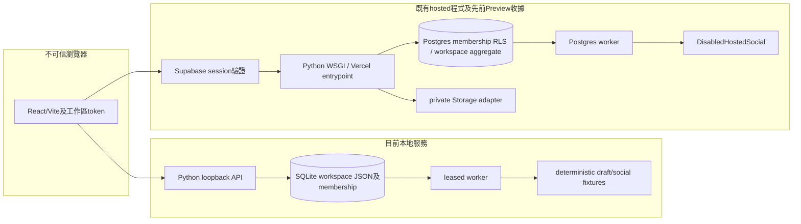
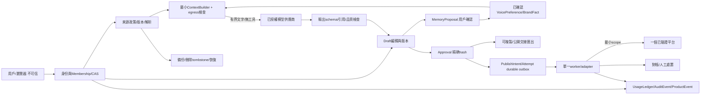
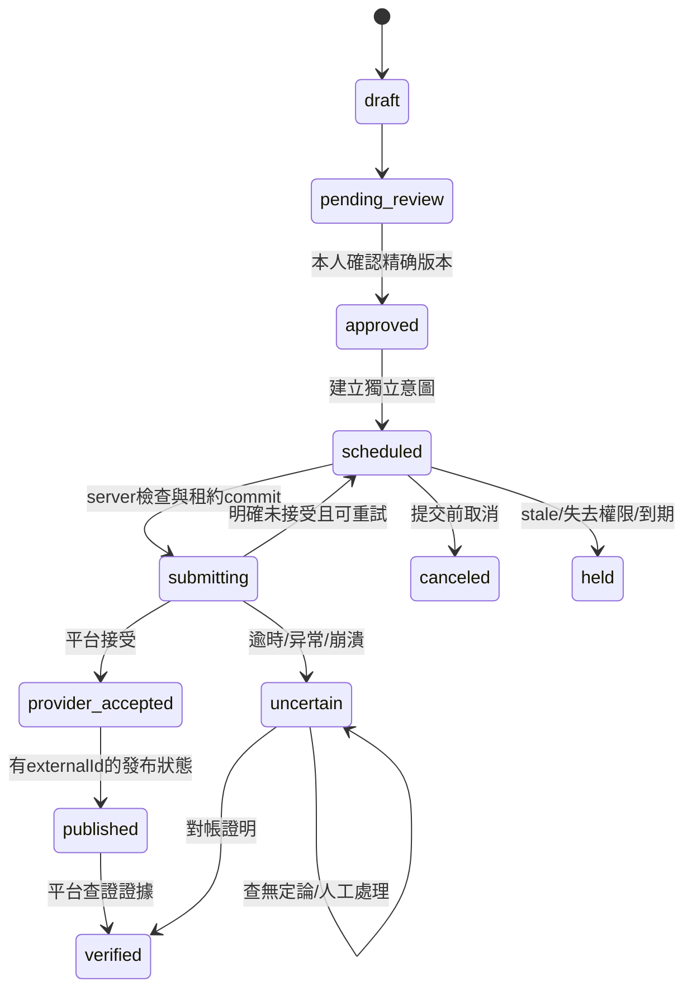

# 產品、資料及可靠性規格

狀態：除 RECEIPT 明列外，以下均為 **候選規格、未實作或未部署**。不以存在 schema／UI／adapter 作完成證据。沿用模組化單體；不用新增微服務、Kubernetes、向量庫或Agent框架。

## 1. 首次與每週流程

### 首次：一個有用任務

1. 首頁「開始一次內容整理」。可查看明確標記的虛構範例；範例不可算客戶激活。
2. 貼上／上傳自己有權使用的一小段素材，設定來源用途和模型外送授權。初期文字20 KB；TXT/MD，其他格式先另行轉文字，不能假裝已解析PDF。
3. 一頁三項：受眾、用途、平台/語言。初始ICP預設英文LinkedIn文字，使用者可改。新增source必须有效且有至少一項批准事實。
4. 可選文字風格樣本；預設「清楚、具體、保留原意」。完整個人檔案、性格與Agent設定後置。「個人聲音」指寫法，不是聲音克隆。
5. 取得一份可編輯首稿，段落旁列sourceId/locator/version；沒有來源的事實標待確認，不能由模型自評變成已核實。
6. 編輯或接受改動，問「你願意使用這份內容嗎？」記錄yes/no/原因。可選「只保存」不強迫產生正面事件。
7. 顯示記憶提議：「原設定→新建議、影響英文LinkedIn開頭、來自這次編輯」。接受／修改／拒絕／僅本次。未確認不改活躍記憶。
8. 複製正文／下載單稿+來源清單；需要真實發布時才連接渠道。帳號只為保存、恢復與成本控制；產品登入與社交登入分開。

報告30分鐘保留為任務觀察窗口。新增候選目標：完成輸入後首稿生成p50≤30秒、p95≤90秒；從開始輸入至用戶判有用中位≤10分鐘、p95≤20分鐘。兩項計時分開；沒有真實provider數據前均未達成。快速 deterministic sample不能算AI效能。

每週工作台：本週素材→待修改→待審核→已完成。顯示到期任務、當前source/voice版本、唯一主要版本、上次採用/拒絕偏好。完成指用戶接受並匯出，不含外部發布。第二語言／平台由明確新增任務觸發，先不製造多個待審版本。

現況差異：Phase2私人export可下載一份草稿的完整JSON ZIP；並非候選的精簡公開交接包。alpha `save`仍要求兩份variants。第一批修安全而未改UI流程；下一批应共用 export policy 避免單稿快速出口繞過來源檢查。

## 2. 當前架構與建議架構

本次沒有檢查正式域名或正式使用者；既有文件記錄protected Preview，不能當本次線上驗證。Phase3 desktop/runtime仍本地施工，独立sidecar/profile/budget permit，不成為首稿前置。

所有模組可在現有Python程序與Postgres完成。外部信任邊界：瀏覽器資料、文件與網頁、模型輸出、平台結果。只有伺服器可選tenant/actor/secret/tool allowlist；模型不持token、不直接啟動worker。失敗點：登入、保存、解析、模型逾時、資料政策變動、quota、平台接受後斷線、worker租約、備份缺素材，各自可解釋，不濃縮為「失敗」。

## 3. 資料模型與權威來源

首期 Tenant≈workspace，每workspace一個brand。個人品牌與公司品牌維持兩個workspace及明確匯入批准，不把加入公司作為資料授權轉移。不宣稱目前aggregate支持公司內任意多品牌隔離。

| 實體 | 关键欄位與約束（候選） |
|---|---|
| Tenant / Membership | Tenant(id,status,policyEpoch)；Membership(tenantId,userId,role,status,version)，unique(tenantId,userId)。角色owner/editor/reviewer/viewer；首期owner本人審稿，editor不可默認獲新團隊發布權 |
| Brand | (tenantId,id,ownerId,kind,version,deletedAt)，unique(tenantId,id)；所有引用composite FK，不能僅用brandId推導可存取 |
| Source | (tenantId,brandId,id,ownerUserId,policy,egressConsent,version,hash,sourceLocator,rightsBasis,retentionUntil,deletedAt,createdAt,updatedAt)；Chunk(id,sourceId,sourceVersion,hash,locator)，版本不可變 |
| Draft / DraftVersion | (tenantId,brandId,draftId,version,text,contentHash,sourceRefs[],voiceVersion,assetVersions[],status,authorId,createdAt)，unique(tenantId,draftId,version)。當前版本CAS，不覆蓋舊稿 |
| MemoryProposal | (tenantId,brandId,userId,id,type,language,platform,context,before,after,sourceRefs[],baseVersion,status,confirmedBy,createdAt,updatedAt,deletedAt)。type=writing_preference/company_fact，後者需已批准事實來源 |
| MemoryVersion | (scopeKey,version,content,status,confirmedBy,sourceRefs[],validFrom,validTo,deletedAt)，同scope只一個active；模型只能写proposal |
| Approval | (tenantId,brandId,id,draftVersion,contentHash,sourcePolicyDigest,voiceVersion,assetDigest,connectorId,providerAccountId,scopeVersion,actorId,timeZone,allowedTimeStart,allowedTimeEnd,expiresAt,digest,status)，immutable |
| PublishIntent / Attempt | unique(tenantId,approvalId,destinationId)；attempt unique(intentId,number)；clientRequestKey unique(tenantId,operation,key)。保存leaseOwner/leaseId/leaseUntil、requestStartedAt、outcome、externalId、lookupEvidence、cancelRequestedAt |
| Connector | tenant/brand/account綁定，identity/scopes/tokenExpiresAt/readVerifiedAt/publishVerifiedAt/capabilityVersion，tokenVaultRef不回傳client，generation看不到 |
| UsageLedger | unique(tenantId,operationId,entryType,sequence)；reservation/settlement/credit，amountMicrousd、quotaUnits、providerRequestId、status、modelVersion、estimatedOrActual。Webhook unique(provider,eventId) |
| AuditEvent / ProductEvent | eventId unique；tenant/brand、actor、operation、resultCode、versions、timestamp、assisted；event不含原文／token。ProductEvent有schemaVersion及實驗cohort，不能以model自評代替useful |

當前state aggregate權威是DB中CAS版本；Markdown/ZIP是可攜副本，不是額外可執行設定。匯入只接受schema allowlist，版本不符拒絕，對舊版以純轉換器產生candidate。`VOICE.md/BRAND.md/SKILL.md`不可授權工具。新增關聯表以additive migration + backfill candidate，先確保owner/tenant外鍵、唯一索引及回滾，再正式遷移；本輪無正式migration。

併發：儲存expectedRevision；同transaction比較policyEpoch/sourceVersion/voiceVersion，寫新版本與outbox。兩個tab冲突409，不覆蓋使用者文字。生成完成時再次比較context hash；過期artifact只能顯示stale，不apply。快取key至少含tenant/brand/model/prompt/policyEpoch/source及voice版本；worker、下載簽名、匯出走同一authorize()/policy projection。

## 4. 四類來源：執行而非標籤

| sourcePolicy | 模型context | 可影響公開草稿 | 派生內容保存 |
|---|---|---|---|
| public_quote（可公開引用） | 有明確模型外送同意才可；local-only仍不得cloud | 批准事實可引用，保留定位及授權範圍 | 可，綁版本、用戶所有、可刪除 |
| rewrite_approval（需改寫／另批） | 有外送同意；只發必要段落 | 只能待審candidate；公開匯出／發布需針對此來源的approveUse記錄，引用不足不放行 | 僅私人candidate，批准後才公開使用 |
| internal_reference（僅內部參考） | 只可在獨立「內部摘要」operation且有provider授權；**公開draft流程完全不檢索** | 不可。避免模型受不可引用資料影響後無法判別洩漏 | 私人內部摘要，不能轉入公開DraftVersion；需另批准來源政策變更 |
| prohibited（禁止使用） | **任何相關生成、檢索、快取回填及profile抽取均排除** | 不可 | 不新增派生；既有派生隔離並等待撤回/刪除政策 |

缺少sourcePolicy或egressConsent的舊資料，預設禁止進公開生成，提出review migration；不能把`private-local`直接解讀為可送雲端。source使用批准與模型資料外送批准獨立。company fact與style樣本各按原owner/語言/用途核對，不從profile observations複製一段受限原文來繞過source policy。

實作順序：①單一`project_context(tenant,brand,operation,provider,source_versions,memory_versions)`純函式；②所有alpha/phase3 managed/file adapters只收projection；③entry和worker雙檢查；④cache/derived IDs/policyEpoch；⑤UI對應選擇；⑥惡意/私密/撤回測試。發布命令絕不在模型tool registry；僅schema輸出草稿。網頁URL是定位，不是事實驗證，也不自動抓取。

### 撤回、刪除與供應商

撤回=停止未來使用並使依賴草稿、memory、待提交approval失效；不假稱清除歷史。刪除=明確流程清原文、chunks/向量、cache、draft snapshots中的受限衍生、memory proposals/versions、匯出暫存與Storage物件；保留不含正文的tombstone/hash必要審計。候選活躍資料刪除72h、備份30天輪替，需按实际合約確認，不能先發布保證。

恢復後先套用 deletion ledger/policyEpoch，再允許生成或對帳，worker預設暫停。已公開貼文需另一外部刪除動作並確認平台限制，不能以本地刪除表示外部已消失。供應商、訓練用途、地域與保留期目前U；在取得真實合約/設定前不說「零保留」「不訓練」。禁止用未授權供應商fallback。

## 5. 審批、發布與恢復

內容與發布狀態分開。公開匯出不等於授權自動發布；私人資料備份也不等於公開可用。

實際代碼`uncertain`對應本規格`outcome_unknown`；`verified`仍有synthetic與live execution標記。每次attempt分開；HTTP200只可以是accepted，不能自動是published。本輪result validator要求發布reference、verified查證方法，但無法獨自證明外部事實，仍依赖已驗證adapter。

manifest綁tenant/workspace、brand、speaker/voice、draft revision+text/language、brief/sourceDigest、asset hash/alt/rights、connector providerAccountId/scopes/capabilityVersion、timezone與時間。變動必須再審。候選時間窗由用戶批准[start,end]，窗內換時間仍記意圖版本，窗外必重批；目前採固定時間與一小時expiry保守行為，尚非彈性時間窗。

提交前server在transaction核對membership、approvalDigest/actor、最新來源、當前draft、取消、quota、capability、expiry。claim/submitting commit作**開始提交的線性化點**：在此之後取消可能已來不及，即使網絡尚未完成，也必顯示「取消已要求，結果待查」。沒有跨平台原子交易／exactly-once保證。若產品要求取消直到最後位元前仍一定生效，現架構不能承諾。

本輪：取消後收到明確pre-acceptance retry回覆時變canceled；對帳回傳scheduled/failed/held均保持uncertain，防重新submit。對帳查不到不等於沒發。unknown若人工證明未發，需單獨存證及新審批；不能修改舊job讓它重試。撤销批准人的已提交工作仍可由最小權限worker對帳，不能把它丟失。

重試候選：429只有明確拒絕且未接受才遵守Retry-After，最多3次，jitter及總時限；401/403/token失效held且需要重新身份/scope核實；明確validation拒絕failed；網絡逾時unknown；worker crash lease到期unknown。5次對帳仍無結果進人工待辦，之後低頻查詢，不盲目重送。優先一個平台，其他匯出。各平台 idempotency/GET查詢能力必按實際API文檔與授權實測，不能從Stripe範例推廣。

OAuth候選維度：disconnected→identity_known→scope_missing/token_expired/reauthorization_required→read_verified→publish_verified；每個timestamp/證據來源/token expiry獨立，capability_version變更使舊批准失效。永不把CLI/browser登入或localhost callback單獨當可發布。

## 6. 成本／計費合約

候選文字operation：一source 20KB；model由server配置；輸入/輸出上限8k/1k tokens；單次45秒、至多兩次、每批預留$0.50（與經濟模型每次$0.30、平均1.25次的保守假設相容；實際依model價格預估再reserve）、每租戶月文字供應商成本$4警戒/$6停止、全局日$5警戒/$10停止。**這些是待價格與品質評估修正的候選上限，不是代碼已實施的額度**。報告100請求不直接當8批次；batch指用戶接受的一份主要內容，修訂/失敗都計成本。媒體默認0，另scope另預算。

小型transaction：鎖tenant/global budget row→扣可用/加reserved→唯一operation insert→commit；外部呼叫後actual settlement→釋放unused。同key不同hash409，同key same返回既有operation；job重送只能取得同reservation。pre-network拒絕釋放；provider結果未知保留reserve、成本記estimated_unknown後對帳；不能因沒有成品把供應商成本記0。候選用戶額度按完成有效artifact扣1，基礎服務失敗退額，但internal USD帳本保留所有成本。不得同時把客服算變動工時與固定全額薪酬。

Billing候選：webhook驗簽+unique(provider,eventId)，plan變更由server價格id allowlist；付款狀態與entitlement分開；cancel_at_period_end保留已付期的export，退款獨立paymentId/idempotency key；取消不立即抹草稿。server reconciliation覆蓋漏webhook。現在沒有billing實作，故並發扣款／真實取消驗證為validation_unavailable。

試用候選：人工協助4週10人上限，或14天自助含2個完整文字循環、無信用卡／無自動轉付費。前者更能學到任務但工時高；後者需安全managed route和quota，不能拿fixture當有效試用。服務式onboarding可另測$99/一次、≤60分鐘、scope固定；服務營收與軟件留存分開，不改現行價格。

## 7. SLO、事件、告警與Runbook

全部為內部候選SLO，**不是付費SLA**。窗口滾動7天（少於100個operation時報分子/分母及原始樣本，不發布漂亮百分比）。

| 觀測 | 分母／候選目標／監測 |
|---|---|
| 草稿保存 | 已驗證有效保存request，99.5%成功；4xx權限拒絕/409另報，不吞掉5xx；server operation log |
| 核心流程 | 合格source+有效quota發起批次，≥95%得到可恢復artifact，provider故障算失敗；用戶有用率另算 |
| 系統首稿延遲 | 所有生成，包括timeout failure另列，p50≤30s/p95≤90s；不要只取成功最快樣本 |
| 队列等待 | 到期且有有效批准job，p95≤60s；無provider啟用前無數據 |
| 發布未知／重複／錯品牌 | attempts中unknown比率；重複/錯品牌/未授權觀察到1件即停相關route，保全最少稽核證據 |
| 單批成本 | 全部生成/重試/解析/索引/媒體/儲存成本 ÷ 使用者接受的批次；0接受時undefined且列失敗成本 |
| 客服 | 每tenant/月、assisted/self-serve、onboarding/重複排障分開；候選成熟Assist≤15分鐘/月，不作對外承諾 |

事件：source_added、draft_requested、artifact_validated、draft_saved、useful_decided、edit_completed、memory_proposed/decided/teachback_checked、export_completed、new_source_return、plan_selected、payment_committed、payment_succeeded、refunded、subscription_retained、cancelled。記 tenant pseudonym、experimentId、cohort、route/model/promptVersion、assisted、serverAt、client elapsed components。禁止記原文、email、token、回調query。activation=同一participant/useful yes+edit接受+能解釋記憶；D7=在首次activation後7x24h內新source再次完成有用內容，分母只含已滿7天者。

告警先用既有錯誤追蹤／每日operator看板，無新SaaS：保存連續3次5xx、成本80%警戒／100%停止、worker heartbeat>2min、任何未知publication>10min、跨tenant異常1次。通知接收人/外部渠道尚未授權，只產生本地待辦，不自動送訊息。

Runbook：①身份/安全紅線停相關寫入/dispatch；②確認事故tenant/time/operation，log遮罩；③確認unknown的外部ID，不重試；④仍可保存/私人export；⑤修復並重跑隔離/狀態測試；⑥責任人決定恢復；⑦記錄根因与有界預防。回應供應商限流先保存內容和manual handoff，不偷偷換供應商。

備份候選RPO24h、RTO4h，正式確認前僅內部目標。本輪可做synthetic local Postgres dump/restore、比較状态與job，不能證明雲端Storage／Auth／金鑰恢復。生产恢复前需database+objects+deletion ledger+vault流程，恢复時worker停用並先對帳，應用不重新submit已有intent。

## 8. 品質與依賴取捨

[quality-cases.json](quality-cases.json)固定8例、版本v1，英文與繁中分開人工評分。檢查來源忠實、未支持主張、風格/自然、平台格式、禁止資料、惡意指令。候選每例硬安全項全部通過、風格/自然4/5且來源正確；用戶願意使用仍另問。現階段只有schema與程式邊界測試；未付費呼叫模型，語意品質為validation_unavailable。新model/prompt按相同版本資料重測，不能用「有輸出」過關。

沒有新增runtime依賴。保留React/Vite/Python的成本是現有維護；SQLite本地易備份，不能部署成多实例共用；已有Postgres服務能給CAS/持久job而毋須新隊列供應商；故障可保存本地/匯出，離開時用SQL dump/JSON/Markdown。Supabase/Vercel實際月費未知，模型$100 infrastructure是預算變數，不是當前帳單。媒體生成、analytics SaaS、新billing及vector服務如需採用，先正式文件/價格/資料條款/失效與匯出退出設計，再提供可審核採購/整合候選。
