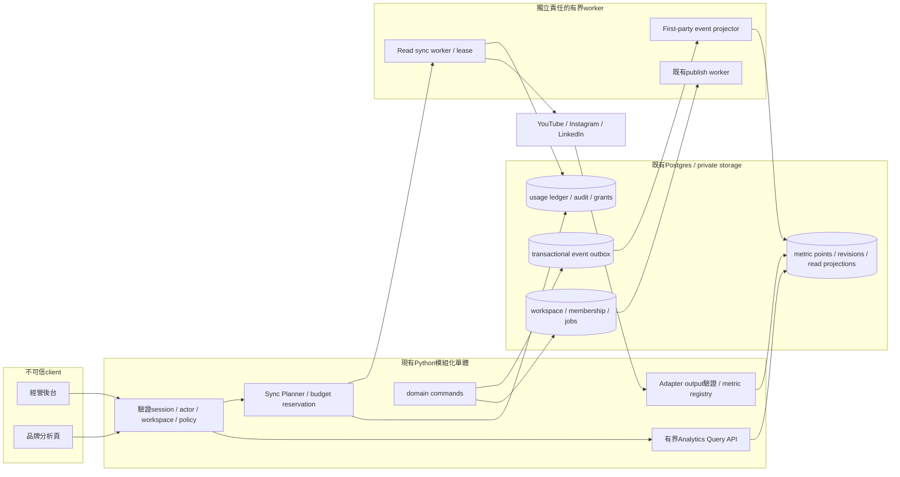

# PostRiff Admin & Social Analytics — 可實作產品／工程規格 v1

**狀態：設計候選；不是已上線後台。** 2026-09-14 當地／2026-09-15 UTC查核。使用 Superpowers brainstorming：檢查現況、比較三方案、選擇模組化單體、一次完整設計檢查。此次只產出規格、合約、示範與驗證；不新增外部服務、不讀取真實客戶內容、不改OAuth或發布。

入口：[互動示範](../../postriff-admin-analytics/index.html) · [平台證據與限制](../../postriff-admin-analytics/SOURCES.md) · [工程合約](../../postriff-admin-analytics/ENGINEERING.md) · [交付及驗收](../../postriff-admin-analytics/DELIVERY.md)。示範數字皆 synthetic；資料模型／API皆candidate。

## 0. 一頁決策

**產品定義：讓James在一個入口回答「PostRiff是否值得繼續投入」與「我獲授權管理的社交內容表現如何」，並能追查每個數字。** 一個入口有兩個權限分離的工作視角：

1. **經營 PostRiff** `/admin`：產品使用、成熟cohort、實付／退款、完整成本、渠道、可靠性。資料來自PostRiff第一方事件及帳本。
2. **管理品牌** `/workspaces/:workspaceId/analytics`：帳號、帖文、原生平台指標、資料更新狀態與素材到成品的追蹤。James選自己的品牌；客戶選自己有權查看的workspace。`platform_owner`本身不授予所有客戶的社交成效或原文。

用戶已指定首期 **YouTube、Instagram、LinkedIn**。工程順序先完成YouTube一條**讀取分析**端到端connector，再接Instagram與LinkedIn；三者均需真實帳號資格核實。英文LinkedIn仍是產品內容試點的用途，兩者不混淆：LinkedIn草稿可先匯出，不需要等LinkedIn分析API審批。本次平台選擇已確認；並不等於批准擴大OAuth、平台API支出或上線，沒有啟用任何平台。

首期五個高價值頁：經營總覽、社交成效、帖文詳情、連接與資料健康、成本／用量。產品留存及收入頁隨第一方資料成熟逐步開放；未接入時明確顯示「尚未計量／尚未接入」，不能填0或示例數字。

**最重要三項工程選擇**：①平台指標保留原生定義與條款能力，不能任意相加；②交易事件outbox與分析讀模型分開，不在頁面載入時呼叫平台；③平台管理權、workspace權及帳號資料授權分別檢查，不建立可任意SQL查全客戶的superadmin捷徑。

## 1. 報告如何變成後台功能

| 報告結論 | 後台設計回應 | 決策與驗收 |
|---|---|---|
| pp1–6 窄但可行；素材→有用稿→編輯→記憶→七日再用 | 首頁首位是「成熟用戶有用內容循環」，不是註冊/曝光總數；有用由作者yes/no判斷 | 每個比率可展開事件、分母、觀察窗口及assisted；sample/fixture不計 |
| pp7–14 ICP未確定 | cohort附ICP版本、主要任務、語言、平台、頻率、招募來源 | 教育者／顧問／小企業分開；n小呈人數，不排名宣告市場勝出 |
| pp15–18 首稿前設定過多 | 追蹤onboarding每步、首次有用稿全任務時間、阻斷原因 | 生成延遲與人的整理/編輯/核對時間分開；Analytics連接不成首稿條件 |
| pp19–21 貢獻未覆蓋全部成本 | MRR、實收、直接貢獻、含客服/創辦人工時的經營結果各一欄 | 每一成本只計一次；缺成本顯示不完整；服務收入不入MRR |
| p20 Bullish摘要衝突 | scenario在獨立「試算」頁，標seed不可得與原值差異 | 報告36月Base186客/$5,581/$4,026全為模擬，不進live tables |
| pp22–28 差異化靠少返工、可糾正記憶、可靠審批 | 帖文詳情可追到來源/版本/記憶決策及發布證據 | 高互動不能自動變為永久聲音偏好或新公司事實 |
| pp29–33 四週門檻 |「試點判斷」顯6/10三週有用、配對編輯−30%、4/10選價格；實付另列 | 未滿28天pending；10人只支持下一筆有限投入；不是PMF或盈利證明 |

證據類別：V本次程式檔案／檢查；R原報告模擬；E官方文件；P新候選；U未知。以下未標V/E者全部為P，不是已觀察成效。

## 2. 現況：從哪裏接入

實際根目錄`/Users/ouxianxing/Documents/James-Au-Studio`，無`.git`；本次再查Git狀態為`validation_unavailable`。沒有適用額外AGENTS.md，沿用用戶規則。程式有並行工作，故本輪不改runtime/UI。

| 已驗證程式 V | 可重用 | 需要補的邊界 |
|---|---|---|
| `studio/web/src/founder/FounderApp.tsx` Analytics/Audience是Placeholder | React/Vite、現有版面、workspace操作 | 沒有live analytics，不把sidebar項目當成完成 |
| `src/postriff_phase2/hosted.py` principal從verify_session取得，membership＋CAS aggregate | verified identity及workspace授權模型 | `get()`鎖完整workspace；分析需小型read query，不鎖讀整份私人state |
| `migrations/postriff/001_phase2.sql` pr_workspaces/pr_memberships及RLS；一workspace一brand | 現有Postgres與索引 | 不直接把analytics EAV塞入state JSON；增加專用schema及read projections |
| `src/postriff_phase2/store.py` manifests/jobs/attempts、上一輪安全修復 | 來源/批准hash、狀態與unknown對帳 | analytics只能消費狀態，不得重用發送worker作資料同步 |
| `src/postriff_phase3/worker.py` permit、running allowance reservation及providerCost未知 | 真實工作attempt與usage provenance來源 | 不是完整USD總帳；事件只記metadata，不能把token缺失当0成本 |
| `src/james_au_social/analytics.py` immutable observation、可比cohort、missing與causality=false | 比較邏輯與不做因果推論原則 | 這是另一套legacy SQLite記錄，沒有租戶鍵；**不能直接掛到SaaS API**。整數非負限制不能表達signed delta/ratio，且要求verified_published會排除原生發帖匯入 |
| `api/index.py`、`src/postriff_phase2/hosted_app.py` hosted WSGI | 既有部署入口 | admin獨立授權middleware、query API、對照測試及route feature flag |

PDF SHA-256與上輪一致：`4ead7524b84a7ee3512e7d1325d295fcce995b41a63c7edc5622c52c4a6366e7`，33頁；上輪全文已讀，本輪重查相關頁提取文字。原始seed仍source_unavailable。真實MRR、平台應用審批、insight token、API預算、客戶同意均U。

## 3. 三個方案與選擇

| 方案 | 優點 | 代價與退出 | 判斷 |
|---|---|---|---|
| **A 現有app＋模組化Python API＋Postgres分析表＋小worker** | 沿用身份、RLS、部署；source到post可追；平台policy可精確控制 | 自己維護adapter/metric registry；保留SQL/CSV匯出可退出 | **推薦**。服務少、授權可測、初期不添新供應商 |
| B 外部BI接資料庫＋輕量同步 | 通用圖表快 | 新採購、service credential及租戶嵌入風險；細粒度平台policy/互動流程仍要自建 | 暫緩。待穩定讀模型及複雜臨時查詢確有需求，再作受限view候選 |
| C 獨立admin app＋warehouse＋streaming | 大規模分析分離 | 額外身份/部署/數據複製/刪除鏈；一人維護不划算 | P2。容量證據達標才考慮；本次不推薦新平台/新採購 |

不以「完美」代表無限功能：首期不用即時全網爬取、粉絲名單、統一影響力分數、多Agent分析、自動改記憶、通用任意SQL、廣告投放或社交發布按鈕。後台的refresh只讀同步，不能獲得發布權限。

## 4. 使用者、權限與兩個視角

### 4.1 角色

| 能力 | platform_owner | ops_analyst | support_operator | workspace owner/editor/analyst/viewer |
|---|---|---|---|---|
| 全站第一方產品匯總 | 可 | 可，pseudonymous | 支持所需健康摘要 | 不可 |
| MRR／全站成本 | 可 | 需finance.read | 不可 | 只看自己方案/用量；不看內部margin |
| 某workspace社交成效 | **需其membership＋帳號分析授權** | 同左 | 限時support grant且平台允許，預設不可 | 對應analytics.read＋帳號授權；viewer不預設可export |
| 草稿／私人素材正文 | 需原本workspace內容權限 | 不可 | 單次同意、明確理由、到期、稽核 | 按內容權限，不因analytics.read取得 |
| 連接／重新授權 | 自己有channels.manage的workspace | 不可 | 可引導，不取得token | owner；editor需明確授權 |
| 重跑資料同步 | ops.replay或自己analytics.refresh，受quota | 可在授權scope | 僅read job，非publish | owner/editor按refresh權限 |
| 暫停高風險route | 可，reason＋audit | 無 | 可告警，不能恢復route | owner只暫停自己connector |
| 管理員授權／退款／刪除 | step-up、preview、明確操作權；首期退款僅轉付款系統 | 不可 | 不可 | 客戶只能自己的取消/刪除申請 |

role不是client傳值。`platform_owner`從獨立server授權表配置，初始owner按驗證後Auth user id離線候選設定；不以email suffix、第一個註冊人、JWT user_metadata或網址參數升權。MFA/step-up需確認現有Auth配置；未到位前不開正式admin。高風險操作session最近驗證≤15分鐘為候選。

### 4.2 同一個James，兩個工作情境

「經營PostRiff」顯示第一方產品與商業數據。「我的品牌」選James擁有的workspace，顯示該品牌授權帳號。不能在全站頁列全客戶社交觀看數；營運統計例如connector數/同步錯誤不含平台指標正文。以owner身分進客戶工作區仍要正式membership／資料擁有人允許，並遵守平台資料接收人規則。

support grant：workspaceId、requester、approver、allowedResources/fields、purpose、expiresAt≤60min候選；只能預定查詢，不能impersonation拿客戶session；一鍵撤回使cache/export/job權限epoch立即失效。若平台條款不准，即使grant也拒絕。

### 4.3 首頁上下文

顶部永遠顯示「視角、品牌/帳號、日期、資料時區、execution」。跨視角切換清除舊結果、取消in-flight fetch、重查授權；URL深連結不帶秘密。default production只live；synthetic示範在獨立路徑與常駐橙色標記，禁止混入同一聚合。

## 5. 資訊架構與頁面規格

### 5.1 導覽

**經營PostRiff**：總覽／使用與留存／收入與成本／獲客與試點／系統與資料健康／稽核與設定。

**品牌分析**：成效總覽／內容表現／帳號與受眾／來源與內容循環／連接與同步／匯出。

首期只露出已可用頁；無資料不是隱藏問題，顯示連接需求、最後成功日期和下一步。進階候選頁使用「尚未啟用」說明，不造假折線。

### 5.2 共用元件與交互

- FilterBar：最近7/28/90天、custom；同長上一期可選；platform/account/type/language/content origin；日期inclusive輸入轉[since,until)；90天以上非同步報告。state在URL，私人搜尋字串不放URL。
- MetricCard：value、unit、來源、最後完整日期、freshness、coverage、n/d、definitionVersion；可按「這個數字如何計算」打開drawer。缺資料顯`—`+原因，0只能為已量到0。
- SourceDrawer：原生metric id、scope、有效日期、api/adapter版本、查詢hash、observedAt/period、樣本、平台定義URL；一般客戶不見raw payload或token。原始證據僅server內部。
- Table：server keyset pagination 50列，最多200；固定排序tie-breaker id；null列最後且不列榜首；Column chooser、keyboard、sticky header。搜尋只scope內metadata，不搜全客戶原文。
- Chart：同單位、同metric version、同time basis才同圖；缺資料断線，延遲尾端斜線；legend可鍵盤；有表格替代；比較期間未完整則不顯percent uplift。
- ActionDrawer：列受影響account/job、範圍、估計請求/成本、合法下一步；refresh與retry不同。取消後清楚說明是否已有request在外部執行。
- 權限錯誤採統一404/403不洩漏資源是否存在；session失效清除私人cache；stale資訊能看但禁用依賴新鮮度的操作。

### 5.3 A1 經營總覽 `/admin`

**每日3分鐘要作的決定**：有安全事故嗎？用戶做出有用內容嗎？支出是否超線？

1. 最上方exception strip：未授權/跨租戶警報、unknown publish、成本hard stop、資料pipeline停止；最多3條，進incident。
2. 核心cards：本週有用內容用戶數；成熟D7 n/d；實際付費workspace與MRR；直接現金貢獻及完整成本狀態。缺billing或support時顯不完整，不用表面MRR當profit。
3. source→draft→useful→memory choice→export funnel；每步unique task/users分開，不以event數湊人數；window與assisted切換。
4. 需關注workspace：匿名ID、最近成功operation、用量/錯誤、support分鐘；點入健康概要。原文需另一權限。
5. 結尾「本週決策」：observed fact、解釋hypothesis、負責人、下一個實驗、deadline；人工填寫，不由LLM自動決定停售或改價。

驗收：日期filter換後分母一致；fixture0混入；所有卡片可追到predicate+asOf；沒有all-customer SNS總曝光。

### 5.4 S1 品牌社交總覽 `/workspaces/:id/analytics`

- 顯示已授權account卡片，每個獨立：原生views/impressions/reach（有哪個顯哪個）、原生互動項、粉絲snapshot／原生新增減少、最後完整日期。
- 首次進入：無連接→「連接分析」及「匯入原生報表」；scope缺少→列所需分析權限、保留其他可用指標；token過期→需重新授權；無帖文→0篇已檢索，未有成效資料。
- 跨平台只**並列**，不預设統一views總和/獨立觸及/綜合engagement rate。相同品牌不等於觀眾去重，同一人可能在多平台。
- 跨帳號合併受policy aggregator控制；YouTube初期只顯選中單一channel的原生reports結果。API提供的channel total不可再加video totals。
- 預設過去28個完整原生日；partial最近日另區。同期比較對YouTube先呈兩個原生期間值，衍生百分比只在額外政策許可verified後開啟。
- 本週內容清單及「平台資料未完整」列表優先於漂亮排名。首期沒有自動內容策略或最佳發帖時間保證。

驗收：Instagram missing reach不顯0；YouTube與LinkedIn指標不同label；沒有所有平台的unique audience。

### 5.5 S2 內容表現 `/analytics/posts`

欄位：post標題/安全縮圖、platform、account、native type、language、publishedAt、content origin、platform availability、link confidence、metric值、window、freshness。可按原生metric排序，同平台同類型範圍；排序標明lifetime或發出後7天，不把老帖與新帖混為公平比較。

content origin=`postriff_published`、`postriff_export_linked`、`native_imported`、`unknown`。列表包含原生發帖，**不要求必須由PostRiff發布**。發布workflow status與platform object存在狀態分開；手工填permalink只是user_reported，API確認account/post identity後才verified link。

合理比較需相同platform/account/native type/language/age window/promotion status及definitionVersion。沒有同齡資料則灰色「不可公平比較」。候選樣本<5不排行、5–19只描述、≥20仍不作因果推論；門檻P不是統計保證。YouTube自建統計/排名/分數受policy gate，不因樣本足夠自動允許。

### 5.6 S3 單帖詳情 `/analytics/posts/:postId`

五個tab：

1. **成效**：原生曲線/快照、原生分項、可取得的受眾/觀看指標；每數字可追來源。Metric delta若平台容許計算才出現，不叫daily impressions。
2. **內容來源**：來源metadata/授權版本→DraftVersion→approval manifest→PublishIntent/Attempt→external object；原文按獨立ACL，沒有來源可顯「原生匯入」。
3. **發布記錄**：submitted/accepted/confirmed/unknown的真實收據；analytics找到external object可供人工對帳，不自動觸發重送或修改批准。
4. **工作量**：整理/等待/編輯/核對/匯出時間、assisted；客戶見自己的task time，內部provider dollars需finance權限。
5. **學習筆記**：人填「觀察→可能原因→下次實驗」，保留confounders；可提出memory proposal，但不能因高views直接寫入active voice。模型分析默認關閉，將來需model資料用途與成本授权。

動作：開原生帖文（allowlisted HTTPS、noopener）；查看授權來源；建立新草稿（另一內容功能）；匯出scope內報告。沒有直接「再次發布」按鈕。

### 5.7 S4 帳號與受眾

帳號首頁：穩定providerAccountId、展示名/handle（可改）、最後驗證、API能力分項、followers snapshot原生值。followers stock不可按日加總；有明確provider流量型 gained/lost才計該項。若只有兩個snapshot且政策允許，顯「兩次觀測之淨差」，保留負數及觀測gap；不能捏造follow/unfollow逐日行為。

受眾只用provider提供的aggregate分布，顯privacy suppression／threshold；不抓粉絲名單，不做跨平台人員identity matching，不推論敏感屬性。國家/年齡/性別等若平台不提供或被抑制就不可顯示。first release可只顯country/source/device在支持的原生report中；小cell和取餘反推一起遮罩。

### 5.8 A2 使用與留存

提供產品任務cohort與付款cohort兩tab，不混同訂閱者/使用者。篩選ICP version、語言、用途、platform、assisted、招募渠道、signup/activation week。

核心表：eligible starters→activated；D7 matured；四週3/4 useful；memory understood/corrected；user useful yes/no；baseline/edit/total time配對；退出原因/未回答。每率n/d＋excluded原因；新來的未成熟用戶pending。

Report gate固定標R；新目標標P可version化。至少10activated、6人在四週3週有用、paired median edit−30%、4選同一offer價格，各自獨立顯示，實付/退款後仍保留另列。不能因四個gate其中一個達到就叫「已通過」。

### 5.9 A3 收入、成本及單位經濟

分「已核實交易」「未結算/estimated成本」「情景試算」三視圖；default交易。MRR from subscription entitlement/price normalized，不從invoice payments簡單相加。cash collections、退款、fees、direct paid service contribution、trial cost、sales/acq、fixed infra、salary、unpaid founder time各有來源及coverage。

顯示同一currency，未有FX資料就分幣種，不隨便相加。subscription MRR、創作者YouTube估算收入、一次性onboarding收入三種不同數據域；不得合成PostRiff MRR。

每成功批次成本=該cohort所有生成/失敗/重試/解析/向量/儲存/媒體/分析同步成本與支持可歸屬額÷user-accepted batches；分母0則undefined並列失敗成本。直接可歸屬成本與固定共用成本分開，allocation_method version必顯示。營運總帳扣過的CAC不能再扣一次。

cash/經濟cost tab一致使用ledger line id避免雙扣。Support記work category、duration、paid/unpaid、rate version、scope，不能同一分鐘同時計固定薪酬全額和變動cost。缺support量測就完整經濟結果`incomplete_costs`，不label profit。

### 5.10 A4 獲客、試點與歸因

first qualified touch、self-reported source、referral code、campaign UTM、cohort payment逐級；未有permission不蒐集任意visitor個資。P0/P1先manual招募管道表＋自願第一方事件，不加第三方tracking SDK。

CTA由PostRiff自己的landing導向trial，click→signup→activation→selected plan→paid→retained_after_refund各自有數據。UTM不能證明因果；post帶來點擊不等於帶來付費。社交平台點擊數與自有站observed訪客不必相等，差異顯method+coverage。

「興趣」「口頭意願」「選方案」「承諾付款」「成功收款」「退款後保留」明確state，每個stage可回退/取消，有event history。全成本CAC按cohort/channel歸屬；0轉換undefined。漏斗capacity用可觸達合格池、每週工時與回應率，不拿followers當合格客源。

### 5.11 A5 連接、同步與系統健康

每帳號顯：identity/scopes/token/read_insights/publish獨立狀態、last attempt/last success、availableThrough、lag、next run、budget剩餘、api/version。只顯scope名稱，不顯token、client secret、完整callback query。

同步job詳情：partition、window、cursor、attempt、lease/fencing、error taxonomy、retryAt、dedupe key、actual requests/resource counts、estimated/settled cost；可預覽一次backfill的calls上限與data window。全局平台故障整合成一個incident，避免每個tenant各發通知造成轟炸。

發布unknown與read sync failure獨立queue。支援pause sync、cancel未claim的backfill、修正CSV mapping、人工核對post link；不允許任意重播已submit的PublishAttempt。所有有外部成本的refresh受已配置budget授權；0预算時回`budget_not_authorized`，不是偷偷呼叫。

### 5.12 A6 稽核、匯出及設定

Audit可按actor、workspace、resource、action、reason、結果filter；不包含原文/secret。範圍擴張、CSV匯入、指標定義改版、support grant、export、route pause/resume有audit。

報告匯出CSV/JSON先做，PDF排P2。filename安全；CSV公式字首`=,+,-,@`文字欄安全處理，數值欄保留型別。export包含filter、definitionVersion、timezone、freshness、null reason、source、generation time；async下載完成與取檔當下均重查權限。signed URL不是唯一授權，優先短期download ticket經server驗權讀Storage；取消/刪除/grant撤回使ticket失效。

不自動email報告或建立通知。設定只允許明確白名單：時間/貨幣顯示、合法同步頻率、上限、内部告警目的地候選。新增外部通知、付費和權限需要具體批准。

## 6. 社交指標合約：每個數字都有原生意思

### 6.1 統一的是資料結構，不是指標定義

每個值必有：`metricKey/definitionVersion/nativeMetric`、`workspace/account/object`、`scope(account/post/media)`、`period/grain`、`unit`、`value/status`、`observedAt/availableThrough`、`sourceKind/execution`、`coverage`、`apiVersion/adapterVersion`、`consentVersion/policyVersion`、`queryHash/evidenceRef`。

- namespace例：`youtube.views`、`instagram.views`、`linkedin.IMPRESSION`。不能偷偷映射成一個可跨平台相加的`views`。
- `sourceKind=provider_api/native_export/manual_entry/first_party`；`execution=live/synthetic`。CSV也可能是synthetic，兩維獨立。
- `valueStatus=measured/not_connected/scope_missing/not_supported/not_applicable/pending_provider/suppressed/stale/error/deleted/unavailable`。只有measured可為0；未知必null。freshness與coverage獨立，stale可帶lastKnownValue，但不能假装新值。
- counts用int64序列化decimal string避免JS溢位；money用currency＋整數microunits；ratios用decimal string及分母；負數只容許明確delta/net/adjustment類型，不把負修正截成0。
- rolling/non-additive（reach/unique viewers/ratios/followers stock）不可SUM。daily flow只有不重疊、完整、原生可加且policy允許才sum；period total與daily不可同時計。時間窗/metric版本不同不合併。
- lifetime snapshot只代表觀測時點，不能把100→140自動當某自然日40次曝光；若允許算delta，必標「兩次觀測之淨差」，保留missing spans與corrections。YouTubederived未qualified時不計delta/自建ratio。

### 6.2 時間與比較

`publishedAt/observedAt/ingestedAt`用UTC；`providerPeriodTimezone`保留原生時區。原生按日聚合不能移到使用者時區後重新分日；頁面把「你在Indianapolis查看」和「此YouTube日期按America/Los_Angeles」分開。

Google文件明定YouTube報表日採Pacific，包括DST23/25小時；query回傳可能早於requested end date。規格以回傳實際coverage為準，不把缺最後兩日補0。見[官方dimensions](https://developers.google.com/youtube/analytics/dimensions)與[reports.query](https://developers.google.com/youtube/analytics/reference/reports/query)，查閱2026-09-15 UTC。

對齊規則：rolling28天選完整原生日；比較期同長、相同capability/definition版本；post-age7天只在可取得與可使用此窗口時比較。遇到平台指標定義改變（如views計法）新version與break marker，不能回寫舊series成相同定義。native dateRange exclusive/inclusive由adapter明確轉換，禁止共用猜測。

### 6.3 首期三平台

完整scope和endpoint見SOURCES；**下表「可設計接入」不等於本app已拿到資格**。

| 平台 | 首期帳號及指標 | 專屬限制與降級 |
|---|---|---|
| YouTube | owner授權channel；reports.query原生views、engagedViews、watch minutes、average duration、likes/comments/shares、subscribers gained/lost，按report支持組合 | identity/read-only資料權與analytics scope獨立；monetary另外授權。只使用API支持的query；thumbnail CTR／Studio專有細節未核實則不承諾。跨owner彙總/衍生指標有policy gate |
| Instagram | professional Business/Creator；目標account/media views/reach/likes/comments/saves/shares等可用項 | Meta原站本輪抓取受限；官方collection確認professional帳號與Facebook Login連Page差異，**精確insights permission／metric/version尚待資格核對**，registry標disabled。consumer帳號顯不支持此候選route；可用原生授權匯出 |
| LinkedIn | authenticated member的posts與profile/follower analytics先行；organization為另一adapter資格 | `r_member_postAnalytics`與Community Management access；TOTAL/DAILY依metric/target不同。不能用w_member_social取代分析scope；Page權限不等於personal。缺審批可匯入原生報表，來源清楚 |

YouTube scope proposal包括`youtube.readonly`（reports方法目前notice要求）與`yt-analytics.readonly`；不用`youtube`管理scope來繞過最小權限。Google reference與範例scope文字有不同完整程度，接入前用本人授權一次只讀query驗證，不以舊token假設可用。

LinkedIn文件同頁同時列不同版本的metric與例子；`MEMBERS_REACHED`、LINK_CLICKS等不支持DAILY，單post IMPRESSION亦有不支持daily提示。首期最穩的單帖路徑採TOTAL；不把daily impression chart列必達功能，必以版本固定的allowlist＋合約fixture＋live資格測試啟用。

### 6.4 平台政策能力不是裝飾

`ProviderPolicy`包括allowedRecipients、crossAccountAggregate、derivedMetricsAllowed、historicalStorageAllowed、refreshWithin、deleteWithin、metadataRefresh、reportingTimezone、version、qualifiedEvidence。

YouTube預設：單授權channel原生值，無跨客戶聚合、無自製成效分數/比率。Google的進階衍生與較長統計保存政策需經審核及接受附加條款，**不能只因文件存在就啟用**；metric metadata、用戶撤回、刪除規則仍適用。完整政策出處與待查核點集中於[SOURCES](../../postriff-admin-analytics/SOURCES.md)。此設計採保守預設，並不是宣稱已取得Google批准。

未通過policy的操作在query層返回`POLICY_BLOCKED`、UI有原因；不能只把按鈕藏起。即使是本公司自己帳號，也不能把同email／品牌認定為Google認可content owner授權。其他平台policy未核實，衍生／cross-account聚合預設關閉。

### 6.5 人工／原生報表匯入

官方原生CSV匯出可作權限/平台失效時fallback，不能藉此繞過資料用途限制。流程：選workspace/account→核對自己有权提供→上傳≤5MB文字CSV→隔離parse→偵測schema/version與時區→預覽mapping/新增/重複/冲突/來源→確認→async匯入→audit。未知column不自動guess，紅旗列必修。

匯入包含source file hash、exportedAt、report period、units、delimiter、encoding、source tool/version、mapperVersion、uploader、rightsAttestation。沒有可驗證providerAccountId時標manual/unverified mapping，不成API verified。API與CSV同metric不相加；預設API current，CSV獨立series，有衝突列差異與review。沒有同意外送時CSV不送模型。無法取得真實格式本輪只提供內部canonical template，不假稱它是三平台原生CSV格式。

## 7. 第一方產品事件與報告門檻

### 7.1 最小事件字典

server authoritative：`source.accepted`、`generation.requested/started/completed/failed`、`draft.saved`、`memory.proposed/decided/revoked`、`export.completed`、`publish.intent_created/status_changed`、`connector.capability_changed`、`usage.reserved/settled/released`、`payment.succeeded/refunded`。

human/client report：`task.started`、`task.timing_reported`、`draft.usefulness_decided`、`memory.teachback_recorded`、`offer.selected`、`exit.recorded`。client只能經domain command改合法resource後，由server產event；不能POST任意payment.succeeded或actorId。操作者記錄assistance role/分鐘，human結果不代表獨立驗證。

共同欄：eventId、schemaVersion、operationId、aggregateId/revision、taskId、workspaceId、pseudonymousParticipantId、occurredAt、receivedAt、assistedMode、execution、experimentId、source、context版本；不放email/正文/prompt/token。userId到pseudonym mapping存權限更窄的表。

既有mutate成功與event outbox**同一DB transaction**寫入；成功但outbox失敗要rollback，不允許工作已保存但event永久遺失。consumer至少一次投遞，`unique(event_id,consumer_version)`去重；late/out-of-order用domain version順序，重建projection不再發送外部動作。local資料默認不上雲；使用者選擇同步telemetry範圍後才上傳metadata，dedupe/device sequence及刪除tombstone同步。

### 7.2 精確分母

| 指標 | 定義／窗口／排除 |
|---|---|
| activated | participant第一次在真實task有useful=yes、保存接受版本、完成memory選擇且能解釋；可拒絕記憶，不強迫接受。沒有memory建議的流程以教學理解記錄取代；按activation_definition_version固定 |
| activation rate | cohort中上述activated / 已提供合格素材並開始試點unique participants；另報邀請/同意/開始，不能混分母 |
| D7 return | 首次activation後(0,7×24h]以**新素材**完成第二個有用task的人 / 已完整觀察7天的activated；尚未成熟pending；不同device不多算 |
| 4-week repeat | activation起[0,7)、[7,14)、[14,21)、[21,28)四段，有≥3段至少一個user-useful新task；分母已成熟activated、n≥10才顯報告門檻達否 |
| time saved | 同participant/相近難度用途的baseline與試點task配對，(baseline−trial)/baseline後取median；baseline0不除零，另列絕對值；完整task時間和edit時間分開 |
| price selection | 同一offerVersion展示的activated中選付費的人；對報告門檻另列全部10activated是否均看到offer，不以未展示者排除造高比例 |
| paid retained | cohort實付後指定30/60/90天仍有付費服務權益、refund status明確；未成熟pending。payment committed不等於success |

task計時候選：總wall-clock與active editing分開；focus heartbeat每15秒、超60秒無互動/失焦停止active，maximum task session2h提示確認。client上報屬estimated，記offline/paused；self-reported baseline另標。不能只量textarea打字時間當全部返工，也不在背景tab累加客服分鐘。

## 8. 收入／成本帳本與同步單位經濟

`LedgerEntry`至少有workspace、operation/attempt、category、quantity/unit、currency、unitRateVersion、amountMicros、estimated/actual/unknown、source invoice reference、allocatedAt、idempotency key、correctionOf。更正追加reversal/adjustment，不改已結算行。成本先reserve後settle；provider未知保留reserve並另列暫估，不因UI沒有輸出釋放為0。

**相依規則：D0/D1先完成最小budget reservation/settlement與hard stop，任何有費用的adapter才可運行；D3是把完整成本分類及經營介面補齊，不是把安全預算延至D3。** 未定價/未授權一律不呼叫。

分析讀API成本也是直接成本：按account/platform/metric job追蹤resource returned與request units（有些按resource計費，不以HTTP次數一概計）。tenant budget＋全局provider budget鎖定預留，批次每頁先查餘額；未定rate card則blocked/no paid call。全球資金上限不能被100個tenant並發繞過。

候選同步預算用公式而非假報價：

`monthly_cost = fixed_provider_access + Σ billable_resources×rate + request_fees + storage_growth + support_hours×hourly_rate`。

**容量示例（P，不是API保證）**：10workspaces×3accounts×30tracked posts×12metric observations×30daily snapshots=324,000 metric rows/月；以含索引2KB/row約648MB/月，90日≈1.94GB，未含備份/raw。window重查若存每fetch revision會更多，必設no-change hash去重。100workspaces同配置約3.24M rows/月；達容量前再決定partition，不先買warehouse。

最多20個recent post/account每日有界更新；冷帖週更、平台回溯上限外不拉。若按每post×metric收1call，3accounts×20posts×5metrics=300calls/workspace/day，**可能超LinkedIn Development配額**；planner必按實際account/app bucket裁切，而不是把全欄位設每小時。

X屬P2的成本警示：官方目前標post read $0.005/resource；10tenant×30posts×30days為$45/月純讀post示例，其他calls另計。Owned Reads優惠有developer-app owner等條件，不套給所有客戶；不依賴去重避免超預算。這不代表選用X或批准花費，出處見SOURCES。

候選launch limits：每workspace≤3accounts、初次backfill≤90原生日且provider實際更短取更短、每manual refresh 15min cooldown、per-account sync concurrency1、全局4；raw payload≤1MB/response，reports rows≤50k/job。實際billable budget預設0 until具體批准；本輪無花費。

## 9. 同步架構與可靠性

實際responsibility separation：read adapters不import publisher，不接受publish tools；query不接credential；成本planner不持內容body；worker只可取本job/account最小token用途；admin metrics query不scan pr_workspaces.state。可以同repo同部署API，不要求每盒一個service。

### 9.1 定時與backfill

頁面只查已保存read model，freshness顯示最後完整資料。worker透過host已授權的排程運行有界批次，不在Vercel request回應後賭process繼續；若host尚無scheduler，先本地/人工安全run，標沒有自動同步。本規格不新建cron或採購。

initial connect順序：verify token與stable account→允許的metric capability probe→最多90天discover metadata→窄7天insights先顯示→分頁background backfill→report coverage。每platform/account/metricFamily/timeWindow有checkpoint，failure不使其他platform消失。

ongoing候選每日2次metadata/必要insights、最近7天overlap補延遲、8–30天週重查、其餘按policy refresh deadline；不同metric unavailableThrough獨立。沒有數據更新webhook的API不假設有；有webhook先驗簽、去重，僅作refresh hint，非metrics真相。

### 9.2 durable job

states：`queued → claimed → running → succeeded/partial/retry_wait/auth_blocked/policy_blocked/budget_blocked/dead_letter/canceled`。job key含workspace/account+consentEpoch+adapterVersion+report family+window；same key存在active時返回同job。

lease持owner/generation/until；claim用row lock SKIP LOCKED；完成寫入時比較fencing token及最新consent epoch。worker crash後safe read可有界重做，**仍可能重複產生供應商讀取費**，因此先對帳或保留reservation，不聲稱read只計一次。重複page upsert不重複metrics/ledger，更新cursor與point同transaction。

429：遵守Retry-After、按account及app bucket暫停，full jitter、最多5次或24h總時限；401 invalid token→auth_blocked一次refresh singleflight；403 scope/policy→blocked不熱重試；5xx/timeouts→read retry_wait；malformed/field change→quarantine+schema incident；pagination循環/empty頁有next cursor超2次→終止partial人工核對。只重跑允許read endpoint，不泛化給publish。

取消：未claim直接cancel；inflight標cancel_requested，無法收回已發HTTP；回覆落地前新查consent/epoch，撤權後不保存或展示新metrics，只存最少合規cost/audit。重連newaccount不同providerAccountId→new connector，不能把新帳號資料接在舊series。

### 9.3 資料質素與修正

原生counter下降可能是平台校正/刪除/不同query，不一律当錯；保存revision及reason，展示更正標記。取得較旧query result不能覆蓋較新observedAt。invalid rows隔離，不默默丟掉而報100%coverage。

完整度分開：discovery coverage（找到了幾多頁/物件）、metric coverage（已查目標/應查目標）、period completeness（provider availableThrough）、identity confidence、data freshness。未知分母不得顯100%。比較卡顯示「10/12篇可用；2篇缺scope」，不把2篇補0。

## 10. 資料治理、安全及刪除

- 來源／post文本／CSV／provider response均不可信。解析無eval/宏；HTML escape；URL allowlist，不做任意server fetch；若支援web reference需阻擋private IP/DNS rebinding/redirect crossing。原生post URL不能單憑字串成verified。
- Token只在加密server vault，job存reference。token rotation/refresh singleflight＋CAS；去標識log，never logauth header/callback query/raw provider message。代碼例只用synthetic IDs。
- 私人analytics cache key含workspace/account、actor或permission cohort、consentEpoch、filter、definition/policyVersion；Response Cache-Control private/no-store；CDN不共用私人payload。scope change使export/cache/sync一起失效。
- 語言模型不讀後台全部數據。若未來做摘要：用已授權projection、無tools、固定JSON schema、需要evidence references、低樣本不作確定結論；對策略的建議只成待審note。
- 刪除由connector revoke/account delete/source tombstone觸發：停jobs→撤vault→purge raw/metric/derived/cache/export→保留不含社交數值正文的必要稽核→有據receipt。derived output繼承原政策；不能用「匿名化」保留被要求刪除的受限原資料。
- 保留期分資料類型與平台：first-party事件候選90天、匯總候選13月；raw social response候選≤7天或provider更短；normalized依provider policy/consent，不統一承諾永遠保留；billing records按實際義務另配置，本輪未提供法律保留期限。
- 個人資料進公司workspace需本人明確移轉/授權；post mapping不跨tenant copy原文。native social同一account若在兩workspace分別授權，資料與policy仍分開，禁止用全局metrics cache跨租戶reuse。
- 備份不能成刪除規則漏洞：backup保留最短可行、還原隔離且worker paused，先replay deletion ledger再可讀。若vendor條款有短期限而DB backup不能選擇性消除，採適當crypto-erasure或改用可滿足期限的儲存／backups；無證據前該provider ingestion blocked。不是口頭承諾30天backup就算合規。

## 11. SLO、告警與可恢復性

以下P內部目標，不能當付費SLA。小樣本報n/d，窗口30天；provider延遲與本身可用性分列。

| SLO | 候選目標／測量 |
|---|---|
| dashboard cached query | p95≤800ms server，p95≤2s桌面可互動；以授權有效請求分母，timeout/5xx算失敗，auth拒絕另報 |
| API可用 | 99.5%，30日；不代表provider資料每日完整 |
| first-party projection lag | p95≤5min；outbox oldestAge監測 |
| sync調度 | eligible帳號≥95%在其schedule+2h內嘗試；auth/policy/budget blocked另列，不能隱藏 |
| freshness | 顯示providerAvailableThrough與ingestion lag；不承諾real-time social analytics |
| duplicate metric canonical rows | 合約應為0，unique key/故障注入驗證；觀察0不代表無風險 |
| 安全 | 任何跨tenant讀取、token外洩、analytics觸發發布即停相關route，保存最少證據 |
| 恢復 | 候選RPO24h、RTO4h；DB＋raw storage＋vault+deletion ledger需完整演練，本輪未有production驗證 |

告警：projection lag>15min、連續3輪scheduler未跑、429達app budget80%、成本80%warning/100%stop、schema mismatch1次、unknown publish>10min、授權後無讀取成功>24h。告警指向可操作runbook，不連續重複。通知默認本地後台收件匣；email/mobile需額外開啟。

runbook：①判身份/平台/資料/成本哪一類；②暫停適當read或publish路徑（互不混淆）；③保存request id而非秘密；④顯示最後可用資料與原因；⑤補scope/修adapter/有界replay；⑥對帳metric revision與cost；⑦恢復測試後記錄解封人。平台故障不阻止用戶編輯、保存和匯出內容。

## 12. 交付順序、工時與停止條件

這是有相依的完整規格，不要求一次全部實作。時間為P工程估算，平台審批日曆等待另列。假設每週可用20h工程、另有市場工作；真實工時未知。

| 切片 | 範圍及完成定義 | 估計工程h | 維護h/月 | 前置 |
|---|---|---:|---:|---|
| D0 信任基礎 | admin server role、workspace/account ACL、metric registry、outbox、最小預算預留／結算、execution隔離；兩租戶測試 | 20–30 | 1–2 | 現有Auth/PG；正式MFA資格 |
| D1 最小可用 | 品牌總覽/單帖/資料健康＋YouTube原生read only、一帳號、有界sync、刪除/restore演練 | 30–45 | 2–4 | D0、真實scope及policy核對、成本授權 |
| D2 已選三平台 | Instagram與LinkedIn各獨立adapter、qualification、同步限制、CSVfallback | 35–55 | 3–6 | D1 contract穩定；Meta/LIn審批未知 |
| D3 產品與成本 | useful/timing/cohort、ledger reserve/settle、support、管理總覽；人類試點資料可用 | 25–40 | 1–2 | 埋點採用/核心真實task及帳本 |
| D4 收入／獲客 | 真實billing read/webhook、refund reconciliation、CAC、campaign來源 | 20–35 | 1–2 | 付款商及法務/條款確認；無交易則頁面unavailable |
| D5 硬化與客戶開放 | export ACL、三平台恢復演練、負載、可及性、受限beta | 15–25 | 1–2 | D0–D4對應風險通過；外部部署授權 |

合計145–230h（約7–12個20h工程週），非承諾期限。初期只投入D0+D1約50–75h，通過下一條線才繼續D2；不要用數據後台拖延核心草稿與客戶訪談。D3必要事件可與D1同時按小切片加入，不依賴社交成效。

繼續門檻P：James能在3分鐘內找到需處理事件；3次實際營運review有一次根據數據作具體決定；首條connector輸出與原生同窗口抽樣一致、缺值與時區有解釋；沒有安全阻斷；每月同步／維護成本可接受（上限由用戶填）。

停止/收窄：30天仍拿不到某平台權限→維持原生匯入，不繞過；只看圖不採取行動→移除低价值卡片；同步費或維護吞貢獻→減頻/範圍；三平台還未qualified不擴第四；數據錯誤先修metric contract，不新增AI摘要。商業報告門檻未達，後台不能替代真實市場證明。

## 13. 可實作的下一張工程票

**D0-01：加入Analytics讀取邊界與合約，暫不連外。**

輸入：本spec、contracts、現有hosted auth。輸出：`/api/admin/v1/context`和`/api/workspaces/:id/analytics/v1/context`、metric registry loader、兩租戶/兩帳號測試。scope：新`src/postriff_analytics/`與對應前端lazy route，不改現有publish語義。成功：server不能被client role/tenant spoof；non-member404；admin無workspace membership不能讀social；synthetic route與live query互斥；未知顯null reason。回滾：feature flag關閉route，additive表保留read-only，無影響現有草稿。

**接續D0-02**：transactional outbox抽取projection與null/freshness contracts；**D1-01**：YouTube qualification worksheet與只讀7天report；外部資格未具體批准前不執行calls。所有施工以本輪candidate為起點，仍需對當時工作樹重新定位並保留並行修改。
